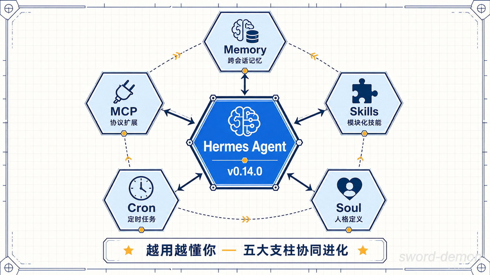

# Hermes Agent 进阶玩法全解

> Hermes Agent 不只是一个聊天机器人, 它是一个**自我进化**的 AI 代理. 真正的威力在于: Memory + Skills + Soul + Cron + MCP 五大支柱的组合拳.

## 五大核心支柱



Hermes Agent(v0.14.0, 2026.05) 由 Nous Research 开发, 构建在五个核心支柱之上:

1. **Memory** - 跨会话记忆系统
2. **Skills** - 模块化技能扩展
3. **Soul** - 人格定义文件
4. **Cron** - 自然语言定时任务
5. **MCP** - 模型上下文协议集成

下面逐一拆解每个支柱的玩法.

## Memory: 三层记忆架构


Hermes 的记忆系统分为三层, 协同工作让 Agent 真正"记住"你.

### 第一层: SOUL.md - 人格层

```bash
~/.hermes/SOUL.md
```

定义 Agent 的语气、风格、边界. 每次会话开始时加载, 控制在 500-2000 tokens 之内.

```markdown
# 我的 Hermes 人格

你是一位简洁、直接的技术助手.

- 回答尽量精炼, 不要废话
- 使用中文回复
- 代码优先, 解释其次
- 遇到不确定的事情主动说明
```

### 第二层: MEMORY.md - 知识层

```bash
~/.hermes/memories/MEMORY.md
~/.hermes/memories/USER.md
```

存储稳定事实: 项目信息、用户偏好、个人细节. 每次会话加载 500-3000 tokens.

触发自动写入的关键词: "记住..." / "remember that..."

```markdown
<!-- written 2026-05-20 -->

## 项目信息

- 当前在开发一个 Next.js SaaS 应用, 部署在 Coolify 上
- 数据库用 PostgreSQL + Drizzle ORM
- 前端用 Tailwind + shadcn/ui
```

关闭自动写入:

```bash
hermes config set memory.auto_write false
```

### 第三层: state.db - 历史层

```bash
~/.hermes/state.db  # SQLite + FTS5 全文检索
```

存储所有会话消息, 支持全文搜索. 不会默认加载, 通过 `session_search` 工具按需查询.

```sql
sqlite3 ~/.hermes/state.db "SELECT content FROM messages WHERE content MATCH '部署' ORDER BY created_at DESC LIMIT 10"
```

:::tip
使用 `/context` 命令查看当前 token 使用量, 帮助你控制上下文大小.
:::

## Skills: 模块化能力扩展


Skills 是 Hermes 的"技能插件", 通过 `SKILL.md` + 脚本组成.

### 安装社区技能

```bash
hermes skills install <skill-name>
```

技能市场: [agentskills.io](https://agentskills.io)

### 创建自定义技能

技能的最小结构:

```
~/.hermes/skills/my-skill/
├── SKILL.md          # 技能说明 + 触发条件
└── scripts/          # 可选的脚本文件
    └── run.sh
```

`SKILL.md` 示例:

```markdown
# Git 提交助手

## 触发条件

当用户说"提交代码"或"commit"时触发

## 执行步骤

1. 运行 git status 查看变更
2. 生成语义化 commit message
3. 确认后执行 git add + commit
```

### 发布技能

```bash
hermes skills publish
```

发布到 agentskills.io 社区共享.

## Soul: 定制你的专属人格

`SOUL.md` 不只是一段 system prompt, 它是 Hermes 的"灵魂文件".

### 高阶用法: 多配置切换

```bash
# 查看当前配置
hermes profile list

# 切换配置(每个 profile 是完全隔离的 Hermes 实例)
hermes profile switch work
hermes profile switch personal
```

每个 Profile 拥有独立的 SOUL.md、MEMORY.md 和 state.db, 实现工作/生活场景隔离.

### SOUL.md 最佳实践

- 控制在 2000 tokens 以内
- 使用 Markdown 标题结构化内容
- 明确指定"不要做什么"比"要做什么"更有效
- 定期审视和更新

## Cron: 自然语言定时任务


这是 Hermes 最让人上瘾的功能之一 - 用自然语言创建定时任务.

### 创建定时任务

**对话式创建:**

```
/cron add "every 2h" "检查服务器状态并汇报"
```

**自然语言创建:**

直接在对话中说:

```
每天早上9点帮我总结昨天的 GitHub notifications
```

Hermes 会自动翻译成标准 cron 表达式.

### 支持的调度格式

| 格式        | 示例          |
| ----------- | ------------- |
| 自然语言    | "每天早上9点" |
| Cron 表达式 | `0 9 * * *`   |
| 间隔        | "every 2h"    |
| ISO 时间戳  | 一次性任务    |

### 管理定时任务

```bash
hermes cron list           # 查看所有任务
hermes cron pause <id>     # 暂停
hermes cron resume <id>    # 恢复
hermes cron run <id>       # 立即执行
hermes cron remove <id>    # 删除
```

### 实战场景

```bash
# 每天早报
/cron add "0 8 * * *" "总结我的日历今天的安排, 发送到飞书"

# 每小时监控
/cron add "every 1h" "检查 https://myapp.com 是否可访问"

# 周报自动生成
/cron add "0 17 * * 5" "根据本周的 git log 生成周报"
```

:::danger
Cron 任务默认不能调用 Skills 和 MCP 服务器(已知限制 #4219), 需要在创建时用 `--skill` 参数显式附加.
:::

## MCP: 无限扩展工具能力

MCP(Model Context Protocol)让 Hermes 连接外部工具服务器.

### 配置 MCP 服务器

编辑 `~/.hermes/config.yaml`:

```yaml
mcp_servers:
  filesystem:
    command: npx
    args: ["-y", "@anthropic/mcp-filesystem", "/path/to/dir"]

  github:
    command: npx
    args: ["-y", "@anthropic/mcp-github"]
    env:
      GITHUB_TOKEN: "your-token"

  # HTTP 类型的 MCP 服务器
  remote-api:
    url: "http://localhost:8080/mcp"
```

### 重载 MCP 配置

修改配置后无需重启:

```bash
/reload-mcp
```

### 工具命名规则

MCP 工具在 Hermes 中的命名: `mcp_<服务器名>_<工具名>`

### Hermes 作为 MCP 服务器

Hermes 自身也能暴露为 MCP 服务器供其他应用调用:

```bash
hermes mcp serve
```

## 工具集(Toolsets)系统

Hermes 内置了分类工具集, 按需加载:

```bash
hermes chat --toolsets "web,terminal,browser"
```

### 内置工具集

| 工具集   | 功能                   |
| -------- | ---------------------- |
| Web      | 网络搜索、网页抓取     |
| Terminal | 命令执行、后台进程管理 |
| Browser  | 浏览器自动化操作       |
| Media    | 图片/音视频处理        |
| Memory   | 记忆读写和搜索         |

### Terminal 后端选项

Terminal 工具支持多种后端:

```yaml
# 本地执行
terminal.backend: local

# Docker 容器隔离
terminal.backend: docker

# SSH 远程执行
terminal.backend: ssh

# Modal 云端沙箱
terminal.backend: modal
```

## 安全使用指南

### 工作目录隔离

```bash
mkdir -p ~/hermes-workspace/{projects,temp,downloads,notes}
hermes config set terminal.cwd ~/hermes-workspace
```

### 禁用敏感功能

```bash
# 关闭持久记忆
hermes tools disable memory
hermes tools disable session_search

# 配置不保存敏感信息
hermes config set memory.memory_enabled false
hermes config set memory.user_profile_enabled false

# 会话自动清理
hermes config set curator.enabled true
hermes config set curator.stale_after_days 7
hermes config set curator.archive_after_days 14
```

### 会话清理

```bash
hermes sessions prune --older-than 1  # 只保留1天
```

## 实战组合拳


### 场景一: 全自动日报系统

```
Soul: 配置为"简洁汇报风格"
Skills: 安装 git-log-summarizer + feishu-sender
Cron: 每天 18:00 触发
MCP: 连接飞书 CLI
```

### 场景二: 代码审查助手

```
Soul: 配置为"严格的 Code Reviewer"
Skills: 自定义 code-review skill
Memory: 记住项目编码规范
MCP: 连接 GitHub MCP
```

### 场景三: 个人知识管理

```
Soul: 配置为"知识整理助手"
Skills: 安装 note-taker + web-clipper
Memory: 自动记录阅读摘要
Cron: 每周日生成知识周刊
```

## 常用命令速查

```bash
# 基础操作
hermes                          # 进入聊天
hermes chat                     # 同上
hermes chat --toolsets "web"    # 指定工具集

# 配置管理
hermes config list              # 查看配置
hermes config set <key> <val>   # 修改配置

# 技能管理
hermes skills list              # 查看已安装技能
hermes skills install <name>    # 安装技能
hermes skills publish           # 发布技能

# 网关(消息平台)
hermes gateway setup            # 配置消息平台
hermes gateway status           # 查看网关状态
hermes pairing approve <plat> <code>  # 批准用户配对

# 定时任务
hermes cron list                # 查看任务
hermes cron create              # 创建任务

# MCP
/reload-mcp                     # 重载 MCP 配置
hermes mcp serve                # 作为 MCP 服务器运行

# Profile 管理
hermes profile list             # 查看配置列表
hermes profile switch <name>    # 切换配置
```

## 总结

Hermes Agent 的核心理念是: **越用越懂你**. 通过 Memory 积累知识, Skills 扩展能力, Soul 定义风格, Cron 实现自动化, MCP 连接万物. 这五个支柱组合起来, 才是它真正的威力所在.

不要只把它当聊天工具用 - 把它当成你的**数字分身**来培养.
