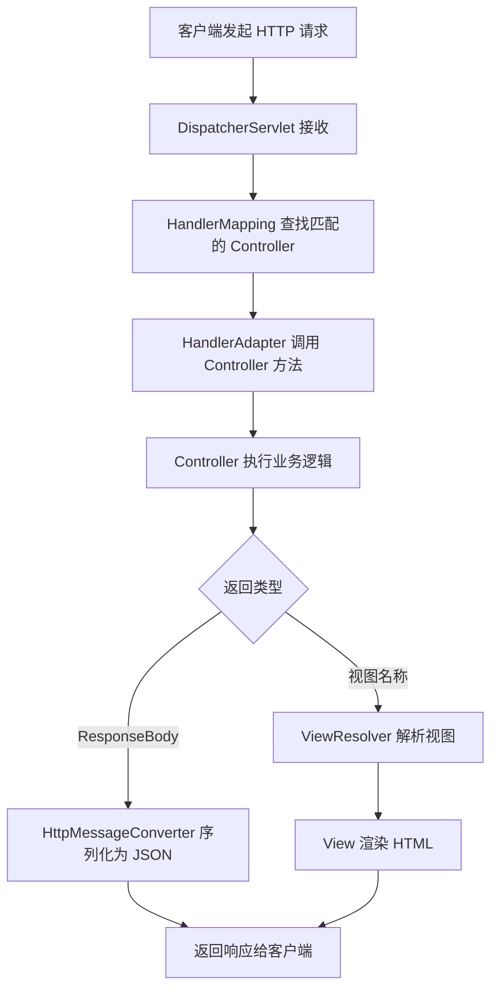
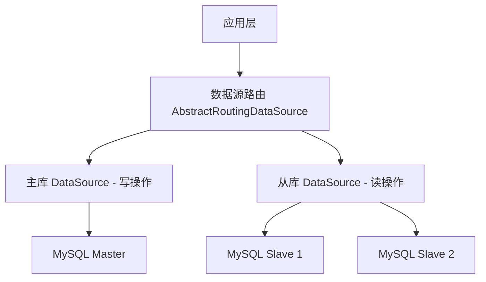
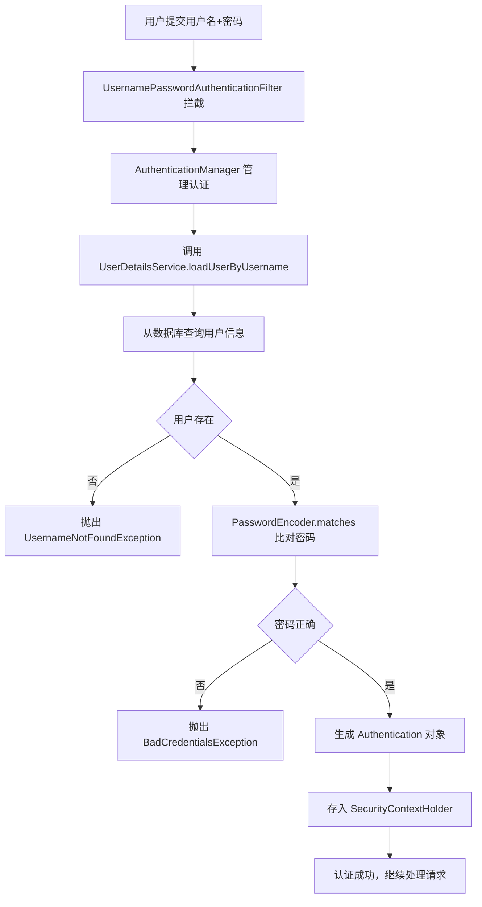
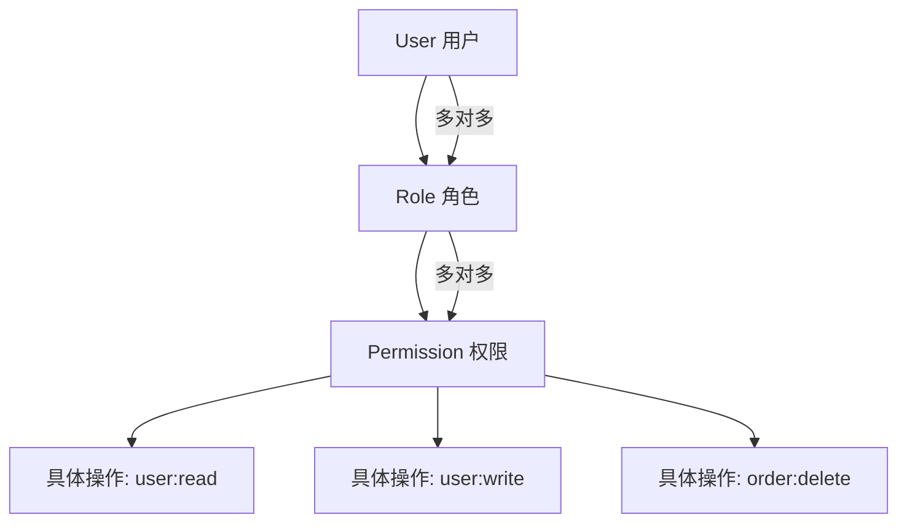
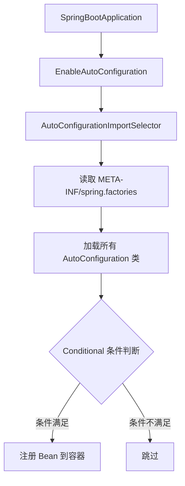
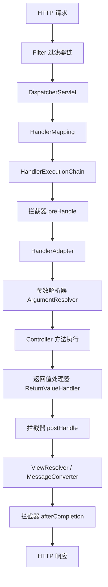
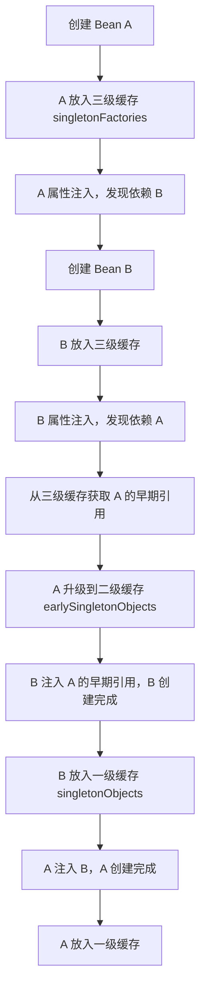

# Spring MVC 技能解析

## 核心组件

### 说人话

想象一家大型餐厅的运作流程：

- **DispatcherServlet** = 前台接待员：所有客人（请求）进门都先找他，他决定把你分配给哪个服务员
- **HandlerMapping** = 排班表：告诉前台"点菜的去 A 区，结账的去 B 区"
- **Controller** = 厨师：真正干活的人，处理具体的业务逻辑
- **ViewResolver** = 摆盘师：厨师做好菜（数据），摆盘师负责装成好看的盘子（HTML/JSON）端给客人

### 请求处理全流程



### 用代码串一遍

```java
// 1. 客户端发请求：GET /users/42

// 2. DispatcherServlet 拦截所有请求（web.xml 或 SpringBoot 自动配置）

// 3. HandlerMapping 找到匹配的方法
@RestController
@RequestMapping("/users")
public class UserController {

    @Autowired
    private UserService userService;

    // 4. HandlerAdapter 调用这个方法
    @GetMapping("/{id}")
    public User getUser(@PathVariable Long id) {
        // 5. 执行业务逻辑
        return userService.findById(id);
        // 6. @RestController = @Controller + @ResponseBody
        //    自动用 Jackson 把 User 对象序列化为 JSON
    }
}

// 7. 客户端收到：{"id": 42, "name": "张三", "email": "zhang@example.com"}
```

---

## 数据绑定与验证

### 说人话

**数据绑定**就是：前端传过来 `name=张三&age=25`，Spring 自动帮你填到 Java 对象里，不用你一个个 `request.getParameter()`。

**数据验证**就是：填完之后检查一下——名字不能为空、年龄不能是负数——不合格就打回去。

### 数据绑定示例

```java
// 前端表单提交：POST /users
// Content-Type: application/x-www-form-urlencoded
// body: name=张三&age=25&email=zhang@example.com

@PostMapping("/users")
public Result createUser(@ModelAttribute UserDTO dto) {
    // Spring 自动把请求参数绑定到 UserDTO 的同名字段
    // 不用写任何 getParameter，直接用 dto.getName() 就是 "张三"
    return userService.create(dto);
}

// JSON 请求体绑定
// Content-Type: application/json
// body: {"name": "张三", "age": 25}

@PostMapping("/users")
public Result createUser(@RequestBody UserDTO dto) {
    // @RequestBody = 从 JSON 反序列化到对象
    return userService.create(dto);
}
```

### 数据验证示例

```java
public class UserDTO {
    @NotBlank(message = "用户名不能为空")
    private String name;

    @Min(value = 0, message = "年龄不能为负数")
    @Max(value = 150, message = "年龄不合理")
    private Integer age;

    @Email(message = "邮箱格式不正确")
    private String email;

    @Pattern(regexp = "^1[3-9]\\d{9}$", message = "手机号格式不正确")
    private String phone;
}

@PostMapping("/users")
public Result createUser(@Valid @RequestBody UserDTO dto, BindingResult result) {
    // @Valid 触发验证，BindingResult 接收错误信息
    if (result.hasErrors()) {
        String msg = result.getFieldErrors().stream()
            .map(FieldError::getDefaultMessage)
            .collect(Collectors.joining(", "));
        return Result.fail(msg);
    }
    return userService.create(dto);
}
```

### 全局异常处理（更优雅的方式）

```java
@RestControllerAdvice
public class GlobalExceptionHandler {

    // 参数校验失败统一处理
    @ExceptionHandler(MethodArgumentNotValidException.class)
    public Result handleValidation(MethodArgumentNotValidException ex) {
        String msg = ex.getBindingResult().getFieldErrors().stream()
            .map(e -> e.getField() + ": " + e.getDefaultMessage())
            .collect(Collectors.joining("; "));
        return Result.fail(400, msg);
    }

    // 业务异常
    @ExceptionHandler(BusinessException.class)
    public Result handleBusiness(BusinessException ex) {
        return Result.fail(ex.getCode(), ex.getMessage());
    }

    // 兜底
    @ExceptionHandler(Exception.class)
    public Result handleAll(Exception ex) {
        log.error("未知异常", ex);
        return Result.fail(500, "服务器开小差了");
    }
}
```

---

## RESTful 风格开发

### 说人话

REST 的核心思想：**把一切都当成"资源"，用 HTTP 动词表达你要对资源做什么**。

不要这样设计接口：

```
GET  /getUserById?id=1     ❌
POST /createUser           ❌
POST /deleteUser?id=1      ❌
GET  /getAllUsers           ❌
```

要这样：

```
GET    /users/1     → 查一个用户
POST   /users       → 创建用户
PUT    /users/1     → 更新用户（全量）
PATCH  /users/1     → 更新用户（部分）
DELETE /users/1     → 删除用户
GET    /users       → 查所有用户
```

### 完整 RESTful Controller

```java
@RestController
@RequestMapping("/api/v1/users")
public class UserController {

    @Autowired
    private UserService userService;

    // 查询列表（支持分页）
    @GetMapping
    public PageResult<UserVO> list(
            @RequestParam(defaultValue = "1") int page,
            @RequestParam(defaultValue = "10") int size) {
        return userService.list(page, size);
    }

    // 查询单个
    @GetMapping("/{id}")
    public UserVO getById(@PathVariable Long id) {
        return userService.getById(id);
    }

    // 创建
    @PostMapping
    @ResponseStatus(HttpStatus.CREATED) // 返回 201
    public UserVO create(@Valid @RequestBody CreateUserDTO dto) {
        return userService.create(dto);
    }

    // 更新
    @PutMapping("/{id}")
    public UserVO update(@PathVariable Long id, @Valid @RequestBody UpdateUserDTO dto) {
        return userService.update(id, dto);
    }

    // 删除
    @DeleteMapping("/{id}")
    @ResponseStatus(HttpStatus.NO_CONTENT) // 返回 204
    public void delete(@PathVariable Long id) {
        userService.delete(id);
    }
}
```

---

## Spring Data JPA

### 说人话

你写一个 DAO 层，无非就是增删改查。Spring Data JPA 的态度是：**你连 SQL 都不用写，定义个接口就行，我帮你生成实现**。

### 魔法方法命名

```java
public interface UserRepository extends JpaRepository<User, Long> {

    // Spring Data 根据方法名自动生成 SQL！

    // SELECT * FROM user WHERE email = ?
    Optional<User> findByEmail(String email);

    // SELECT * FROM user WHERE age > ? AND status = ?
    List<User> findByAgeGreaterThanAndStatus(Integer age, String status);

    // SELECT * FROM user WHERE name LIKE '%xxx%'
    List<User> findByNameContaining(String keyword);

    // SELECT * FROM user WHERE age BETWEEN ? AND ? ORDER BY created_at DESC
    List<User> findByAgeBetweenOrderByCreatedAtDesc(Integer min, Integer max);

    // DELETE FROM user WHERE status = ?
    void deleteByStatus(String status);

    // SELECT COUNT(*) FROM user WHERE department_id = ?
    long countByDepartmentId(Long deptId);
}
```

### 方法命名规则速查

| 关键词        | SQL 等价       | 示例                                       |
| ------------- | -------------- | ------------------------------------------ |
| `findBy`      | `SELECT WHERE` | `findByName(name)`                         |
| `And`         | `AND`          | `findByNameAndAge(name, age)`              |
| `Or`          | `OR`           | `findByNameOrEmail(name, email)`           |
| `Between`     | `BETWEEN`      | `findByAgeBetween(min, max)`               |
| `LessThan`    | `<`            | `findByAgeLessThan(age)`                   |
| `GreaterThan` | `>`            | `findByAgeGreaterThan(age)`                |
| `Like`        | `LIKE`         | `findByNameLike(pattern)`                  |
| `Containing`  | `LIKE %x%`     | `findByNameContaining(keyword)`            |
| `OrderBy`     | `ORDER BY`     | `findByStatusOrderByCreatedAtDesc(status)` |
| `Top/First`   | `LIMIT`        | `findTop5ByOrderByScoreDesc()`             |

### 复杂查询用 @Query

```java
public interface UserRepository extends JpaRepository<User, Long> {

    // JPQL 写法
    @Query("SELECT u FROM User u WHERE u.department.name = :deptName AND u.status = 'ACTIVE'")
    List<User> findActiveByDepartment(@Param("deptName") String deptName);

    // 原生 SQL（复杂统计场景）
    @Query(value = "SELECT department_id, COUNT(*) as cnt FROM user " +
                   "GROUP BY department_id HAVING cnt > :minCount",
           nativeQuery = true)
    List<Object[]> findDepartmentsWithMinMembers(@Param("minCount") int minCount);

    // 更新操作
    @Modifying
    @Query("UPDATE User u SET u.status = :status WHERE u.lastLoginAt < :deadline")
    int deactivateInactiveUsers(@Param("status") String status, @Param("deadline") LocalDateTime deadline);
}
```

### 多数据源配置（核心思路）



```java
// 自定义注解标记数据源
@Target({ElementType.METHOD, ElementType.TYPE})
@Retention(RetentionPolicy.RUNTIME)
public @interface DataSource {
    String value() default "master";
}

// 使用
@Service
public class UserService {

    @DataSource("master")
    @Transactional
    public void createUser(User user) { /* 写主库 */ }

    @DataSource("slave")
    public List<User> listUsers() { /* 读从库 */ }
}
```

---

## Spring Security

### 说人话

Spring Security 就是你家大门的**智能门禁系统**：

1. **认证（Authentication）**：你是谁？刷脸/刷卡/输密码证明身份
2. **授权（Authorization）**：你能干什么？住户能进小区，但只有物业能进机房

### 认证流程



### 最简配置（Spring Boot 3.x）

```java
@Configuration
@EnableWebSecurity
public class SecurityConfig {

    @Bean
    public SecurityFilterChain filterChain(HttpSecurity http) throws Exception {
        http
            .csrf(csrf -> csrf.disable()) // 前后端分离关闭 CSRF
            .sessionManagement(session ->
                session.sessionCreationPolicy(SessionCreationPolicy.STATELESS)) // 无状态
            .authorizeHttpRequests(auth -> auth
                .requestMatchers("/api/auth/**").permitAll()      // 登录注册放行
                .requestMatchers("/api/admin/**").hasRole("ADMIN") // 管理接口需要 ADMIN 角色
                .anyRequest().authenticated()                      // 其他都要认证
            )
            .addFilterBefore(jwtFilter, UsernamePasswordAuthenticationFilter.class);

        return http.build();
    }

    @Bean
    public PasswordEncoder passwordEncoder() {
        return new BCryptPasswordEncoder(); // 密码加密器
    }
}
```

### 自定义 UserDetailsService

```java
@Service
public class CustomUserDetailsService implements UserDetailsService {

    @Autowired
    private UserRepository userRepo;

    @Override
    public UserDetails loadUserByUsername(String username) throws UsernameNotFoundException {
        User user = userRepo.findByUsername(username)
            .orElseThrow(() -> new UsernameNotFoundException("用户不存在: " + username));

        return org.springframework.security.core.userdetails.User.builder()
            .username(user.getUsername())
            .password(user.getPassword()) // 数据库里存的是 BCrypt 加密后的
            .roles(user.getRoles().toArray(new String[0]))
            .build();
    }
}
```

### JWT Token 认证（前后端分离主流方案）

```java
@Component
public class JwtAuthenticationFilter extends OncePerRequestFilter {

    @Autowired
    private JwtUtils jwtUtils;

    @Autowired
    private CustomUserDetailsService userDetailsService;

    @Override
    protected void doFilterInternal(HttpServletRequest request,
                                    HttpServletResponse response,
                                    FilterChain chain) throws ServletException, IOException {

        String token = extractToken(request); // 从 Header 取 Bearer token

        if (token != null && jwtUtils.validateToken(token)) {
            String username = jwtUtils.getUsernameFromToken(token);
            UserDetails userDetails = userDetailsService.loadUserByUsername(username);

            // 构建认证对象放入上下文
            UsernamePasswordAuthenticationToken authentication =
                new UsernamePasswordAuthenticationToken(userDetails, null, userDetails.getAuthorities());
            SecurityContextHolder.getContext().setAuthentication(authentication);
        }

        chain.doFilter(request, response); // 继续过滤器链
    }

    private String extractToken(HttpServletRequest request) {
        String header = request.getHeader("Authorization");
        if (header != null && header.startsWith("Bearer ")) {
            return header.substring(7);
        }
        return null;
    }
}
```

### RBAC 权限模型



```java
// 方法级别权限控制
@RestController
@RequestMapping("/api/users")
public class UserController {

    @PreAuthorize("hasRole('ADMIN')")      // 需要 ADMIN 角色
    @DeleteMapping("/{id}")
    public void deleteUser(@PathVariable Long id) { /* ... */ }

    @PreAuthorize("hasAuthority('user:read')") // 需要 user:read 权限
    @GetMapping("/{id}")
    public UserVO getUser(@PathVariable Long id) { /* ... */ }

    @PreAuthorize("#id == authentication.principal.id or hasRole('ADMIN')")
    @PutMapping("/{id}")                   // 只能改自己的，或者管理员随便改
    public UserVO updateUser(@PathVariable Long id, @RequestBody UpdateDTO dto) { /* ... */ }
}
```

---

# 面试高频架构图

### Spring Boot 自动装配原理

**口述要点**：Spring Boot 的核心魔法就是"约定大于配置"。你引入一个 `spring-boot-starter-web`，它怎么就自动帮你配好了 Tomcat、Jackson、DispatcherServlet？

答案是 `@EnableAutoConfiguration` 触发了 `AutoConfigurationImportSelector`，它去读 classpath 下所有 jar 包的 `META-INF/spring.factories` 文件（Spring Boot 3.x 改为 `META-INF/spring/org.springframework.boot.autoconfigure.AutoConfiguration.imports`），拿到一堆 AutoConfiguration 类的全类名。但不是全部加载——每个类上都有 `@Conditional` 系列注解做条件过滤，比如 `@ConditionalOnClass(DataSource.class)` 表示"只有 classpath 里有 DataSource 这个类才生效"。最终只有条件满足的配置类才会注册 Bean 到容器。



**面试加分回答**：可以补充说"我们也可以自定义 starter，写自己的 AutoConfiguration + spring.factories，实现公司内部的通用组件自动装配"。

---

### Spring MVC 完整请求链路（面试必画）

**口述要点**：一个 HTTP 请求进来，经历的完整链路可以分为三大阶段——

1. **前置阶段**：先过 Servlet 容器的 Filter 链（如编码过滤器、Security 过滤器），然后到 DispatcherServlet
2. **核心处理阶段**：DispatcherServlet 通过 HandlerMapping 找到对应的 Controller 方法，包装成 HandlerExecutionChain（方法 + 拦截器）。拦截器先执行 `preHandle`，然后 HandlerAdapter 负责参数解析（`@PathVariable`、`@RequestBody` 等都在这里处理）、调用 Controller 方法、处理返回值
3. **后置阶段**：拦截器 `postHandle`（可以修改 ModelAndView）→ 视图解析或 JSON 序列化 → 拦截器 `afterCompletion`（无论成功失败都执行，适合做资源清理）



**面试加分回答**：如果被追问"异常怎么处理"，可以说 Controller 抛异常后会跳过 `postHandle`，但 `afterCompletion` 一定会执行。全局异常处理靠 `@ControllerAdvice` + `@ExceptionHandler` 在 DispatcherServlet 层面统一捕获。

---

### Spring 三级缓存解决循环依赖

**口述要点**：循环依赖就是 A 依赖 B、B 又依赖 A，形成了环。Spring 用三级缓存巧妙解决了这个问题：

- **一级缓存** `singletonObjects`：存放完全初始化好的 Bean（成品）
- **二级缓存** `earlySingletonObjects`：存放已实例化但未完成属性注入的 Bean（半成品）
- **三级缓存** `singletonFactories`：存放 Bean 的工厂对象（能生产早期引用，支持 AOP 代理）

为什么需要三级而不是两级？因为如果 A 被 AOP 代理了，B 拿到的必须是 A 的代理对象而不是原始对象。三级缓存的工厂方法（`ObjectFactory`）会在需要时调用 `getEarlyBeanReference()`，判断是否需要生成代理。



**哪些情况搞不定**：

- **构造器注入**：对象还没 `new` 出来就要注入依赖，三级缓存无用武之地 → 用 `@Lazy` 打破
- **prototype 作用域**：Spring 不缓存多例 Bean，直接报错
- **@Async 标注的 Bean**：因为代理时机特殊，可能导致早期引用和最终代理不一致 → 用 `@Lazy` 或调整依赖结构

---

## 常见面试追问

| 问题                                      | 核心回答                                                                                                                         |
| ----------------------------------------- | -------------------------------------------------------------------------------------------------------------------------------- |
| DispatcherServlet 的作用？                | 前端控制器，统一入口接收请求，分发给 Handler 处理                                                                                |
| `@Controller` 和 `@RestController` 区别？ | `@RestController` = `@Controller` + `@ResponseBody`，直接返回 JSON                                                               |
| 拦截器和过滤器的区别？                    | Filter 是 Servlet 规范，拦截所有请求；Interceptor 是 Spring 的，只拦截 Controller                                                |
| `@RequestParam` 和 `@PathVariable` 区别？ | `@RequestParam` 取 `?key=value`；`@PathVariable` 取 `/users/{id}` 中的 id                                                        |
| Spring Security 的过滤器链执行顺序？      | SecurityContextPersistenceFilter → UsernamePasswordAuthenticationFilter → ExceptionTranslationFilter → FilterSecurityInterceptor |
| JWT 和 Session 的区别？                   | Session 存服务端有状态；JWT 存客户端无状态，适合分布式                                                                           |
| JPA 的 N+1 问题怎么解决？                 | `@EntityGraph` 指定 fetch 策略 / `JOIN FETCH` / 批量查询                                                                         |
