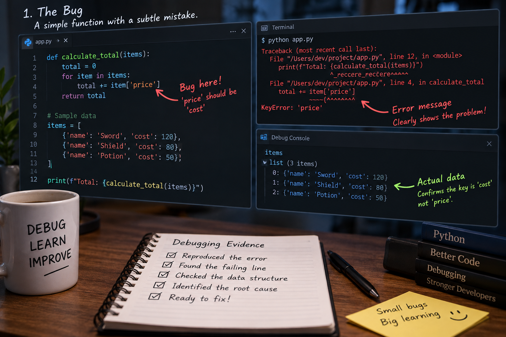
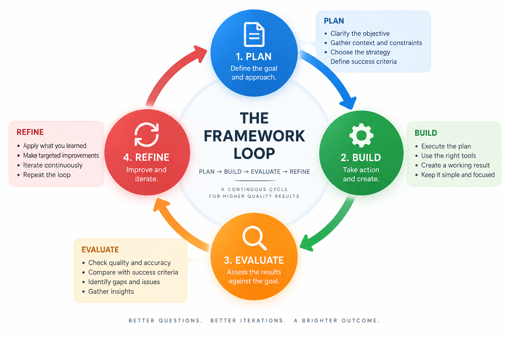

这几天我一直在用 [Compound Engineering](https://github.com/EveryInc/compound-engineering-plugin) 做开发。它给我的最大变化，不是多了几个命令，而是把“问 AI 写代码”改成了一条可以重复的工程流程：先把问题想清楚，再实现，最后把这次踩过的坑留下来。



插件官方把这条流程概括为六步：`brainstorm`、`plan`、`work`、`simplify`、`code-review`、`compound`。仓库目前提供 35 个技能，能运行在 Codex、Claude Code、Cursor 等多个 Agent 宿主上。它的目标很朴素：这次改动完成后，下一次改动应该更容易。

## 它解决的不是“不会写代码”

普通的 AI 编程对小改动很有效：贴一段报错，让模型给出补丁，运行测试，结束。但项目一旦涉及多个服务、数据库迁移、异步任务和产品规则，真正困难的通常是下面几件事：

- 需求里有哪些边界还没说清楚？
- 现有代码为什么这样写，哪些约束不能破坏？
- 改完后应该验证什么，哪些“看起来成功”其实不算成功？
- 这次排查得到的知识，下次能不能直接复用？

Compound Engineering 把这些容易被跳过的步骤变成了显式产物。`ce-brainstorm` 先整理需求，`ce-plan` 把它变成可执行计划，`ce-work` 执行计划，`ce-code-review` 独立检查，`ce-compound` 再把结论写进项目文档。这样做的价值不在仪式感，而在于每一步都有东西可以阅读和复核。

## 我实际使用的一条路径

我现在更常用下面这条路径，而不是直接把一句模糊需求丢给模型：

```text
$ce-brainstorm 描述问题和目标
$ce-plan
$ce-work
$ce-simplify-code
$ce-code-review
$ce-compound
```

遇到已经发生的故障，就从 `$ce-debug` 开始；只是想比较技术方向，可以用 `$ce-pov`；需要理解旧代码时，先用 `$ce-explain`。如果需求、计划和风险都已经明确，也可以使用 `$lfg` 让它自动跑完整流程，但我更愿意把它当成“明确范围后的自动执行器”，而不是需求分析器。

在 Codex 里，技能调用使用 `$skill-name`。第一次在项目里使用时，可以先运行 `$ce-setup`，让插件检查能力并生成项目配置。我的博客仓库把文章放在 `docs/`，因此会特别关注插件产物目录是否和现有文档结构冲突，必要时通过 `docs_root` 统一位置。

## 在不同 AI 宿主上的安装方法

Compound Engineering 支持 14 种 Agent 宿主平台。以下是主流平台的真实安装步骤：

### Claude Code（推荐）

```bash
# 进入项目后直接在终端执行
/plugin marketplace add EveryInc/compound-engineering-plugin
/plugin install compound-engineering

# 验证安装
/plugin list

# 首次使用，运行设置命令
/ce-setup
```

**调用方式：** 在 Claude Code 对话中输入 `/ce-brainstorm`、`/ce-plan` 等斜杠命令

---

### Cursor（最易用）

**方式一：通过插件市场**

在 Cursor 的 Agent 聊天框中输入：

```
/add-plugin compound-engineering
```

或者在插件市场中搜索 "compound engineering" 并安装。

**方式二：手动添加**

在 Cursor Agent 聊天中直接输入：

```
/add-plugin EveryInc/compound-engineering-plugin
```

**验证安装：**

```
# 在对话中输入
/ce-help

# 应该看到所有可用的 CE 命令列表
```

**调用方式：**

- 在 AI 聊天中输入 `/ce-brainstorm`、`/ce-plan` 等
- 或使用快捷键唤起 AI（默认 Cmd+K），然后输入命令

---

### Codex App（需要自定义市场）

Codex 的内置插件市场还没有 Compound Engineering，需要手动添加自定义市场：

1. 在 Codex App 左侧边栏打开 **Plugins**
2. 点击 **Create** 旁边的箭头，选择 **Add marketplace**
3. 填入以下信息：

| 字段         | 值                                     |
| ------------ | -------------------------------------- |
| Source       | `EveryInc/compound-engineering-plugin` |
| Git ref      | `main`                                 |
| Sparse paths | 留空                                   |

4. 点击 **Add marketplace**
5. 搜索 "Compound Engineering"，安装 `compound-engineering-plugin`
6. **重启 Codex**

**命令行方式（Codex CLI）：**

```bash
# 注册市场
codex plugin marketplace add EveryInc/compound-engineering-plugin

# 安装插件
codex plugin add compound-engineering@compound-engineering-plugin

# 或者通过图形界面
# 运行 /plugins → 找到 Compound Engineering 市场 → 选择插件 → Install
```

**特殊场景 - 多配置文件：**

如果你的 Codex 使用了不同 profile（比如工作用、学习用）：

```bash
# 为特定 profile 安装（例如 work 配置文件）
CODEX_HOME="$HOME/.codex/profiles/work" codex plugin marketplace add EveryInc/compound-engineering-plugin
CODEX_HOME="$HOME/.codex/profiles/work" codex plugin add compound-engineering@compound-engineering-plugin
```

**调用方式：** 在 Codex 对话中使用 `$skill-name` 格式，如 `$ce-brainstorm`、`$lfg`

---

### Kimi Code CLI

Kimi 原生支持直接从 GitHub 安装：

```bash
# 直接安装
/plugins install https://github.com/EveryInc/compound-engineering-plugin

# 或通过自定义市场
/plugins marketplace https://raw.githubusercontent.com/EveryInc/compound-engineering-plugin/main/.kimi-plugin/marketplace.json
```

**重要：** 安装或更新后，运行 `/reload` 或启动新的 Kimi 会话才能加载技能。

---

### Cline

Cline 通过 SKILL.md 目录按需加载技能：

**全局安装（所有项目可用）：**

```bash
# 先克隆仓库
git clone https://github.com/EveryInc/compound-engineering-plugin

# 运行安装脚本
./compound-engineering-plugin/.cline/scripts/install-skills.sh --global
```

**仅当前项目可用：**

```bash
./compound-engineering-plugin/.cline/scripts/install-skills.sh --project
```

**重要：** 安装后启动新的 Cline 任务才能看到技能。

---

### Grok Build CLI (grok)

xAI 的 Grok Build CLI 可以直接从仓库安装：

```bash
# 直接安装（追踪最新版本）
grok plugin install EveryInc/compound-engineering-plugin

# 验证安装
grok plugin list

# 更新到最新版
grok plugin update
```

**可选：通过市场浏览**

```bash
grok plugin marketplace add EveryInc/compound-engineering-plugin
grok plugin install compound-engineering
```

**提示：** 添加 `--trust` 参数可以跳过安装确认。

---

### Devin CLI

Devin 原生支持直接从 GitHub 安装：

```bash
# 安装插件
devin plugins install EveryInc/compound-engineering-plugin

# 验证并查看技能详情
devin plugins list
devin plugins info compound-engineering

# 更新到最新版
devin plugins update compound-engineering
```

**重要：** 插件在会话启动时加载，安装或更新后需启动新的 Devin 会话。

---

### 其他平台

#### GitHub Copilot

**VS Code 插件：**

1. 运行 Chat: Install Plugin from Source（从 VS Code 命令面板）
2. 输入 repo：`EveryInc/compound-engineering-plugin`
3. 选择 `compound-engineering`

**Copilot CLI：**

```bash
/copilot plugin marketplace add EveryInc/compound-engineering-plugin
/copilot plugin install compound-engineering@compound-engineering-plugin
```

#### Factory Droid

```bash
droid plugin marketplace add https://github.com/EveryInc/compound-engineering-plugin
droid plugin install compound-engineering@compound-engineering-plugin
```

#### Qwen Code

```bash
qwen extensions install EveryInc/compound-engineering-plugin:compound-engineering
```

#### OpenCode

编辑 `opencode.json`，在 plugin 数组中添加：

```json
{
  "plugin": [
    "compound-engineering@git+https://github.com/EveryInc/compound-engineering-plugin.git"
  ]
}
```

重启 OpenCode 即可。

#### Pi

```bash
# 安装主插件
pi install git:github.com/EveryInc/compound-engineering-plugin

# 推荐的辅助包（用于子 agent 调度）
pi install npm:pi-subagents

# 更好的阻塞问题处理
pi install npm:pi-ask-user
```

#### oh-my-pi (omp)

```bash
# 添加市场
omp plugin marketplace add EveryInc/compound-engineering-plugin

# 安装插件
omp plugin install compound-engineering@compound-engineering-plugin

# 启用自动更新（可选）
omp config set marketplace.autoUpdate auto
```

**重要：** 运行 `/reload-plugins` 或启动新的 omp 会话才能加载技能。

#### Antigravity CLI (agy)

Google 的 Gemini CLI 已被 Antigravity CLI 替代：

```bash
# 直接从 GitHub 安装（不需要克隆）
agy plugin install https://github.com/EveryInc/compound-engineering-plugin

# 验证安装
agy plugin list

# 本地开发模式（可选）
git clone https://github.com/EveryInc/compound-engineering-plugin
agy plugin install ./compound-engineering-plugin
```

---

## 通用建议和常见问题

### 首次使用流程

无论用哪个平台，建议按这个顺序开始：

```bash
# 1. 安装插件后先运行设置命令
/ce-setup   # 或在 Codex 中使用 $ce-setup

# 这会做三件事：
# - 检查 API 密钥和环境变量
# - 生成项目配置文件 `.compound-engineering/config.yaml`
# - 列出所有可用技能

# 2. 查看完整技能列表
/ce-help    # 或在 Codex 中使用 $ce-help

# 3. 开始第一条循环（六步走）
/ce-brainstorm <描述你的需求>
/ce-plan
/ce-work
/ce-simplify-code
/ce-code-review
/ce-compound
```

### 配置文件位置

插件默认输出到这些目录（可在 `.compound-engineering/config.yaml` 中修改）：

- `docs/solutions/` - 知识沉淀
- `docs/plans/` - 设计文档
- `docs/reviews/` - 审查记录

如果你的项目已有 `docs/` 结构，可以通过 `docs_root` 配置将所有产物集中到一个子目录。

### 常见问题速查

| 问题                   | 解决方案                                                  |
| ---------------------- | --------------------------------------------------------- |
| 找不到 `/ce-xxx` 命令  | 确认插件已正确安装，运行 `/plugin list` 查看是否显示      |
| API 密钥无效           | 检查环境变量设置，CLI 通常会提示缺失的 key                |
| 权限不足无法写入文件   | 确保对项目目录有写权限                                    |
| 输出目录与现有结构冲突 | 修改 `.compound-engineering/config.yaml` 中的 `docs_root` |
| 技能列表为空           | 重新运行 `/ce-setup`，或检查网络能否访问 GitHub           |
| 安装后看不到新技能     | 重启 IDE 或运行 reload 命令                               |
| 想升级插件             | 大多数平台使用 `update` 命令，详见各平台说明              |

### 平台选择建议

根据你的使用习惯选择：

- **终端重度用户** → Claude Code（命令行友好，适合脚本化）
- **追求易用性** → Cursor（可视化强，容易上手）
- **OpenAI 生态** → Codex（API 可靠，支持多 profile）
- **需要批量操作** → Kimi / Cline（SKILL.md 灵活加载）
- **尝鲜新工具** → Grok / Devin（原生支持好）

不同平台的插件是通用的，只是调用方式和配置略有差异。你可以在一个平台编写 Plan，然后在另一个平台执行 Work，只要确保输出目录一致即可。

### 关于 Bun

很多人会问：_"我需要装 Bun 吗？"_

**回答：不需要！** 🚫

Bun 只需要用于：

- 仓库本地开发
- 转换器维护

**日常使用完全不需要 Bun**，各个平台的安装命令都是独立的。

---

## 给 SDD + Vibe Coding 玩家的快速上手

### 先让模型画出问题边界

在支付、退款或订单状态这类需求里，直接让模型“加一个接口”通常会漏掉回调、补偿和最终状态。我会先让 `brainstorm` 把参与者、状态变化、失败路径和验收条件列出来，再进入计划阶段。



最近排查 Z-Pay 退款流程时，一个很容易误判的地方是：后台 `act=order` 返回成功，并不能证明退款已经完成。真正的闭环还包括 `act=refund`、异步 finalize worker，以及查询接口对最终状态的校验。把这些写进计划后，代码改动反而更小，因为实现不需要靠猜。

### 把“启动失败”当成约束来读

有一次开发服务卡在 migration `00049_course_chapter_groups.sql`，数据库报错指向 `paid_course_release_chapters` 的 append-only 约束。模型如果只看最后一行错误，很容易建议直接放开更新。沿着 `ce-debug` 的路径回看迁移、触发器和数据关系后，结论是先保留 append-only 不变量，再改成合法的关系写入路径，并在数据库里验证迁移。

这类问题说明，AI 的第一版修复建议只能算假设。真正有价值的是让它继续追到约束的来源，并留下可重复的验证命令。

### Review 要审模式，不只审这一行

`ce-code-review` 对我帮助最大的一点，是会把局部修复放回调用链里看。比如订单过期扫描，不能只修当前找到的一条记录；提醒任务也不能只在单元测试里证明“能发出”，还要确认重复执行、锁和勿扰边界。

我在学习行动闭环里遇到过提醒非重入、进度排序和过期订单扫描的问题。最后保留了每条 pending order 独立检查和 `timeoutMinutes`，并用数据库锁保证并发下不会重复处理。Review 的作用不是增加抽象，而是提醒我去检查兄弟调用方和失败分支。

### `simplify` 值得保留

模型很容易为了“以后扩展”加接口、工厂和配置项。实现完成后先跑一次 `ce-simplify-code`，常常能删掉这些还没有真实需求的东西。它和 code review 的关注点不同：前者问“能不能更简单”，后者问“有没有错误和回归”。

我的经验是，简单化应该发生在测试通过之后。这样删代码有证据，遇到行为变化也容易定位。

### 经验沉淀要写成下一次能用的规则

`ce-compound` 不是工作总结，而是把“下次遇到同类问题该先检查什么”写下来。例如：

- 迁移涉及 append-only 表时，先检查触发器和已有 release 行；
- 退款流程中，`act=order` 不能作为退款完成证据；
- 文档构建被 pnpm 11 的 `ERR_PNPM_IGNORED_BUILDS` 卡住时，使用项目已有的 VitePress 二进制做内容验证；
- 只修改目标文件，提交前检查 staged 文件名、统计和 `git diff --check`。


这些规则比“今天修了一个 bug”更有复用价值。下一次 brainstorm 读取到它们后，模型会更早问出正确的问题。

## 我不会把所有事情都交给插件

这套流程也有边界。它不能替代产品取舍、真实环境验证和最终责任判断。尤其是支付、权限、数据迁移这类路径，模型给出的“测试通过”只说明某个检查通过，不能等同于线上闭环完成。

我通常把交付拆成三层：代码是否改对，测试和运行是否真实通过，Git 或外部发布是否完成。每层都单独报告，不把局部自动化结果包装成完整交付。

另外，`$lfg` 虽然可以自动执行计划、修复 review 问题、跑浏览器测试并提交代码，但它仍可能在预算耗尽时留下未解决项。范围不清楚时，自动化只会更快地产生返工；范围清楚、验证条件明确时，它才真正省时间。

## 适合什么时候用

小修小补直接改更快。下面这些场景值得走完整或半完整闭环：

- 跨多个模块的功能；
- 涉及数据库迁移、并发、支付或权限的改动；
- 需要多人或多个 Agent 接力的任务；
- 反复出现、希望变成项目规则的问题；
- 准备合并或发布前，需要独立 review 的改动。

我现在把它理解成一套“带记忆的工作方法”，不是一个更会补全代码的插件。AI 负责加速调查、实现和检查，人负责确认目标、约束和证据。两者配合起来，才有可能让每一轮开发真的比上一轮轻松。

## 给 SDD + Vibe Coding 玩家的快速上手

如果你平时习惯先写设计文档（SDD），然后靠 AI vibe coding，可以这样把 Compound Engineering 融入你的工作流：

### 1. 用 `brainstorm` 代替手写的草稿

传统流程里你会先在白板或文档里梳理：模块边界、数据流、状态机、异常分支。

换成 `ce-brainstorm` 后：

```bash
$ce-brainstorm "我要实现一个订单超时自动取消功能。需要扫描 pending 状态的订单，检查超过 30 分钟未支付的，调用关闭接口，并记录日志。注意要支持批量处理和幂等性。"
```

模型会输出类似你手写草稿的东西，但多了一份"可执行检查清单"：哪些表要改、哪些接口要调、失败怎么办、怎么验证。你可以直接把它当作简化版 SDD 的起点。

**关键技巧**：在描述里显式写出你关心的约束（"不能阻塞主线程"、"要能回滚"、"必须有审计日志"），模型会更早提出这些问题。

---

### 2. 让 `plan` 生成你的 SDD 正式稿

`ce-brainstorm` 结束后，运行：

```bash
$ce-plan
```

这一步会把 brainstorm 的输出整理成结构化计划，包括：

- 改动文件清单
- 需要新增的函数/接口
- 测试策略
- 风险和依赖

这基本就是你的 SDD 正式版。你可以：

- 直接在 `CE_OUTPUT_DIR`（默认是 `compound_engineering/`）下查看 Markdown 产物
- 复制 Plan 内容到你们团队要求的文档模板
- 把它当作代码审查的检查表

**建议**：如果项目已经有设计文档目录，可以在首次运行时指定 `docs_root`，让产物落在统一位置。

---

### 3. Vibe Coding 阶段：用 `work` 接管实现

通常 vibe coding 你会说"帮我实现这个功能"，但容易漏掉细节。

现在改成：

```bash
$ce-work
```

它会：

- 读取你确认过的 Plan
- 按步骤生成代码
- 主动问你不清楚的地方（而不是猜）
- 在每次重要改动后给出总结

**优势**：

- 实现过程可追溯：每个步骤都有记录
- 不会偏离 Plan：实现范围受控
- 中途随时暂停查看中间结果

如果你喜欢一次看完所有改动，可以等它跑完再 review；如果想逐步控制，可以在每个阶段停下检查。

---

### 4. `simplify`：砍掉过度设计的部分

vibe coding 最容易出现的问题是"为未来扩展"加了很多还没需要的抽象。

实现完成后先跑：

```bash
$ce-simplify-code
```

它会问你："这些接口真的需要吗？这些配置项有人用吗？"常见结果：

- 删掉未使用的 helper 函数
- 合并过于分散的配置项
- 简化还没有真实需求的工厂类

**时机很重要**：建议在测试通过后运行，这样删代码有依据，出问题也容易回退。

---

### 5. `code-review`：让它当独立审查员

你 Review 自己的代码时容易陷入"实现细节"，而忽略架构层面的问题。

运行：

```bash
$ce-code-review
```

它会从不同角度审查：

- 调用链是否完整（比如异步任务有没有重试）
- 边界条件有没有覆盖（并发、失败、重启）
- 是否符合项目既有规范（锁策略、错误处理模式）

**用法建议**：不要只看它指出的问题，还要看它提出的"替代方案"。有时候模型会建议你用现有工具替换新实现的逻辑。

---

### 6. `compound`：把坑变成项目规则

这是 Compound Engineering 最特别的一步。做完改动后：

```bash
$ce-compound
```

它会把这次开发中遇到的坑、查到的资料、验证命令整理成 `KNOWLEDGE_BASE.md` 或项目特定领域的文档。例如：

**普通工作总结**：

> 今天修了个订单超时 bug，加了扫描逻辑。

**Compound 沉淀**：

> **问题**：订单超时清理可能重复执行导致双重关闭  
> **原因**：没有分布式锁，定时任务在多个实例上运行  
> **验证命令**：`SELECT COUNT(*) FROM orders WHERE status='pending' AND timeout_at < NOW()`  
> **规则**：所有批量任务必须加 `LOCK_IN_SHARE_MODE` 或使用 Redis 分布式锁  
> **相关代码**：`pkg/order/cancel.go:L45`

下次新人接手或你换个环境开发，这些规则会自动出现在 Brainstorm 阶段的参考材料里。

---

## 完整示例：从零到提交

假设你要加一个新功能，下面是完整的对话式操作流（以 Codex 为例）：

```bash
# Step 1: 扔出需求，让它帮你细化
$ce-brainstorm "用户可以在课程发布后邀请最多 10 人组队学习。需要记录邀请关系，队伍满 10 人后自动锁定，不能再邀请。"

# 模型会问：队伍 ID 怎么生成？邀请链接格式？有人退出怎么处理？
# 你回答后，它生成 Brainstorm 文档和 Plan

# Step 2: 确认 Plan
# 打开 compound_engineering/plan.md，检查是否漏掉字段或边界情况
# 有问题继续问，没问题进入下一步

# Step 3: 实现
$ce-work

# 它会生成代码，可能会中途问："队伍 ID 用 UUID 还是自增 ID？"
# 回答后继续，直到完成

# Step 4: 砍掉多余抽象
$ce-simplify-code
# 它可能会说："这个 TeamFactory 类没人调用，要不要删？"

# Step 5: 独立审查
$ce-code-review
# 它会指出："队伍锁定没有防重入保护，高并发下可能超员"

# Step 6: 修复 Review 问题后沉淀知识
$ce-compound
# 它在 KNOWLEDGE_BASE.md 里写上："队伍锁定必须在数据库层面加 UNIQUE 约束，前端校验不可信"

# Step 7: 提交
git add .
git commit -m "feat: add team study feature with auto-lock at 10 members"
```

全程不需要你记住"第一步该干嘛"，模型会按顺序引导你。如果你跳步（比如直接 run test），它会提醒你没做 code review。

---

## 常用组合命令

除了单步执行，还有一些快捷组合：

| 命令          | 作用             | 适用场景                     |
| ------------- | ---------------- | ---------------------------- |
| `$lfg`        | 自动跑完整个流程 | 需求明确、想加速时的懒人模式 |
| `$ce-debug`   | 带证据链排查     | 线上故障、启动失败、迁移卡住 |
| `$ce-explain` | 解释旧代码       | 接手遗留模块、理解复杂逻辑   |
| `$ce-pov`     | 多个技术方向对比 | 选型讨论、架构决策前         |

**推荐节奏**：初期多用单步命令熟悉流程，稳定后用 `$lfg` 自动化，遇到复杂问题时插入 `$ce-debug` 或 `$ce-explain`。

---

## 常见问题速查

**Q：不想修改现有目录结构怎么办？**  
A：在首次 `$ce-setup` 时指定 `docs_root` 或 `output_dir`，让它落在独立目录（比如 `compound_engineering/`），避免和 `docs/` 冲突。

**Q：Plan 写得不对还能改吗？**  
A：可以。在 `$ce-work` 之前都可以重新运行 `$ce-plan` 覆盖旧计划。一旦开始实现，模型会以当前 Plan 为准。

**Q：测试一直过不去怎么办？**  
A：先用 `$ce-debug` 定位是环境问题还是逻辑问题，不要手动乱改。Debug 模式会要求提供错误日志、复现步骤和期望行为，比直接问"为什么失败"更有效。

**Q：能不能只用在某个模块？**  
A：可以。插件支持上下文隔离，你可以在特定目录执行命令，它会优先加载该目录的代码作为上下文。

**Q：和原有 Vibe Coding 冲突吗？**  
A：不冲突。你可以继续用自然语言描述需求，只是多了几步显式的思考和沉淀。如果觉得某步没用，可以跳过（但不推荐完全放弃 `brainstorm` 和 `compound`）。

---

## 适合你的姿势

如果你是 SDD + Vibe Coding 流派，Compound Engineering 本质上是一套"AI 增强的设计 - 实现 - 复盘"流水线：

- **Brainstorm ≈ 需求分析阶段的草图**
- **Plan ≈ 正式设计文档**
- **Work ≈ AI 辅助实现**
- **Simplify ≈ 架构审查**
- **Code Review ≈ 独立 QA**
- **Compound ≈ 技术债务管理 + 知识库**

它不会改变你的工作习惯，而是让这些习惯变得可追踪、可复用、可交接。

第一次用可能会觉得"步骤多了"，但当你发现：

- 三个月后还能快速理解自己写的模块
- 新人接手不用反复问"这个为啥这么设计"
- 同类 bug 不会再犯第二次

你就会明白这套流程的价值不在"效率提升"，而在"累积效应"——每一轮开发都比上一轮更轻、更稳、更少返工。

## 参考

- [Compound Engineering Plugin](https://github.com/EveryInc/compound-engineering-plugin)
- [Compound Engineering 文档目录](https://github.com/EveryInc/compound-engineering-plugin/tree/main/docs/guides)
