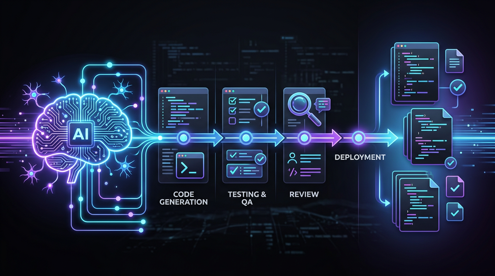
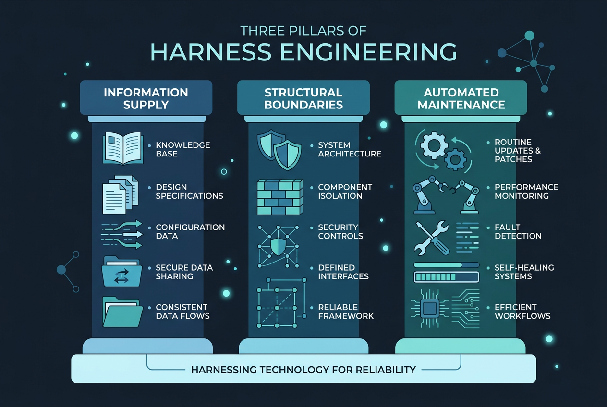
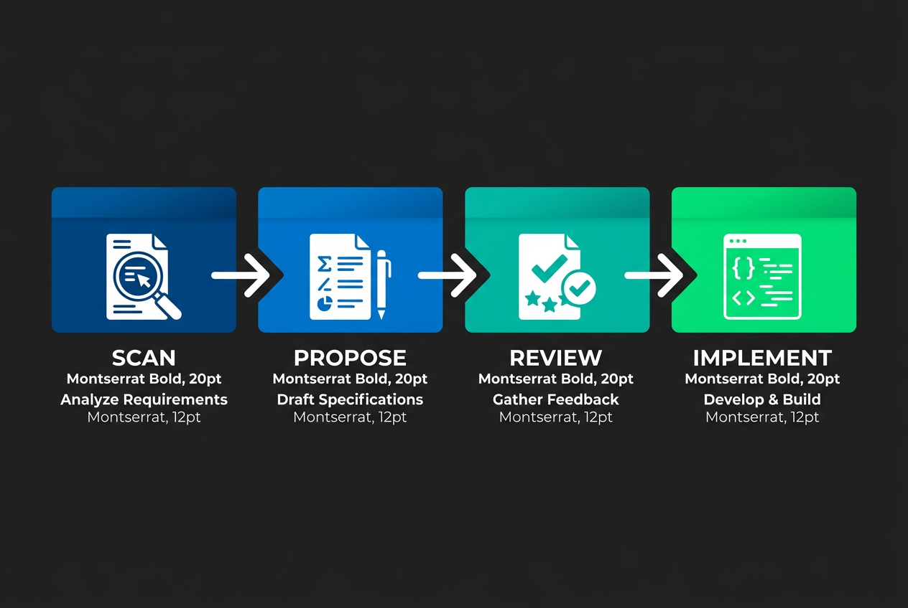

# AI 编程的正确打开方式：从 OpenSpec 到 gstack，一条完整的规范驱动流水线

> 用规范驱动替代「凭感觉聊」，让 AI 写的代码第二天不用推倒重来。



---

## 一、那个让我决定「不能再这样了」的下午

上个月的一个周三，我用 Claude Code 写一个内部工具的后端接口。

对话很流畅。我描述需求，它出代码，我复制粘贴，跑通，继续下一个。四个小时干完了平时两天的活。收工的时候甚至有点膨胀——AI 编程也太爽了。

第二天打开项目，发现问题：

- 前一天写的用户模块和后端接口**对不上**，字段命名不一致
- 有两个功能其实**做重了**，因为我在不同对话里描述了同一件事
- 测试覆盖约等于零——AI 每次都只实现「当前对话里的需求」，从不考虑上一次对话里写了什么

**60% 的代码需要重写。** 省下的时间，加倍还回去了。

这不是 Claude Code 的问题。AI 每次对话都是在一个**全新的上下文窗口**里工作的。你没有给它持久化的规格约束，它就只能根据当下这一刻的只言片语去推理——每次都是「重新理解」，而不是「持续对齐」。

**规范驱动开发（Specification-Driven Development, SDD）** 解决的就是这个问题。

---

## 二、先搞懂两个核心概念

### 2.1 Harness Engineering：给 AI 套上缰绳

Harness Engineering 是一个在 2025-2026 年快速成型的概念。它的核心思想很简单：**你不需要亲手写每一行代码，但你必须亲手设计 AI 编程的约束环境。**

可以理解为——AI Agent 是一匹力气巨大的野马，Harness Engineering 就是你给它套上的缰绳、马鞍和跑道。



Harness Engineering 有三个支柱：

| 支柱           | 做什么                                      | 不给做的后果           |
| -------------- | ------------------------------------------- | ---------------------- |
| **信息供给**   | 提供静态文档 + 动态系统指标，让 AI 理解环境 | AI 靠猜，方向跑偏      |
| **结构边界**   | 代码规范检查、依赖分层约束，机械性强制执行  | 代码风格混乱，架构腐蚀 |
| **自动化维护** | 定期修复文档漂移、清理冗余脚本              | Spec 慢慢变成废纸      |

换句话说：**Harness Engineering 不是让 AI 更聪明，而是让 AI 的输出变得可预测、可追溯、可信任。**

### 2.2 SDD（规范驱动开发）：先写 Spec，再写 Code

传统的 AI 编程方式我称之为「对话驱动」——你敲一段 prompt，AI 回一段代码，然后这段对话的上下文在会话关闭后就蒸发了。

SDD 的做法完全相反：

```
❌ 对话驱动：Prompt → 代码 → 上下文消失
✅ 规范驱动：需求 → Spec文件 → 审查 → 代码实现 → Spec归档
```

四个核心差异：

1. **Spec 是持久化的**：需求以 Markdown 文件形式存在项目仓库里，版本受控，不会随对话关闭而消失
2. **人先审再写**：AI 生成的不是代码，而是「提案」——技术方案、实现清单、风险点——人审完确认后才开始写代码
3. **代码对齐 Spec**：实现阶段 AI 带着 Spec 文件作为上下文约束，保证输出不跑偏
4. **双向可追溯**：任何一个功能，你都能从 Spec 找到代码，从代码回溯到 Spec

**SDD 的本质，是把人类软件工程里「需求文档 → 设计文档 → 实现 → 验收」这套流程，适配到了 AI 编程的场景里。**

---

## 三、工具三件套：OpenSpec、Superpowers、gstack

市面上已经出现了一批围绕 SDD 理念构建的开源工具。我选了三个最落地的，按「管规格 → 管技能 → 管流程」的层次来拆。

### 3.1 OpenSpec：管规格——让需求活下来

[OpenSpec](https://github.com/Fission-AI/OpenSpec) 是一个轻量级的 SDD 框架，核心就一个命令：

```bash
/openspec:proposal 实现用户登录认证模块
```

执行后，AI 不会直接写代码，而是做四件事：

1. **扫描**项目已有的 Spec 文件和源码，理解当前状态
2. **生成**一个结构化提案，包含技术方案、实现清单、更新的 Spec
3. **等待**你审查和修改这个提案
4. **确认后**才进入实现阶段

提案文件长这样：

```
openspec/
├── changes/
│   └── add-user-auth/
│       ├── proposal.md    # 技术方案与决策
│       ├── tasks.md       # 实现清单
│       └── specs/
│           └── auth/
│               └── spec.md  # 更新的功能规格
```

**关键设计**：每个变更都是一个独立目录，包含本次改什么、怎么改、改完后的 Spec 长什么样。审查通过后，`specs/` 目录下的内容会合并到项目的主 Spec 中，形成持续演进的「活文档」。

这解决了第一个问题：**AI 不会丢失上下文，因为上下文写在了文件里。**



### 3.2 Superpowers：管技能——三阶段流水线

[Superpowers](https://github.com/obra/superpowers) 是一个 AI Agent 技能框架，作者把整个开发流程压缩成**三个核心命令**，每一个对应一个不可跳过的阶段：

| 命令            | 角色       | 产出物                                                     |
| --------------- | ---------- | ---------------------------------------------------------- |
| `/brainstorm`   | 头脑风暴   | 通过反问澄清目标，输出经你确认的**设计文档**               |
| `/write-plan`   | 计划工程师 | 把设计文档拆成颗粒度极细的**任务列表**，每条都附带验证步骤 |
| `/execute-plan` | 执行调度官 | 派发独立子 Agent 完成任务，每个任务做两轮严格审查          |

**关键设计**：三个命令是**强制顺序**的——上一个的输出文件是下一个的输入。Superpowers 在文档里明确说，这套流程是「Mandatory workflows, not suggestions」（强制工作流，不是建议）。

典型用法：

```bash
# Claude Code 中安装一次（其他工具看 4.1 节）
/plugin install superpowers@claude-plugins-official

# 阶段 1：先头脑风暴，让 AI 反问到你想明白
/brainstorm 实现一个用户权限管理模块

# 阶段 2：基于上一步的设计文档生成任务列表
/write-plan

# 阶段 3：调度子 Agent 真正动手写代码
/execute-plan
```

每一步都会在仓库里留下文件——设计稿、任务清单、执行日志，所以**整个过程对人类完全透明**，你随时可以介入修改某一步的产出。

Superpowers 跟 OpenSpec 的配合点在于：**OpenSpec 管「规格变更提案」（What changes & why），Superpowers 管「任务执行流水线」（How to deliver）。** 一个解决「向谁交代」，一个解决「谁来动手」。

### 3.3 gstack：管流程——把 Claude Code 变成虚拟工程团队

[gstack](https://github.com/garrytan/gstack) 是 Y Combinator CEO Garry Tan 开源的 Claude Code 技能套件。它的核心卖点：**"Turns Claude Code into a virtual engineering team."**

gstack 把交付一次「Sprint」拆成六个真实角色，每个角色是一个独立的斜杠命令。**关键点是这些命令首尾相接——前一个的输出文件是下一个的必读输入**：

| 命令               | 扮演角色           | 干什么                                               |
| ------------------ | ------------------ | ---------------------------------------------------- |
| `/office-hours`    | **产品策略师**     | 用 6 个尖锐问题逼你重新审视想法，产出 design doc     |
| `/plan-ceo-review` | **创始人/CEO**     | 用 4 种战略视角挑战范围，找出真正的核心价值          |
| `/plan-eng-review` | **工程经理**       | 敲定架构、数据流、边界情况和测试策略                 |
| `/qa`              | **QA Lead**        | 跑真实 URL 测试，发现 bug 用原子提交修复，再回归验证 |
| `/review`          | **Staff Engineer** | 揪出生产级隐患，能自动修的就修，修不了就标出来       |
| `/ship`            | **发布工程师**     | 同步分支、跑测试、覆盖率审计、推代码、开 PR          |

> 💡 用作者的原话：「`/office-hours` 写的设计文档会被 `/plan-ceo-review` 读取；`/plan-eng-review` 写的测试计划会被 `/qa` 接手；`/review` 发现的 bug 会被 `/ship` 验证已修复。每一步都知道前一步做了什么，所以没有任何东西会从缝里漏掉。」

gstack 一共有 **31 个斜杠命令**，除了上面这 6 个核心 Sprint 命令，还包含 `/design-consultation`、`/investigate`、`/canary`、`/benchmark`、`/retro`、`/learn` 等专项工具，可以按需调用。

**这就是它跟 Superpowers 的本质差异**：

- **Superpowers** = 三阶段强制流水线（brainstorm → plan → execute），适合从 0 到 1 的功能开发
- **gstack** = 六角色专家团（PM → CEO → 工程经理 → QA → Staff Eng → Release Eng），适合带评审、带验证、带上线的完整 Sprint

### 3.4 安装：把 gstack 加进来

```bash
# 浅克隆到 Claude skills 目录
git clone --single-branch --depth 1 https://github.com/garrytan/gstack.git ~/.claude/skills/gstack

# 执行初始化脚本
cd ~/.claude/skills/gstack && ./setup
```

安装完成后，重启 Claude Code 会话，所有 31 个 gstack 命令都可用了。

---

## 四、实战：搭建你的 SDD 工作流

现在我们把这五个概念串成一条可落地的流水线。以「开发一个用户认证模块」为例。

### 4.1 环境准备

```bash
# 1. 确保安装了 Claude Code
claude --version

# 2. 在你的项目根目录初始化 OpenSpec
cd your-project
openspec init

# 3. 安装 gstack（作为 Claude skill）
git clone --single-branch --depth 1 https://github.com/garrytan/gstack.git ~/.claude/skills/gstack
cd ~/.claude/skills/gstack && ./setup

# 4. 在 Claude Code 中安装 Superpowers 插件
# 进入 Claude Code 会话后执行：
# /plugin install superpowers@claude-plugins-official
```

> 注：Superpowers 走 Claude Code 的官方插件市场，不需要 git clone。如果用的是其他 AI 编程工具（Gemini CLI、Cursor、Copilot CLI 等），到 [Superpowers 仓库](https://github.com/obra/superpowers) 找对应的安装命令。

### 4.2 第一步：用 OpenSpec 生成提案

在 Claude Code 中：

```bash
/openspec:proposal 为现有项目添加用户认证模块，支持邮箱密码登录和 JWT Token 鉴权
```

OpenSpec 会先扫描项目结构（用的是什么框架、数据库、已有的用户相关代码），然后生成提案。

**你在这个阶段要做的事**：审查提案，确认技术方案合理，修改你不认可的部分。**这是整个流程里最关键的人工干预点。** 方向对了，后面都是执行；方向错了，后面全是返工。

提案确认后，`openspec/changes/add-user-auth/` 目录下会有三个文件：

- `proposal.md`：方案概述和决策理由
- `tasks.md`：实现任务清单
- `specs/auth/spec.md`：更新后的认证模块规格

### 4.3 第二步：选执行框架——Superpowers 还是 gstack？

OpenSpec 写好提案后，**接下来用什么工具来真正动手，是个二选一**：

- **Superpowers**（4.3）：三阶段强制流水线，适合需求清晰、想要快速从规格到代码的场景
- **gstack**（4.4）：六角色专家团 Sprint，适合需要严格评审、QA、上线流程的场景

我下面分别演示这两条路径。**实际项目里你只需要选一条。** 如果团队习惯敏捷迭代，选 gstack 拿到完整 Sprint；如果是个人 / 小团队快速开发，选 Superpowers 更轻。

#### 路径 A：Superpowers 三阶段

**阶段 1：`/brainstorm`** — 把 OpenSpec 的提案当作上下文，让 AI 反问到细节落地：

```bash
/brainstorm 基于 openspec/changes/add-user-auth/proposal.md，细化用户认证模块的实现方案
```

Superpowers 会主动问你：注册要不要邮箱验证？登录失败几次锁定？Token 多久过期？Refresh Token 要不要？你回答完，它会写一份 design doc 让你确认。

**阶段 2：`/write-plan`** — 把 design doc 拆成可执行的任务列表：

```bash
/write-plan
```

输出的任务列表大概长这样（每条都有验证步骤）：

```
[1] User 数据模型 + 数据库迁移
    ✓ 验证：迁移文件能 up/down 来回切换
[2] 注册接口 POST /api/auth/register
    ✓ 验证：curl 测试，密码已被 bcrypt 哈希
[3] 登录接口 POST /api/auth/login
    ✓ 验证：返回结构化 JWT，含 exp 字段
[4] 认证中间件
    ✓ 验证：受保护路由无 token 返回 401
```

**阶段 3：`/execute-plan`** — 派子 Agent 真正动手：

```bash
/execute-plan
```

Superpowers 会为每个任务派一个独立的子 Agent，**每个任务做两轮审查**（实现 → 自查 → 派另一个 Agent 复审），失败自动重做。整个过程你只需要在它停下来问你关键决策时介入。

#### 路径 B：gstack 六角色 Sprint

如果你需要的不只是「写完代码」，而是要**评审、QA、上线**全流程，那就用 gstack。六个命令依次跑下来：

**Step 1：`/office-hours`** — 产品策略反问

```bash
/office-hours 我要为内部工具加用户认证模块，主要给后台管理员用
```

它会问 6 个尖锐问题，比如：「为什么不直接用 SSO？」「如果只给管理员用，注册流程真的需要吗？」**目的是逼你重新审视方案，避免做没必要的功能。** 输出 `design.md`。

**Step 2：`/plan-ceo-review`** — 老板视角挑刺

```bash
/plan-ceo-review
```

读上一步的 design doc，从战略价值、机会成本、最小可行边界等角度反问。这一步经常会让你砍掉 30% 的需求——而砍掉的部分，恰恰是最容易翻车的部分。

**Step 3：`/plan-eng-review`** — 工程经理把关

```bash
/plan-eng-review
```

敲定架构、数据流、边界情况、测试策略。输出**测试矩阵**（test plan），下一步 `/qa` 直接读这个文件。

**Step 4：`/qa`** — QA Lead 验证

```bash
/qa
```

读 `/plan-eng-review` 写的测试矩阵，跑真实接口测试。发现 bug 就用**原子提交**修复（一次提交只修一个问题），修完再回归验证，最后自动生成回归测试加进测试套件。

**Step 5：`/review`** — Staff Engineer 终审

```bash
/review
```

抓生产级隐患：JWT secret 是否硬编码、密码哈希算法对不对、有没有 SQL 注入、限流加了没。能自动修的它就修了，修不了的会标出来等你决策。

**Step 6：`/ship`** — 发布

```bash
/ship
```

同步分支 → 跑全量测试 → 审计覆盖率 → 推代码 → 开 PR。**这一步的关键产出是一份「可审计的发布记录」**：什么时候发的、覆盖率多少、跑了哪些测试、PR 链接。

整条链路跑完，你的 commit 历史会非常清晰：每条 commit 都对应一个具体的子任务或修复，PR 描述里有完整的测试报告。这就是「可信任的 AI 输出」。

### 4.4 第三步：回环验证——Spec 归档

全部完成后，最后一步往往被忽略但最关键：

```bash
# 将验证通过的 Spec 合并到项目主 Spec
openspec archive add-user-auth

# 提交所有变更（Spec + 代码）
git add openspec/ src/
git commit -m "feat(auth): 添加用户认证模块

基于 OpenSpec 提案 add-user-auth 实现。
详见 openspec/specs/auth/spec.md"
```

**这个 commit 的价值**：任何人（包括三个月后的你自己和 AI Agent）都能从 Spec 文件理解这个模块的设计意图、接口约定和边界条件。代码是「怎么实现的」，Spec 是「为什么这么实现」。

---

## 五、这套流水线的真正价值

回头想那个让我重写 60% 代码的下午，问题不是 AI 不够聪明，而是**我没有给它一个不该跑偏的理由**。

SDD 五件套的分工是这样的：

```
┌─────────────────────────────────────────────┐
│           Harness Engineering                │
│       （顶层哲学：约束环境设计）              │
├─────────────────────────────────────────────┤
│              SDD 方法论                      │
│        （先写 Spec，再写 Code）               │
├───────────────┬───────────────┬─────────────┤
│   OpenSpec    │  Superpowers  │   gstack    │
│  规格变更提案  │   三阶段流水线  │  六角色 Sprint │
│  proposal.md  │  brainstorm→  │ office-hours│
│  + tasks.md   │  plan→execute │  →…→ ship   │
└───────────────┴───────────────┴─────────────┘
        管「做什么」     ↓ 二选一执行 ↓
                    管「怎么做」 / 「怎么交付」
```

**跟传统 AI 编程方式的本质区别**：

|                   | 传统 AI 编程           | SDD 流水线                     |
| ----------------- | ---------------------- | ------------------------------ |
| 需求在哪          | 聊天记录里，关了就没了 | Markdown 文件，Git 版本控制    |
| AI 什么时候写代码 | 立刻                   | 审查提案通过后                 |
| 上下文持久性      | 一次对话               | 永久（Spec 文件）              |
| 可追溯性          | "我好像让 AI 改过这个" | commit → Spec → 代码，完整链路 |
| 接手成本          | 重新问 AI              | 读 Spec 即可                   |

### 适合什么样的团队和项目？

这套流水线不是银弹。它最适合以下场景：

- **团队协作项目**：多人 + 多 AI Agent 同时推进，必须有统一的 Spec 作为对齐基准
- **长期维护的项目**：三个月后你完全不记得当时为什么这么设计，Spec 是你的「外置记忆」
- **有一定复杂度的功能**：简单 CRUD 可能用不上，但涉及多个模块联动的需求，SDD 的价值会充分体现
- **需要合规或审计的场景**：Spec → 提案 → 实现 → 验收的完整链条天然满足审计追溯需求

**不适合的场景**：

- 一次性脚本或原型验证——成本大于收益
- 需求极度确定且简单的单文件改动——直接写更快

SDD 不代表「变慢」，它代表**把思考前置，把返工减少**。刚开始会觉得比直接让 AI 写代码多了一步，但做过两个项目之后你就会发现——那多出来的一步，省掉的是成倍的返工时间。
