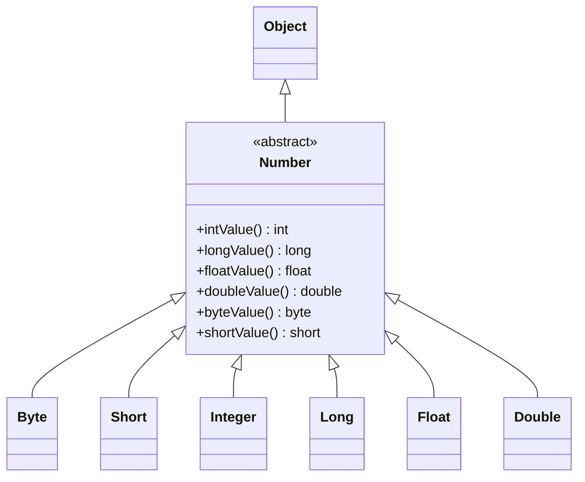
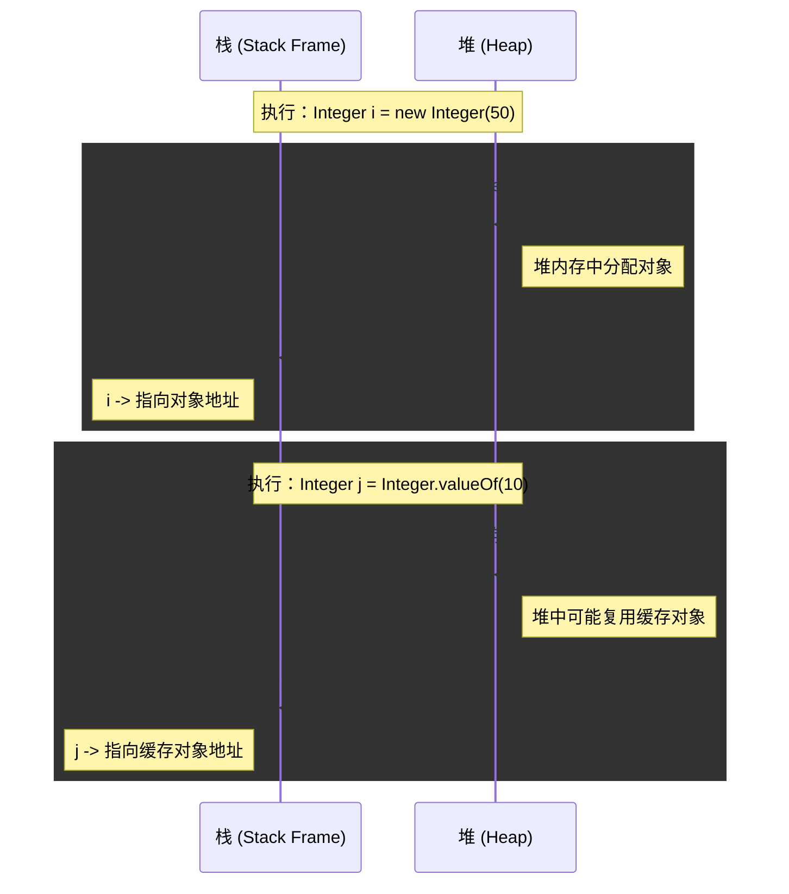
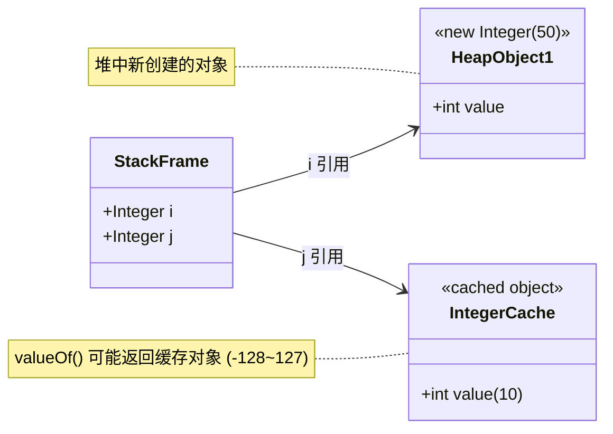
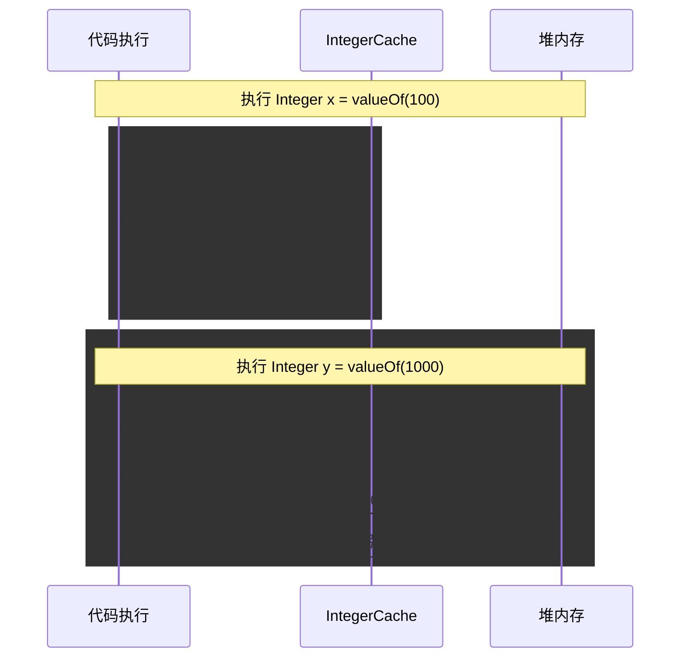

# 基础加强

## 思维导图概览内容

<PreviewMarkmapPath />

## 异常机制

**异常机制的本质**

> 当程序出现错误，程序安全的、继续执行的机制。

案例代码

```java
try {
  copyFile("d:/a.txt", "e:/a.txt")
} catch (Exception e) {
  e.printStackTrace();
}
```

### Exception 概念

所谓异常处理，就是指程序在出现问题时依然可以正确的执行完。

异常的分析

```java
public class Test {
  public static void main(String[] args) {
    System.out.println("111");
    int a = 1 / 0;
    System.out.println("222");
  }
}
```

```
Exception in thread "main" java.lang.ArithmeticException: / by zero  # 算数异常
```

当前代码只能执行到输出`"111"`，如果添加`try catch`，则能继续往前走，输出`"222"`

```java
public class Test {
  public static void main(String[] args) {
    System.out.println("111");
    try {
      int a = 1 / 0;
    } catch (Exception e) {
      e.printStackTrace();
    }
    System.out.println("222");
  }
}
```

**捕获异常：**JRE 得到该 异常之后，寻找相应的代码来处理该异常。JRE 在方法的调用栈中查找，从生成异常的方法开始回溯，直到找到相应的异常处理代码为止。

### 异常分类

所有的异常对象都是派生于`Throwable`类的一个实例。如果内置的异常类不能够满足需要，还可以创建自己的异常类。

所有的异常的根类是`java.lang.Throwable`，它下面又派生了 2 个子类：`Error`和`Exception`，我们通常只能管`Exception`。

## 布尔型(boolean)

1. boolean 类型有 2 个常量值，true 和 false
2. 在内存中占用一个字节【布尔数组】或 4 个字节【一般时候都是 4 个字节】，不可以使用 0 或非 0的整数替代 true 和 false，这点和 C 语言不一样

```java
public class TestBoolean {
  public static void main(String[] args) {
    boolean b1 = true;
    boolean b2 = false;

    if (b1) {
      System.out.println("b1是true!");
    } else {
      System.out.println("b1是false!");
    }
  }
}
```

> 尽量避免写`b1 == true`来判断，虽然是正确的，但是不推荐。

## 方法的重载

> 一个类中可以定义多个名称相同，但参数列表不同的方法。

构成方法重载的条件

1. 形参列表不同的含义
   1. 形参类型不同
   2. 形参个数不同
   3. 形参顺序不同
2. 只有返回值不同，不构成方法的重载
3. 只有形参的名称不同，不构成方法的重载

## static

**静态变量/静态方法生命周期和类相同，在整个程序执行期间都有效。**

- 为该类的公共变量，属于类，被该类的所有实例共享，在类载入的时候被初始化
- `static`成员变量只有一份
- 一般用“类名.类变量/方法” 来调用
- 在`static`方法中不可直接访问非`static`的成员

> 静态初始化块

构造方法用于对象的普通属性初始化

静态初始化块，用于类的初始化操作，初始化静态属性

在静态初始化块中不能直接访问非`static`成员

**注意事项**

静态初始化块执行顺序：上溯到`Object`类，先执行`Object`的静态初始化块，再向下执行子类的静态初始化块，直到类的静态初始化块为止。构造方法执行顺序和上面顺序一样

## try-with-resource 自动关闭 Closable 接口的资源

JVM 的垃圾回收机制可以对内部资源实现自动回收，给开发者带来了极大的便利。但是 JVM 对外部资源(调用了底层操作系统的资源)的引用却无法自动回收，例如数据库连接，网络连接以及输入输出 IO 流等。这些连接就需要我们手动去关闭，不然会导致外部资源泄露，连接池溢出以及文件被异常占用等。

JDK7 之后新增了`try-with-resource`，它可以自动关闭实现了`Closable`接口的类。

```java
public class Test01 {
  public static void main(String[] args) {
    try (FileReader reader = new FileReader("d:/a.txt")) // 这个里面的代码会自动关闭连接 {
      // ...
      // ...
    } catch (Exception e) {
      e.printStackTrace();
    }
  }
}
```

在编译时，仍然会编译成`try-catch-finally`，只是代码变简单了。

## 基本数据类型的包装类

Java 为每一个基本数据类型提供了相应的包装类。我们经常用到的基本数据类型就不是对象，但是我们在实际应用中经常需要将基本数据类型转化为对象，以便于操作。为了解决这个不足，Java 在设计类时为每个基本数据类型设计了一个对应的类进行代表。包装类位于`java.lang`包

| 基本数据类型 |  包装类   |
| :----------: | :-------: |
|     byte     |   Byte    |
|   boolean    |  Boolean  |
|    short     |   Short   |
|     char     | Character |
|     int      |  Integer  |
|     long     |   Long    |
|    float     |   Float   |
|    double    |  Double   |

**用的最多的是 `Integer`和`Long`**

## Number 类继承体系



**说明：**

1. `Number` 是一个抽象类，位于 `java.lang`包，是数字包装类的父类
2. `Number` 提供了将数值转换为其基本类型的常用方法
3. `Byte`, `Short`, `Integer`, `Long`, `Float`, `Double`都继承自`Number` 类

### 初识包装类

```java
public class Test {
  public static void main(String[] args) {
    Integer i = new Integer(50); // 从 jdk9 开始被废弃
    Integer j = Integer.valueOf(10); // 官方推荐
  }
}
```

### 内存分析（栈与堆）



**或者使用类图形式展示内存引用关系：**



`valueOf`源码里有对应的缓存的过程。

```java
public static Integer valueOf(int i) {
  if (i >= IntegerCache.low && i <= IntegerCache.high)
    return IntegerCache[i + (-IntegerCache.low)];
  return new Integer(i);
}
```

```java
public class Test {
  public static void main(String[] args) {
    Integer i = new Integer(50); // 从 jdk9 开始被废弃
    Integer j = Integer.valueOf(10); // 官方推荐

    int a = j.intValue(); // 把包装类对象转换成基本数据类型
    double b = j.doubleValue();

    // 把字符串转换成数字 不能包含非数字的字符串
    Integer m = Integer.valueOf("123");
  }
}
```

### 主要用途

1. 作为和基本数据类型对应的类型存在，方便涉及到对象的操作，如`Object[]`、集合等的操作
2. 包含每种基本数据类型的相关属性如最大值、最小值等，以及相关的操作方法(这些操作方法的作用是在基本数据类型、包装类对象、字符串对象、字符串之间提供相互之间的转化！)

### 自动装箱和拆箱

> 将基本数据类型和包装类型自动转化。

自动装箱

```java
Integer i = 100; // 自动装箱，相当于编译器自动为您作以下的语法编译：
Integer i = Integer.valueOf(100);
```

自动拆箱

```java
Integer x = 100;
int y = x; // 编译器：int y = x.intValue();
```

**注意：空指针异常**

```java
Integer z = null;
int z2 = z; // 编译器: int z2 = z.intValue();
```

### 包装类的缓存问题

```java
Integer x1 = 100; // Integer x1 = Integer.valueOf(100);
Integer x2 = 100;
Integer x3 = 1000;
Integer x4 = 1000;

System.out.println(x1 == x2); // true
System.out.println(x3 == x4); // false

System.out.println(x1.equals(x2)); // true 值相等
System.out.println(x3.equals(x4)); // true 值相等
```

### 包装类缓存机制详解

**现象解释：**

- `x1 == x2` 返回 `true`：因为 `100` 在缓存范围 `-128~127` 内，`valueOf()` 返回的是缓存池中的同一个对象引用
- `x3 == x4` 返回 `false`：因为 `1000` 超出缓存范围，每次 `valueOf()` 都会创建新的对象
- `equals()` 比较的是值，所以无论是否缓存都返回 `true`

**Integer Cache 工作原理：**



**Java 源码实现（JDK 8）：**

```java
private static class IntegerCache {
    static final int low = -128;
    static final int high;
    static final Integer cache[];

    static {
        // 初始化缓存数组，加载 -128 到 high 之间的所有整数对象
        high = sun.misc.VM.getIntProperty("sun.java.lang.Integer.cache.high", 127);
        cache = new Integer[high - low + 1];
        for (int i = 0; i < cache.length; i++) {
            cache[i] = new Integer(i + low);
        }
    }
}

public static Integer valueOf(int i) {
    if (i >= IntegerCache.low && i <= IntegerCache.high)
        return IntegerCache[i + (-IntegerCache.low)]; // 直接返回缓存对象
    return new Integer(i); // 创建新对象
}
```

**关键要点：**

1. **缓存范围**：默认为 `-128 ~ 127`，可通过 JVM 参数 `sun.java.lang.Integer.cache.high` 调整
2. **== 运算符**：比较的是引用地址（内存地址），不是值
3. **equals() 方法**：`Integer`重写了`equals()`，比较的是数值大小
4. **最佳实践**：比较数值用 `equals()`，不要使用`==`

**扩展思考：**

- `boolean`、`byte`、`short`、`char` 等包装类也有类似的小数值缓存机制
- Java 通过缓存减少内存占用，提高性能


## 字符串相关类

`String`类代表的是不可变的字符序列

`StringBuilder`和`StringBuffer`类代表的是可变的字符序列

**可变还是不可变都是`final`**来决定的

**底层都是`unicode`**字符集


```java
public final class String {
  /** The value is used for character storage. */
  private final char value[];
}
```


### StringBuilder 和 StringBuffer

- StringBuffer：线程安全，做同步检查，效率低
- StringBuilder：线程不安全，不做线程同步检查，效率高，一般使用它

