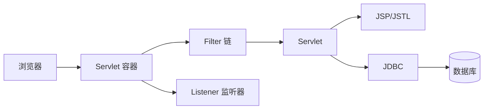

# JavaEE 基础核心知识与常见面试题

JavaEE（Jakarta EE）是一组企业级 Java 规范。学习基础时，重点不是记住某个框架注解，而是理解 Web 容器如何接收请求、Servlet 如何处理请求，以及 Java 程序如何访问数据库。

## 一、JavaEE Web 应用的组成

一个传统 JavaEE Web 应用通常运行在 Tomcat、Jetty 等 Servlet 容器中，打包为 `war`，目录中包含 `WEB-INF/web.xml`、Java 类、JSP 和静态资源。



Servlet 容器负责创建组件、分发请求、管理线程、维护 Session，并在应用停止时销毁组件。

## 二、HTTP 基础

HTTP 请求由请求行、请求头、空行和可选请求体组成；响应由状态行、响应头、空行和响应体组成。

- `GET` 通常用于获取资源，参数常在 URL 中，应该是幂等的。
- `POST` 通常用于提交数据，参数常在请求体中，不保证幂等。
- `200` 表示成功，`301/302` 表示重定向，`400` 表示请求有问题，`401/403` 表示认证或权限问题，`404` 表示资源不存在，`500` 表示服务端异常。

HTTP 本身无状态。Cookie 放在浏览器端，由浏览器按域名和路径自动发送；Session 数据保存在服务端，客户端通常只保存 `JSESSIONID`。

## 三、Servlet 生命周期与线程安全

Servlet 生命周期由容器管理：

1. 创建实例并调用 `init()`。
2. 每次请求调用 `service()`，再分派到 `doGet()` 或 `doPost()`。
3. 应用停止时调用 `destroy()`。

同一个 Servlet 实例可能被多个线程同时调用。因此不要把当前请求的数据放在成员变量中，应使用局部变量。

```java
@WebServlet("/hello")
public class HelloServlet extends HttpServlet {
    @Override
    protected void doGet(HttpServletRequest req, HttpServletResponse resp)
            throws IOException {
        resp.setContentType("text/plain;charset=UTF-8");
        resp.getWriter().println("Hello JavaEE");
    }
}
```

## 四、请求与响应对象

`HttpServletRequest` 用于读取请求信息：参数、请求头、Cookie、Session 和请求路径；`HttpServletResponse` 用于设置状态码、响应头、Cookie 和响应体。

请求参数来自不可信输入，必须校验。处理中文参数时要正确设置编码，例如在读取 POST 参数前调用 `req.setCharacterEncoding("UTF-8")`。

转发和重定向的区别：

| 对比 | 转发 `forward` | 重定向 `sendRedirect` |
|---|---|---|
| 请求次数 | 一次 | 两次 |
| URL 是否改变 | 不改变 | 改变 |
| 是否共享 request | 共享 | 不共享 |
| 常见用途 | 服务端页面跳转 | 提交后跳转，避免重复提交 |

## 五、Filter 与 Listener

Filter 可以在请求到达 Servlet 前后执行，适合统一编码、登录校验、访问日志和耗时统计。多个 Filter 按配置顺序形成调用链，必须调用 `chain.doFilter()` 才能继续执行后续组件。

Listener 用于监听容器或对象的生命周期事件，例如：

- `ServletContextListener`：应用启动和停止。
- `HttpSessionListener`：Session 创建和销毁。
- `ServletRequestListener`：请求创建和销毁。

Filter 处理“每次请求”，Listener 处理“生命周期事件”，两者职责不同。

## 六、Cookie 与 Session

Cookie 适合保存非敏感、少量的客户端标识；Session 适合保存服务端会话数据。登录成功后，服务端创建 Session 并返回 `JSESSIONID`，后续请求凭此找到用户会话。

安全设置应至少考虑 `HttpOnly`、`Secure`、合理的 `Max-Age` 和 `SameSite`。注销时要销毁服务端 Session，不能只删除页面上的一个按钮状态。

## 七、JSP、EL 与 JSTL

JSP 是在服务端生成 HTML 的模板技术，最终会被容器翻译成 Servlet。EL 用 `${user.name}` 读取属性，JSTL 提供条件判断和循环标签。

现在的项目常用前后端分离替代 JSP，但理解 JSP 仍有助于理解 Servlet 的请求转发和服务端渲染。页面展示逻辑应放在 JSP/JSTL 中，数据库查询和复杂业务逻辑应放在 Java 类中。

## 八、JDBC 基础

JDBC 是 Java 访问关系型数据库的标准 API，基本步骤是：加载驱动、获取连接、创建预编译语句、执行 SQL、读取结果、关闭资源。

```java
String sql = "select id, name from user where id = ?";
try (Connection c = dataSource.getConnection();
     PreparedStatement ps = c.prepareStatement(sql)) {
    ps.setLong(1, id);
    try (ResultSet rs = ps.executeQuery()) {
        if (rs.next()) return rs.getString("name");
    }
}
return null;
```

`PreparedStatement` 能复用执行计划，并避免把用户输入直接拼接进 SQL。生产环境通常使用连接池，避免每次请求重复建立数据库连接。

## 九、部署与作用域

常见 JavaEE 作用域包括：

- `page`：当前 JSP 页面。
- `request`：一次请求和转发链路。
- `session`：一个浏览器会话。
- `application`：整个 Web 应用。

作用域越大，数据生命周期越长，越要注意并发和内存占用。部署 `war` 后，容器读取应用配置并创建 Servlet、Filter、Listener 等组件。

## 十、常见面试题

### 1. Servlet 是单例的吗？

通常一个 URL 映射对应一个 Servlet 实例，多个请求由不同线程并发调用它。因此 Servlet 不是“每次请求创建一个对象”，成员变量也不能保存请求状态。

### 2. Filter 和 Interceptor 有什么区别？

Filter 属于 Servlet 规范，由容器调用，可以拦截所有进入 Web 应用的请求；Interceptor 通常是框架提供的能力，只能拦截框架已经接管的请求。JavaEE 基础优先掌握 Filter。

### 3. Cookie 和 Session 有什么区别？

Cookie 主要保存在客户端，Session 主要保存在服务端；Cookie 会随请求发送，Session 通过 Session ID 找到服务端数据。Session 并不等于“数据存在浏览器里”。

### 4. 转发和重定向有什么区别？

转发发生在服务端，浏览器只发一次请求且 URL 不变；重定向让浏览器重新发起请求，URL 会改变，原 request 数据也不会保留。

### 5. `doGet` 和 `doPost` 有什么区别？

两者都是 HTTP 方法对应的 Servlet 处理入口。GET 参数通常在 URL 中，适合读取；POST 数据通常在请求体中，适合提交。真正的安全性不能只靠选择 POST，还要做鉴权、校验和 CSRF 防护。

### 6. JSP 最终是什么？

JSP 首次访问时会被容器翻译并编译成 Servlet，之后由这个 Servlet 生成响应。因此 JSP 不是浏览器直接执行的 Java 页面。

### 7. JDBC 为什么要使用连接池？

建立数据库连接涉及网络和认证，成本较高。连接池预先创建并复用连接，减少开销，同时可以限制并发连接数，保护数据库。

### 8. 如何防止 SQL 注入？

使用 `PreparedStatement` 的参数绑定，不拼接用户输入；同时限制数据库账号权限，并对输入做业务校验。
