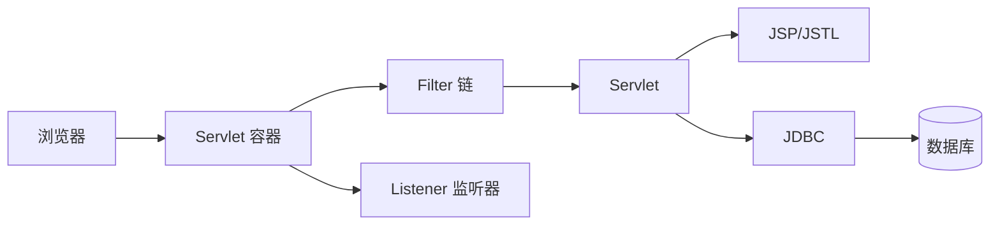
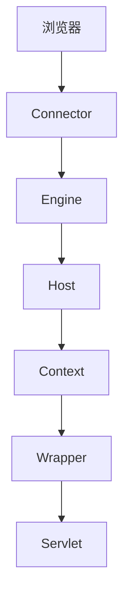
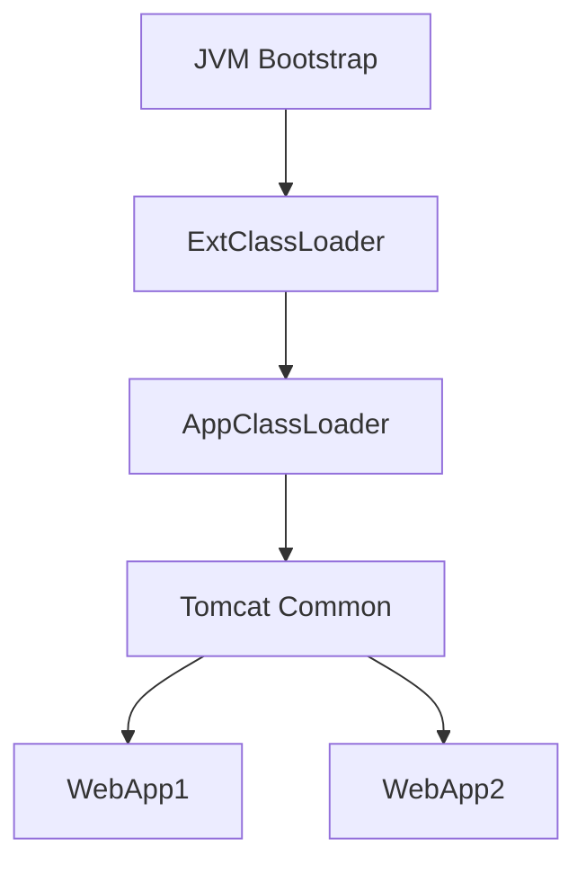
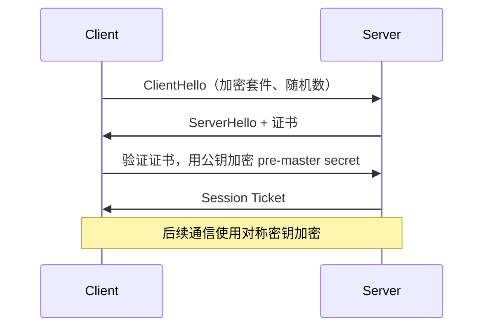

# JavaEE 基础核心知识与常见面试题

JavaEE（Jakarta EE）是一组企业级 Java 规范。学习基础时，重点不是记住某个框架注解，而是理解 Web 容器如何接收请求、Servlet 如何处理请求，以及 Java 程序如何访问数据库。

## 一、JavaEE Web 应用的组成

一个传统 JavaEE Web 应用通常运行在 Tomcat、Jetty 等 Servlet 容器中，打包为 `war`，目录中包含 `WEB-INF/web.xml`、Java 类、JSP 和静态资源。



Servlet 容器负责创建组件、分发请求、管理线程、维护 Session，并在应用停止时销毁组件。

## 二、HTTP 基础

HTTP 请求由请求行、请求头、空行和可选请求体组成；响应由状态行、响应头、空行和响应体组成。

- `GET` 通常用于获取资源，参数常在 URL 中，应该是幂等的。
- `POST` 通常用于提交数据，参数常在请求体中，不保证幂等。
- `200` 表示成功，`301/302` 表示重定向，`400` 表示请求有问题，`401/403` 表示认证或权限问题，`404` 表示资源不存在，`500` 表示服务端异常。

HTTP 本身无状态。Cookie 放在浏览器端，由浏览器按域名和路径自动发送；Session 数据保存在服务端，客户端通常只保存 `JSESSIONID`。

## 三、Servlet 生命周期与线程安全

Servlet 生命周期由容器管理：

1. 创建实例并调用 `init()`。
2. 每次请求调用 `service()`，再分派到 `doGet()` 或 `doPost()`。
3. 应用停止时调用 `destroy()`。

同一个 Servlet 实例可能被多个线程同时调用。因此不要把当前请求的数据放在成员变量中，应使用局部变量。

```java
@WebServlet("/hello")
public class HelloServlet extends HttpServlet {
    @Override
    protected void doGet(HttpServletRequest req, HttpServletResponse resp)
            throws IOException {
        resp.setContentType("text/plain;charset=UTF-8");
        resp.getWriter().println("Hello JavaEE");
    }
}
```

## 四、请求与响应对象

`HttpServletRequest` 用于读取请求信息：参数、请求头、Cookie、Session 和请求路径；`HttpServletResponse` 用于设置状态码、响应头、Cookie 和响应体。

请求参数来自不可信输入，必须校验。处理中文参数时要正确设置编码，例如在读取 POST 参数前调用 `req.setCharacterEncoding("UTF-8")`。

转发和重定向的区别：

| 对比 | 转发 `forward` | 重定向 `sendRedirect` |
|---|---|---|
| 请求次数 | 一次 | 两次 |
| URL 是否改变 | 不改变 | 改变 |
| 是否共享 request | 共享 | 不共享 |
| 常见用途 | 服务端页面跳转 | 提交后跳转，避免重复提交 |

## 五、Filter 与 Listener

Filter 可以在请求到达 Servlet 前后执行，适合统一编码、登录校验、访问日志和耗时统计。多个 Filter 按配置顺序形成调用链，必须调用 `chain.doFilter()` 才能继续执行后续组件。

Listener 用于监听容器或对象的生命周期事件，例如：

- `ServletContextListener`：应用启动和停止。
- `HttpSessionListener`：Session 创建和销毁。
- `ServletRequestListener`：请求创建和销毁。

Filter 处理“每次请求”，Listener 处理“生命周期事件”，两者职责不同。

## 六、Cookie 与 Session

Cookie 适合保存非敏感、少量的客户端标识；Session 适合保存服务端会话数据。登录成功后，服务端创建 Session 并返回 `JSESSIONID`，后续请求凭此找到用户会话。

安全设置应至少考虑 `HttpOnly`、`Secure`、合理的 `Max-Age` 和 `SameSite`。注销时要销毁服务端 Session，不能只删除页面上的一个按钮状态。

## 七、JSP、EL 与 JSTL

JSP 是在服务端生成 HTML 的模板技术，最终会被容器翻译成 Servlet。EL 用 `${user.name}` 读取属性，JSTL 提供条件判断和循环标签。

现在的项目常用前后端分离替代 JSP，但理解 JSP 仍有助于理解 Servlet 的请求转发和服务端渲染。页面展示逻辑应放在 JSP/JSTL 中，数据库查询和复杂业务逻辑应放在 Java 类中。

## 八、JDBC 基础

JDBC 是 Java 访问关系型数据库的标准 API，基本步骤是：加载驱动、获取连接、创建预编译语句、执行 SQL、读取结果、关闭资源。

```java
String sql = "select id, name from user where id = ?";
try (Connection c = dataSource.getConnection();
     PreparedStatement ps = c.prepareStatement(sql)) {
    ps.setLong(1, id);
    try (ResultSet rs = ps.executeQuery()) {
        if (rs.next()) return rs.getString("name");
    }
}
return null;
```

`PreparedStatement` 能复用执行计划，并避免把用户输入直接拼接进 SQL。生产环境通常使用连接池，避免每次请求重复建立数据库连接。

## 九、部署与作用域

常见 JavaEE 作用域包括：

- `page`：当前 JSP 页面。
- `request`：一次请求和转发链路。
- `session`：一个浏览器会话。
- `application`：整个 Web 应用。

作用域越大，数据生命周期越长，越要注意并发和内存占用。部署 `war` 后，容器读取应用配置并创建 Servlet、Filter、Listener 等组件。

## 十、常见面试题

### 1. Servlet 是单例的吗？

通常一个 URL 映射对应一个 Servlet 实例，多个请求由不同线程并发调用它。因此 Servlet 不是“每次请求创建一个对象”，成员变量也不能保存请求状态。

### 2. Filter 和 Interceptor 有什么区别？

Filter 属于 Servlet 规范，由容器调用，可以拦截所有进入 Web 应用的请求；Interceptor 通常是框架提供的能力，只能拦截框架已经接管的请求。JavaEE 基础优先掌握 Filter。

### 3. Cookie 和 Session 有什么区别？

Cookie 主要保存在客户端，Session 主要保存在服务端；Cookie 会随请求发送，Session 通过 Session ID 找到服务端数据。Session 并不等于“数据存在浏览器里”。

### 4. 转发和重定向有什么区别？

转发发生在服务端，浏览器只发一次请求且 URL 不变；重定向让浏览器重新发起请求，URL 会改变，原 request 数据也不会保留。

### 5. `doGet` 和 `doPost` 有什么区别？

两者都是 HTTP 方法对应的 Servlet 处理入口。GET 参数通常在 URL 中，适合读取；POST 数据通常在请求体中，适合提交。真正的安全性不能只靠选择 POST，还要做鉴权、校验和 CSRF 防护。

### 6. JSP 最终是什么？

JSP 首次访问时会被容器翻译并编译成 Servlet，之后由这个 Servlet 生成响应。因此 JSP 不是浏览器直接执行的 Java 页面。

### 7. JDBC 为什么要使用连接池？

建立数据库连接涉及网络和认证，成本较高。连接池预先创建并复用连接，减少开销，同时可以限制并发连接数，保护数据库。

### 8. 如何防止 SQL 注入？

使用 `PreparedStatement` 的参数绑定，不拼接用户输入；同时限制数据库账号权限，并对输入做业务校验。

## 十一、Tomcat 架构与请求处理流程

Tomcat 是最常用的 Servlet 容器实现，理解它的架构有助于理解整个 JavaEE 应用是怎么运转的，也是后端面试的高频考点。



核心组件：

- Server：整个 Tomcat 实例，一个 JVM 只有一个。
- Service：包含一个或多个 Connector 与一个 Engine。
- Connector：接收客户端连接并解析 HTTP，可以是 BIO、NIO、APR 三种模式。
- Container：Engine > Host > Context > Wrapper 四层容器，负责具体处理请求。
- Wrapper：每个 Servlet 对应一个 Wrapper，是请求分发的最小单元。

### 11.1 请求处理流程

```
连接 -> Acceptor -> Poller(NIO Selector) -> Executor
-> Http11Processor -> CoyoteAdapter -> Engine
-> Host -> Context -> Wrapper -> FilterChain -> Servlet.service()
```

一次请求会经过多个组件协作处理，最终才到达业务 Servlet。

### 11.2 Connector 三种 IO 模型

| 模型 | 线程模型 | 适用场景 |
|---|---|---|
| BIO | 一连接一线程 | 已废弃 |
| NIO | 多路复用（默认） | 并发量中等偏上，推荐 |
| APR | JNI + 本地库 | 对性能要求极致的场景 |

NIO 模式下，Acceptor 接收连接、注册到 Poller 的 Selector，Poller 监测到读事件后交给 Executor 线程池处理。

### 11.3 类加载机制（打破双亲委派）



Tomcat 自定义 `WebAppClassLoader`，先从 Web 应用自身目录加载类，没找到再委托父加载器。这一打破双亲委派的设计是为了实现不同 Web 应用之间的类隔离，让每个应用可以使用不同版本的依赖。

### 11.4 Tomcat 性能优化要点

- Connector 调优：`maxThreads`、`acceptCount`、`maxConnections`、`enableLookups=false`。
- 启用 HTTP/2，开启压缩，配置 `compressableMimeType`。
- JVM 调优：合理设置堆大小、新生代比例，使用 G1/ZGC 收集器。
- 数据库连接池参数调优（最大连接数、超时时间）。
- 静态资源交给 Nginx / CDN，不走 Servlet 容器。

## 十二、HTTP 协议深入

### 12.1 HTTP 演进

- HTTP/1.0：每个请求独立 TCP 连接（短连接）。
- HTTP/1.1：默认长连接（`Connection: keep-alive`），支持管线化、Chunked、Host 头、`OPTIONS` 预检。
- HTTP/2：二进制分帧、多路复用、HPACK 头部压缩、服务器推送，从协议层解决 HTTP/1.1 的队头阻塞。
- HTTP/3：基于 QUIC（UDP）+ TLS 1.3，从传输层解决 TCP 队头阻塞，握手更快。

### 12.2 HTTPS 握手流程



HTTPS = HTTP + TLS/SSL，默认 443 端口，需要 CA 证书。握手阶段的非对称加密用于协商对称密钥，实际数据传输使用对称加密。

### 12.3 跨域（CORS）

同源策略要求 协议 + 域名 + 端口 三者一致，否则浏览器会拦截响应。

服务端放行跨域需要响应头：

- `Access-Control-Allow-Origin`
- `Access-Control-Allow-Methods`
- `Access-Control-Allow-Headers`
- `Access-Control-Allow-Credentials`

简单请求直接发送，复杂请求（自定义头、`Content-Type=application/json` 等）会先发 `OPTIONS` 预检请求。

### 12.4 CSRF 防御

- 校验 `Origin` / `Referer` 头部是否合法。
- 请求携带 CSRF Token，服务端校验。
- Cookie 设置 `SameSite=Strict` 或 `SameSite=Lax`。
- 关键操作要求二次验证或重新输入密码。

## 十三、Servlet 进阶

### 13.1 ServletConfig vs ServletContext

| 维度 | ServletConfig | ServletContext |
|---|---|---|
| 作用范围 | 单个 Servlet | 整个 Web 应用 |
| 来源 | `init()` 参数或 `@WebInitParam` | 全局参数或编程方式 |
| 是否共享 | 不共享 | 所有 Servlet 共享 |
| 典型用途 | 注入当前 Servlet 配置 | 缓存全局配置、做组件通信 |

### 13.2 Servlet 3.0 注解

```java
@WebServlet(urlPatterns = "/hello", loadOnStartup = 1,
        initParams = @WebInitParam(name = "greeting", value = "Hello"))
public class HelloServlet extends HttpServlet { /* ... */ }

@WebFilter(urlPatterns = "/*", filterName = "encoding",
        initParams = @WebInitParam(name = "charset", value = "UTF-8"))
public class EncodingFilter implements Filter { /* ... */ }

@WebListener
public class AppListener implements ServletContextListener { /* ... */ }
```

`@WebServlet` 对应一个 Wrapper，`@WebFilter` 注册到容器 Filter 链，`@WebListener` 注册为生命周期监听器。

### 13.3 异步 Servlet（处理耗时任务）

容器线程池是宝贵的，长时间阻塞会拖垮整个应用。Servlet 3.0 提供异步处理能力：

```java
@WebServlet(urlPatterns = "/async", asyncSupported = true)
public class AsyncServlet extends HttpServlet {
    @Override
    protected void doGet(HttpServletRequest req, HttpServletResponse resp) {
        AsyncContext ctx = req.startAsync();
        ctx.setTimeout(30_000);
        ctx.start(() -> {
            try {
                TimeUnit.SECONDS.sleep(2);
                ctx.getResponse().getWriter().write("done");
            } catch (Exception e) {
                ctx.getResponse().getWriter().write("error");
            } finally {
                ctx.complete();
            }
        });
    }
}
```

通过 `AsyncContext` 把耗时任务交给业务线程池，容器线程可以被释放去处理其他请求，提升吞吐量。

### 13.4 转发与重定向原理

| 对比 | 转发 `forward` | 重定向 `sendRedirect` |
|---|---|---|
| 请求次数 | 一次 | 两次 |
| URL | 不变 | 变化 |
| request 共享 | 共享 | 不共享 |
| 跳转到外部地址 | 不能（仅当前 Web 应用内） | 可以（任意 URL） |
| 浏览器参与 | 不感知 | 浏览器重新发起请求 |

## 十四、Session 与分布式会话

### 14.1 四种分布式 Session 方案

| 方案 | 实现 | 优点 | 缺点 |
|---|---|---|---|
| Session 复制 | Tomcat 集群间广播 | 实现简单 | 广播风暴、性能差 |
| Session 粘性 | Nginx `ip_hash` | 无侵入 | 单点风险、扩容受限 |
| 集中存储 | 写入 Redis / DB | 易扩展 | 引入外部依赖 |
| 客户端 Token | 不存服务端，Token + 签名 | 天然适合分布式 | Token 失效与续签复杂 |

生产环境最常用的是 **Spring Session + Redis** 或 **JWT 替代 Session**。

### 14.2 JWT 结构

```
Header.Payload.Signature
```

- Header：声明签名算法（如 HMAC SHA256）。
- Payload：携带用户信息（`sub`、`iat`、`exp` 等）。
- Signature：服务端用密钥对前两段签名后的结果。

JWT 的优势是无状态、适合分布式；缺点是 Token 一旦签发无法主动失效，常配合 Refresh Token 使用。

### 14.3 Session 失效场景

- 服务端超时：默认 30 分钟无访问。
- 调用 `session.invalidate()`。
- 应用重启（除非启用 Session 持久化）。
- 客户端关闭浏览器，JSESSIONID 丢失，但服务端 Session 仍在。

## 十五、JDBC 进阶

### 15.1 PreparedStatement 预编译

- 服务端预编译（MySQL 需 `useServerPrepStmts=true`）：相同 SQL 只编译一次，复用执行计划，性能更好。
- 客户端预编译：只做占位符替换，没有真正的预编译。
- 参数通过 `?` 占位符绑定，作为数据传递而非 SQL 片段，是防 SQL 注入的核心机制。

### 15.2 事务 ACID

- Atomicity 原子性：事务内操作要么全部成功要么全部回滚。
- Consistency 一致性：事务前后数据满足业务约束。
- Isolation 隔离性：并发事务之间互不干扰。
- Durability 持久性：事务提交后数据永久生效。

### 15.3 四种隔离级别

| 隔离级别 | 脏读 | 不可重复读 | 幻读 |
|---|---|---|---|
| Read Uncommitted | ✔ | ✔ | ✔ |
| Read Committed | ✘ | ✔ | ✔ |
| Repeatable Read（MySQL 默认） | ✘ | ✘ | ✔ |
| Serializable | ✘ | ✘ | ✘ |

### 15.4 主流连接池对比

| 连接池 | 性能 | 监控能力 | 特点 |
|---|---|---|---|
| HikariCP | 极高 | 一般 | Spring Boot 默认 |
| Druid | 高 | 强（SQL 监控、防御注入） | 阿里出品，国产项目首选 |
| Tomcat JDBC | 中 | 一般 | Tomcat 自带 |
| DBCP | 中 | 弱 | Apache 老牌 |

### 15.5 批处理

```java
try (Connection c = ds.getConnection();
     PreparedStatement ps = c.prepareStatement("INSERT INTO t(name) VALUES (?)")) {
    for (int i = 0; i < 1000; i++) {
        ps.setString(1, "name-" + i);
        ps.addBatch();
    }
    int[] rows = ps.executeBatch();
}
```

`addBatch()` + `executeBatch()` 把多条 INSERT 一次提交，比循环单条插入快很多。MySQL 打开 `rewriteBatchedStatements=true` 能把多语句重写为一条多值 INSERT。

## 十六、JSP 深入

### 16.1 九大内置对象

| 对象 | 类型 | 作用 |
|---|---|---|
| request | HttpServletRequest | 一次请求 |
| response | HttpServletResponse | 一次响应 |
| session | HttpSession | 一次会话 |
| application | ServletContext | 整个应用 |
| config | ServletConfig | Servlet 配置 |
| pageContext | PageContext | 当前页面 |
| out | JspWriter | 输出 |
| page | Object | 当前 JSP 实例（this） |
| exception | Throwable | 错误对象（仅错误页可用） |

### 16.2 处理流程

```
.jsp -> JSP 编译器 -> .java（继承 HttpServlet） -> .class -> Servlet 执行
```

第一次访问时翻译编译，之后直接执行编译后的 Servlet。生产环境通常做 JSP 预编译避免首次访问慢。

### 16.3 为什么现在少用 JSP

- 前后端分离成为主流，视图交给 Vue / React 等前端框架。
- JSP 强依赖 Servlet 容器，云原生部署（K8s + Nginx）需要额外适配。
- JSP 页面内嵌 Java 代码难以维护。
- SEO 已有专门的 SSR 框架（Next.js、Nuxt.js）。

但 JSP 仍是面试考点，因为它是理解「Servlet 生成 HTML」的过渡。

## 十七、面试高频补充题

### 1. Tomcat 是怎么接收并处理请求的？

NIO 模式下，Acceptor 把连接注册到 Poller 的 Selector，Poller 检测到读事件后把请求交给 Executor 线程池处理。请求经过 Connector 解析后，按 Engine > Host > Context > Wrapper 的层级匹配，最终调用目标 Servlet 的 `service()`。

### 2. HTTP 与 HTTPS 的区别？

- HTTPS = HTTP + TLS/SSL，数据加密传输、可认证身份、防篡改。
- HTTPS 默认 443 端口，需要 CA 证书。
- HTTPS 首次握手有额外 RTT 开销，后续通信使用对称加密。

### 3. 302、303、307、308 的区别？

- 302：临时重定向，方法可能被改写为 GET（多数浏览器会改写）。
- 303：明确要求用 GET 访问资源。
- 307：临时重定向，保持原 HTTP 方法。
- 308：永久重定向，保持原 HTTP 方法。

### 4. GET 请求为什么有长度限制？

- HTTP 协议本身没有规定 URL 长度。
- 浏览器和 Web 服务器出于安全与性能做了限制。
- Tomcat 默认 `maxHttpHeaderSize` 为 8KB。
- POST 用请求体传参，相对不受限，受 `maxPostSize` 控制。

### 5. 如何解决请求参数中文乱码？

- POST：调用 `req.setCharacterEncoding("UTF-8")`，必须放在首次读参数之前。
- GET：Tomcat 8 及以上默认 `URIEncoding=UTF-8`；更早版本需要手工 `new String(param.getBytes("ISO-8859-1"), "UTF-8")`。
- Spring 中通常配 `CharacterEncodingFilter` 一次性解决。

### 6. Filter 与 Spring Interceptor 的区别？

- Filter 属于 Servlet 规范，能拦截所有进入容器的请求（包括静态资源）。
- Interceptor 是 Spring MVC 提供，只能拦截 `DispatcherServlet` 已经接管的 Controller 请求。
- 执行顺序：Filter -> Interceptor -> Controller。
- Filter 处理的是字节层面，Interceptor 拿到的已经是 `HandlerMethod`。

### 7. JDBC 与 ORM 框架区别？

- JDBC：Java 标准 API，灵活但样板代码多，需手工处理结果集与异常。
- MyBatis：半自动 ORM，SQL 自己写，专注结果集到对象的映射。
- Hibernate：全自动 ORM，可使用 HQL / Criteria 自动生成 SQL。

### 8. 分布式 Session 怎么实现？

最常见是 **Spring Session + Redis**。也可使用 JWT 替代 Session，Token 自包含用户信息，天然适合分布式。

### 9. 为什么现在少用 JSP？

- 前后端分离成为主流，前端用 Vue / React 渲染视图。
- JSP 强依赖 Servlet 容器，云原生部署受限。
- JSP 页面内嵌 Java 代码不利于工程化。
- SEO 已有专门的 SSR 方案。

### 10. Tomcat 类加载为什么要打破双亲委派？

为了让不同 Web 应用之间实现类隔离。每个 Web 应用独立打包，可能使用不同版本的依赖。Tomcat 自定义 `WebAppClassLoader` 先从 Web 应用目录加载类，没找到再委托父加载器，避免类冲突。

### 11. JDBC 批处理如何优化？

`PreparedStatement.addBatch()` + `executeBatch()` 一次提交多条 SQL；MySQL 配合 `rewriteBatchedStatements=true` 能把多语句重写为多值 INSERT，性能提升明显。

### 12. Session、Cookie、Token 三者关系？

- Cookie 是浏览器存储机制，会随请求自动携带到同源服务端。
- Session 是服务端的会话机制，通过 Cookie 中的 JSESSIONID 关联。
- Token 是无状态凭证，常放 HTTP `Authorization` 头或 Cookie 中。
- 分布式环境下，Token（如 JWT）常被用来替代 Session。

### 13. 异步 Servlet 解决了什么问题？

Servlet 容器线程是宝贵的，耗时操作（远程调用、长查询）会阻塞容器线程。异步 Servlet 把请求处理交给业务线程池，容器线程可以被释放去处理其他请求，提高吞吐量。

### 14. 转发能跳转到外部地址吗？

不能。`RequestDispatcher.forward()` 只能在同一 Web 应用内部跳转。重定向可以跳到任意 URL，包括外部域名。

### 15. 如何保证 Session 的安全性？

- Cookie 设置 `HttpOnly` 防 JS 读取。
- Cookie 设置 `Secure` 强制 HTTPS。
- `SameSite=Strict` / `Lax` 防 CSRF。
- 登录后重新生成 `JSESSIONID`，防 Session 固定。
- 设置合理的超时时间。
- 服务端 Session 数据脱敏存储。

