# JavaSE 基础核心知识与 Java 版本演进

JavaSE 是 Java 平台的标准版，覆盖语言基础、集合、并发、I/O、JVM 等核心能力，也是面试中考察底层功底的主战场。理解 Java 版本演进，能帮助我们看清语言设计趋势（lambda、Stream、模块系统、虚拟线程、模式匹配等），并在面试中精准说出「我项目用的是 Java X」背后的特性依据。

## 一、Java 语言整体特性

Java 的定位是「**一次编译，到处运行**」，核心机制由编译器、JVM 类加载、执行引擎组成：

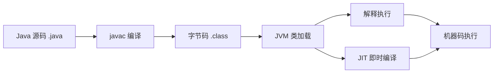

Java 既有编译型语言的静态检查优势，又有解释型语言的跨平台能力。JIT 把热点字节码编译成本地机器码，让长时间运行的 Java 程序接近原生性能。

Java 与 C/C++ 的关键差异：

- 内存由 JVM 自动管理（GC）。
- 没有指针运算，无显式 free/delete。
- 单继承 + 多实现，支持接口。
- 运行时元信息（反射）。
- 多线程内置于语言。

## 二、Java 基础语法

### 2.1 八大基本类型

| 类型 | 位数 | 字节 | 范围 | 默认值 | 包装类 |
|---|---|---|---|---|---|
| byte | 8 | 1 | -128 ~ 127 | 0 | Byte |
| short | 16 | 2 | -32768 ~ 32767 | 0 | Short |
| int | 32 | 4 | -2^31 ~ 2^31-1 | 0 | Integer |
| long | 64 | 8 | -2^63 ~ 2^63-1 | 0L | Long |
| float | 32 | 4 | IEEE 754 单精度 | 0.0f | Float |
| double | 64 | 8 | IEEE 754 双精度 | 0.0d | Double |
| char | 16 | 2 | '\u0000' ~ '\uffff' | '\u0000' | Character |
| boolean | - | - | true / false | false | Boolean |

要点：

- 八种基本类型都有对应包装类，用于集合泛型和反射。
- 自动装箱通过 `valueOf()`，拆箱通过 `xxxValue()`。
- `Integer` 默认缓存 `-128 ~ 127`（可通过 JVM 参数 `-XX:AutoBoxCacheMax` 调整上限），所以小整数比较用 `==` 在缓存内「巧合」可用，但**永远应当用 `equals`**。
- `char` 是 16 位无符号整数，适合存 Unicode 单元（但不一定是完整的码点）。

### 2.2 引用类型

类、接口、数组、枚举（特殊类）、注解（特殊接口）。引用类型默认是 `null`，所有继承自 `Object`，可调用 `toString()`、`equals()`、`hashCode()` 等方法。

### 2.3 面向对象三大特性

- **封装**：隐藏实现细节，对外暴露受控接口，降低耦合。
- **继承**：子类复用父类代码，建立 IS-A 关系。
- **多态**：父类引用指向子类对象，方法调用在运行时动态分派，依赖方法表与虚方法表（vtable）。

### 2.4 重写（Override）与重载（Overload）

| 对比 | 重写 | 重载 |
|---|---|---|
| 范围 | 子类与父类 / 接口间 | 同一类内 |
| 方法签名 | 完全一致 | 方法名相同，参数列表不同 |
| 返回类型 | 子类协变返回（Java 5+） | 任意 |
| 抛异常 | 不能比父类更宽 | 任意 |
| 多态表现 | 运行时分派 | 编译时绑定 |

### 2.5 == 与 equals / hashCode

- `==` 比较基本类型值，引用类型地址。
- `Object.equals()` 默认就是 `==`，所以业务类需要重写。
- **重写 `equals()` 必须同时重写 `hashCode()`**，因为 `HashMap`、`HashSet` 等先比 hash 再比 equals。

`equals` 与 `hashCode` 契约：

- equals 相等 ⇒ hashCode 相等（必要条件）。
- hashCode 相等 ⇏ equals 相等（哈希冲突）。

经典实现思路：

```java
// Objects.equals / Objects.hash 工具
@Override
public boolean equals(Object o) {
    if (this == o) return true;
    if (!(o instanceof User u)) return false;
    return Objects.equals(id, u.id) && Objects.equals(name, u.name);
}

@Override
public int hashCode() {
    return Objects.hash(id, name);
}
```

### 2.6 抽象类与接口

| 维度 | 抽象类 | 接口 |
|---|---|---|
| 继承 | 单继承 | 多实现 |
| 成员变量 | 任意 | 隐式 `public static final` |
| 抽象方法 | 任意访问修饰符 | 默认 `public` |
| 默认实现 | 可有非抽象方法 | Java 8+ 可有 `default` / `static`；Java 9+ 可有 `private` |
| 设计意图 | IS-A 模板（共享代码） | HAS-A 能力（横向扩展） |

冲突解决优先级：

- 接口 `default` 与父类同名同参方法冲突时，优先父类。
- 两个接口同名 `default` 方法冲突时，子类必须显式重写覆盖，否则编译失败。

### 2.7 内部类

- **成员内部类**（非 `static`）：持有外部类引用，可访问外部私有成员。
- **静态内部类**：不持有外部类引用，与普通类几乎一致。
- **局部内部类**：定义在方法内，作用域受限于方法。
- **匿名内部类**：一次性使用的子类实现，Java 8 后通常用 lambda 替代。

匿名内部类引用的局部变量必须是 `final` 或 effectively final。原因是局部变量随方法栈销毁，但匿名内部类对象可能在方法返回后还存活，必须拷贝一份不变副本。

### 2.8 枚举（Java 5+）

- 实际是继承 `Enum` 的 `final` 类，构造器默认 `private`。
- 枚举值本身就是单例，线程安全，类型安全。
- 可带属性、方法、`abstract` 方法，适合替代 `int` 常量（替代后编译器可校验、可遍历、可带行为）。

```java
public enum ResultCode {
    SUCCESS(0, "成功"),
    FAIL(1, "失败");

    private final int code;
    private final String msg;

    ResultCode(int code, String msg) { this.code = code; this.msg = msg; }
    public int code() { return code; }
    public String msg() { return msg; }
}
```

## 三、常用类与 API

### 3.1 Object

9 大核心方法：`getClass()`、`hashCode()`、`equals()`、`toString()`、`clone()`、`notify()`、`notifyAll()`、`wait()`、`finalize()`（已弃用）。

### 3.2 String

- 不可变（`final char[]`，JDK 9 改为 `byte[] + 编码标识`）。
- 字符串字面量编译期入池（String Pool），位于堆中。
- `String s = "a" + "b"` 编译期合并为 `"ab"`；`String s = a + b`（变量）走 `StringBuilder.append`。
- `intern()` 主动入池（慎用，JDK 6 后池位于堆）。
- 注意 `+` 在循环中会创建大量对象，生产环境用 `StringBuilder` 或 `StringJoiner`。

常用方法：`length()`、`charAt()`、`substring()`、`indexOf()`、`replace()`、`split()`、`trim()`/`strip()`、`stripLeading()`、`stripTrailing()`、`isBlank()`、`repeat()`（Java 11）。

### 3.3 StringBuilder / StringBuffer

- `StringBuffer` 线程安全（方法 `synchronized`），`StringBuilder` 不安全。
- 单线程场景首选 `StringBuilder`，性能约高 10~15%。

### 3.4 包装类缓存

| 包装类 | 缓存范围 |
|---|---|
| Integer | -128 ~ 127（可调上限） |
| Long | -128 ~ 127 |
| Short | -128 ~ 127 |
| Byte | -128 ~ 127 |
| Character | 0 ~ 127 |
| Boolean | true / false |
| Float / Double | 不缓存 |

`new Integer(127) == Integer.valueOf(127)` 可能为 `false`，因为一个是堆对象、一个是缓存对象。包装类型判等永远用 `equals`。

### 3.5 BigDecimal

- 解决 `double` 浮点精度丢失问题，适合金额。
- 必须用字符串构造：`new BigDecimal("1.23")`，不要 `new BigDecimal(1.23)`。
- 设置舍入模式：`BigDecimal.setScale(2, RoundingMode.HALF_UP)`。

### 3.6 时间 API

| 版本 | 主要类型 | 特点 |
|---|---|---|
| Java 8 之前 | Date、Calendar、SimpleDateFormat | 可变、线程不安全、易出错 |
| Java 8+ | LocalDate、LocalTime、LocalDateTime、Instant、ZonedDateTime、Duration、Period | 不可变、线程安全、API 清晰 |

`SimpleDateFormat` 不是线程安全的，多线程场景需要加锁或每次新建；Java 8 的 `DateTimeFormatter` 不可变、可复用，线程安全。

## 四、集合框架（JavaSE 重头戏）

### 4.1 整体体系

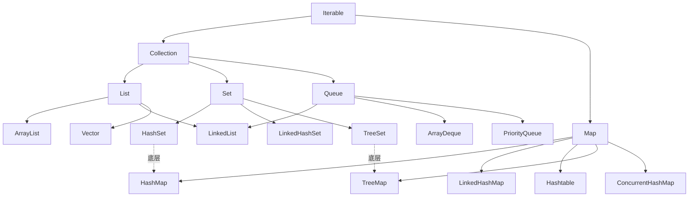

### 4.2 List

| 实现类 | 数据结构 | 线程安全 | 特点 |
|---|---|---|---|
| ArrayList | 动态数组 | 否 | 随机访问 O(1)，插入删除 O(n) |
| LinkedList | 双向链表 | 否 | 插入删除 O(1)（已知位置），随机访问 O(n) |
| Vector | 动态数组 | 是（synchronized） | 已过时 |
| CopyOnWriteArrayList | 写时复制数组 | 是 | 读多写少，如监听器列表 |

### 4.3 Set

- `HashSet` 内部是 `HashMap`，用 key 存值，value 是固定 `PRESENT`。
- `LinkedHashSet` 维护插入顺序的链表。
- `TreeSet` 底层是 `TreeMap`（红黑树），按自然顺序或 `Comparator` 排序。

### 4.4 Queue / Deque

- `LinkedList`：可双端队列。
- `ArrayDeque`：循环数组实现，性能优于 `LinkedList`。
- `PriorityQueue`：堆结构，按优先级出队。
- `DelayQueue`：延迟队列，常用于定时任务。

### 4.5 Map

| 实现类 | 数据结构 | 线程安全 | 特点 |
|---|---|---|---|
| HashMap | 数组 + 链表 / 红黑树 | 否 | 最常用，O(1) 平均 |
| LinkedHashMap | HashMap + 双向链表 | 否 | 维护插入/访问顺序，可做 LRU |
| Hashtable | 数组 + 链表 | 是（synchronized） | 已过时 |
| TreeMap | 红黑树 | 否 | key 按自然或自定义排序 |
| ConcurrentHashMap | 数组 + 链表/红黑树 + CAS + synchronized | 是 | 高并发首选 |

### 4.6 HashMap 原理（八股文绝对重头）

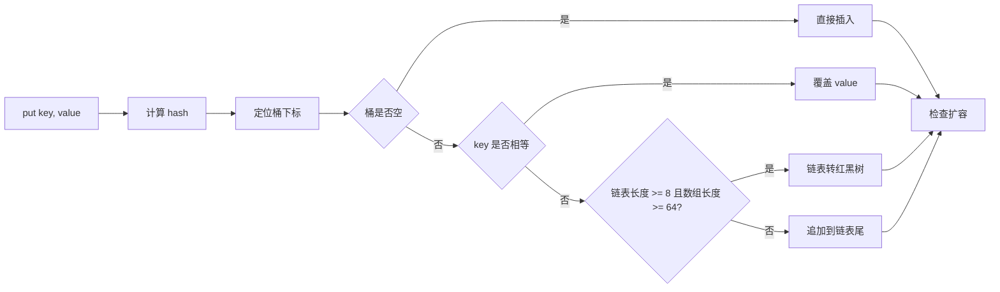

JDK 7 与 JDK 8 差异：

- JDK 7：数组 + 单向链表，hash 扰动函数比较简单，扩容时用**头插法**，并发场景会形成环形链表（死循环）。
- JDK 8+：数组 + 链表 + 红黑树，**尾插法**避免环形链表，但并发仍然不安全（数据丢失、可见性等问题，必须用 `ConcurrentHashMap`）。

关键参数：

| 参数 | 默认值 | 说明 |
|---|---|---|
| initialCapacity | 16 | 初始容量 |
| loadFactor | 0.75 | 负载因子 |
| threshold | 12 | capacity * loadFactor |
| TREEIFY_THRESHOLD | 8 | 链表转红黑树阈值 |
| UNTREEIFY_THRESHOLD | 6 | 红黑树退化为链表阈值 |
| MIN_TREEIFY_CAPACITY | 64 | 链表转红黑树的最小数组长度 |

两个常被问的细节：

- **为什么容量是 2 的幂？** `hash & (n-1)` 等价于 `hash % n`，位运算更快；同时扩容时只需判断 hash 高位的 0/1 决定新下标。
- **为什么要扰动 hash？** `(h = key.hashCode()) ^ (h >>> 16)`，让高位特征也参与取模，减少哈希冲突。

### 4.7 ConcurrentHashMap（JDK 8+）

- 抛弃 JDK 7 的 `Segment` 分段锁，改用 `Node` 数组 + `CAS` + `synchronized`（锁桶头节点）。
- `size` 用 `baseCount` + `CounterCell[]` 累加（LongAdder 思路），避免并发争抢。
- `get` 不加锁，利用 `volatile` + 不可变 `Node`。
- 链表长度超过 8 也转红黑树。

### 4.8 fail-fast / fail-safe

- `fail-fast`：遍历时检测集合结构性修改，抛 `ConcurrentModificationException`（`ArrayList`、`HashMap`）。
- `fail-safe`：基于快照/弱一致的迭代器，不抛异常（`CopyOnWriteArrayList`、`ConcurrentHashMap`）。

### 4.9 选择建议

- 频繁随机访问：`ArrayList`。
- 频繁头尾操作：`ArrayDeque`。
- 去重：`HashSet`。
- 需要排序：`TreeSet` / `TreeMap`。
- 高并发：`ConcurrentHashMap` / `CopyOnWriteArrayList`。
- 实现 LRU：`LinkedHashMap`（`accessOrder=true` + `removeEldestEntry`）。

## 五、泛型

### 5.1 类型擦除

- 编译期检查类型，运行时擦除为原始类型（裸类型）。
- `List<String>` 与 `List<Integer>` 在运行时是同一个类。
- 编译器自动生成桥接方法（bridge method）保证多态。

### 5.2 通配符与 PECS 原则

- `<? extends T>`：上界，只能 get 接收 T，符合生产者（Produce）。
- `<? super T>`：下界，只能 put 写入 T，符合消费者（Consume）。
- `<?>`：无界，只能 `null` 写入。

### 5.3 泛型局限

- 不能 `new T()`，可改用 `Array.newInstance(clazz, size)` 或工厂。
- 不能用基本类型作为泛型实参（如 `List<int>`）。
- 静态变量不能引用泛型类型参数。
- 反射拿到的是擦除后的类型。

## 六、反射

### 6.1 三个核心类

- `Class<T>`：类的元数据。
- `Constructor`：构造器。
- `Method`：方法。
- `Field`：字段。

### 6.2 优缺点

- 优点：动态性；Spring 依赖注入、MyBatis 映射、Hibernate ORM、Servlet 等都依赖反射。
- 缺点：性能差（不能 JIT 内联）、破坏封装、安全风险（可访问 `private` 字段，需 `setAccessible(true)`）。

### 6.3 方法查找差异

| 方法 | 范围 | 修饰符 |
|---|---|---|
| `getMethod` | 本类 + 父类 + 接口 | 仅 `public` |
| `getDeclaredMethod` | 仅本类 | 任意 |

### 6.4 动态代理

- JDK 动态代理：基于接口（`Proxy.newProxyInstance`）。
- CGLIB：基于子类继承，性能更好，Spring AOP 默认用 JDK / CGLIB 切换。

## 七、注解

### 7.1 元注解

| 元注解 | 作用 |
|---|---|
| `@Retention` | 保留级别：SOURCE / CLASS / RUNTIME |
| `@Target` | 应用位置：TYPE、METHOD、FIELD 等 |
| `@Documented` | 是否写入 Javadoc |
| `@Inherited` | 是否允许子类继承 |
| `@Repeatable` | 是否可重复（Java 8+） |

### 7.2 注解处理

- 编译期：`AbstractProcessor`（Lombok、Dagger、MapStruct）。
- 运行时：反射处理（Spring、MyBatis）。
- 实际场景：自定义 ORM、参数校验、权限控制、AOP。

## 八、异常体系

### 8.1 体系结构

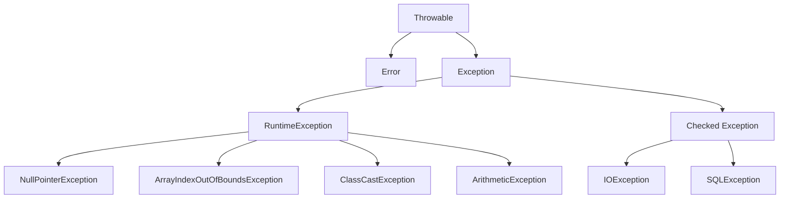

- **Error**：系统级错误（OOM、StackOverflowError），程序无法处理。
- **RuntimeException**（非受检）：NPE、AIOOBE、ClassCastException、ArithmeticException、NumberFormatException。
- **Checked Exception**：IOException、SQLException、ClassNotFoundException，必须 `try/catch` 或 `throws`。

### 8.2 try-with-resources

实现 `AutoCloseable` 接口的资源可以用 try-with-resources 自动关闭，比 finally 整洁：

```java
try (Connection c = ds.getConnection();
     PreparedStatement ps = c.prepareStatement("...")) {
    // 处理逻辑
}
```

### 8.3 处理原则

- 早 throw 晚 catch。
- 捕获具体异常，不要捕获 `Exception` 一把梭。
- 不要用异常控制业务流程（性能差）。
- 包装异常时保留原始 `cause`，方便定位根因。

## 九、Java I/O

### 9.1 BIO / NIO / AIO

| 模型 | 全称 | 特点 |
|---|---|---|
| BIO | Blocking I/O | 同步阻塞，一连接一线程 |
| NIO | Non-blocking I/O | 同步非阻塞，多路复用（Selector） |
| AIO | Asynchronous I/O | 异步非阻塞，回调 / Proactor |

### 9.2 NIO 三大核心

- **Buffer**：字节容器（`ByteBuffer` 等），写读模式切换（`flip()`、`clear()`、`compact()`）。
- **Channel**：双向通道（`FileChannel`、`SocketChannel`、`ServerSocketChannel`）。
- **Selector**：多路复用器，监听 `Channel` 事件（`OP_READ`、`OP_WRITE`、`OP_CONNECT`、`OP_ACCEPT`）。

### 9.3 Reactor 模型

- 单 Reactor 单线程（Redis）。
- 单 Reactor 多线程。
- **主从 Reactor 多线程**：Netty BossGroup + WorkerGroup。

## 十、多线程与并发

### 10.1 线程生命周期

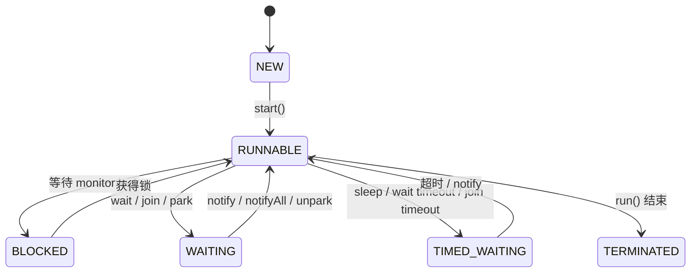

### 10.2 线程创建方式

- 继承 `Thread`。
- 实现 `Runnable` / `Callable`。
- 通过 `ExecutorService` / `ThreadPoolExecutor`。
- `Future`、`CompletableFuture` 异步编排。

### 10.3 线程池七大参数

```java
new ThreadPoolExecutor(
    corePoolSize,                 // 核心线程数
    maximumPoolSize,              // 最大线程数
    keepAliveTime,                // 空闲线程存活时间
    unit,                         // 时间单位
    workQueue,                    // 任务队列 BlockingQueue<Runnable>
    threadFactory,                // 线程工厂
    handler                       // 拒绝策略
);
```

执行流程：

1. 当前线程数 < core：创建新线程。
2. 当前线程数 ≥ core：入队。
3. 队列满 && 线程数 < max：创建非核心线程（救急线程）。
4. 队列满 && 线程数 ≥ max：执行拒绝策略。

### 10.4 四种拒绝策略

| 策略 | 行为 |
|---|---|
| `AbortPolicy` | 抛 `RejectedExecutionException`（默认） |
| `CallerRunsPolicy` | 调用者线程执行任务 |
| `DiscardPolicy` | 静默丢弃 |
| `DiscardOldestPolicy` | 丢弃队首，再提交新任务 |

### 10.5 常见 JDK 线程池

| 线程池 | 特点 |
|---|---|
| FixedThreadPool | 固定大小，无界队列，可能 OOM |
| CachedThreadPool | 弹性伸缩（`SynchronousQueue`），可能创建大量线程 |
| SingleThreadExecutor | 单线程，保证任务顺序 |
| ScheduledThreadPool | 延时 / 周期任务 |
| WorkStealingPool | ForkJoinPool，任务窃取 |

### 10.6 synchronized 锁升级（JDK 6+）

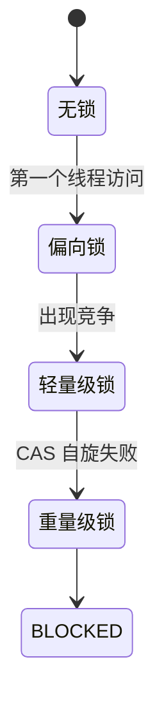

- 偏向锁：单线程场景，几乎无开销（JDK 15 默认关闭，JDK 18 删除）。
- 轻量级锁：CAS 自旋，多线程交替执行。
- 重量级锁：阻塞，依赖 OS mutex。

### 10.7 volatile

- 保证**可见性**（CPU 缓存一致性）。
- 禁止**指令重排**（写后 StoreStore + StoreLoad，读前 LoadLoad + LoadStore 屏障）。
- **不保证原子性**（`i++` 不是原子的，必须在 synchronized / AtomicInteger / LongAdder 内做）。

### 10.8 JMM（Java 内存模型）

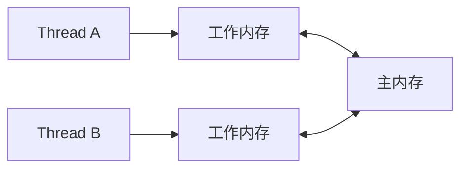

happens-before 规则：

- 程序顺序规则：单线程内顺序可见。
- 锁规则：`unlock` happens-before `lock`。
- volatile 规则：`volatile` 写 happens-before 后续读。
- 线程启动 / 终止规则。
- 传递性。

### 10.9 并发工具类

| 工具 | 用途 |
|---|---|
| CountDownLatch | 一个线程等待多个线程完成 |
| CyclicBarrier | 多个线程相互等待到同一屏障点（可复用） |
| Semaphore | 信号量，限流（控制并发许可数） |
| Exchanger | 两个线程间数据交换 |
| Phaser | 多阶段同步，比 CyclicBarrier 灵活 |

### 10.10 AQS

`AbstractQueuedSynchronizer` 是 Java 并发核心基础设施。

- `state`：同步状态（如锁的可重入次数、信号量许可数）。
- CLH 队列：等待线程组成的 FIFO 队列。
- 模板方法：子类实现 `tryAcquire` / `tryRelease` 等。

基于 AQS 的同步器：`ReentrantLock`、`Semaphore`、`CountDownLatch`、`ReentrantReadWriteLock`、`StampedLock`（JDK 8，部分基于 AQS）。

### 10.11 CAS 与 ABA

- CAS（Compare And Swap）是硬件原语，乐观锁核心。
- ABA 问题：值从 A → B → A，CAS 看不到过程。解决方案是版本号（`AtomicStampedReference`）。

### 10.12 ThreadLocal

- 线程私有变量副本，避免传参。
- 内存泄漏原因：`ThreadLocalMap` 的 Entry 中 key 是弱引用、value 是强引用；线程池中线程长期存活，key 被 GC 后 value 仍持有。
- **必须**在 `finally` 中调用 `remove()` 清理。

### 10.13 CompletableFuture

JDK 8 引入，用于异步编排：

- `supplyAsync` / `runAsync`：异步执行。
- `thenApply` / `thenAccept` / `thenRun`：串行回调。
- `thenCombine` / `thenCompose`：并行组合。
- `allOf` / `anyOf`：等待所有 / 任一完成。
- `exceptionally` / `handle`：异常处理。

### 10.14 锁 / 并发容器选型速查

| 场景 | 选型 |
|---|---|
| 简单同步 | `synchronized` |
| 可中断 / 超时 / 公平 | `ReentrantLock` |
| 读多写少 | `ReentrantReadWriteLock`、`StampedLock` |
| 计数器 / 累加器 | `LongAdder` / `AtomicLong` |
| 并发 Map | `ConcurrentHashMap` |
| 并发 List（读多写少） | `CopyOnWriteArrayList` |
| 并发 Queue | `ConcurrentLinkedQueue`、`ArrayBlockingQueue`、`PriorityBlockingQueue` |
| 延时队列 | `DelayQueue` |

## 十一、JVM

### 11.1 运行时数据区

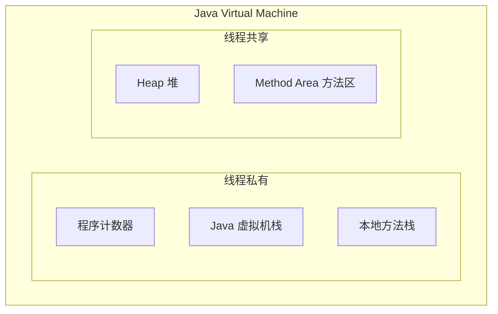

| 区域 | 线程私有 | 存放内容 | OOM / SOF |
|---|---|---|---|
| 程序计数器 | ✔ | 字节码指令地址 | 不会 OOM |
| Java 虚拟机栈 | ✔ | 栈帧（局部变量表、操作栈、动态链接、方法出口） | StackOverflowError |
| 本地方法栈 | ✔ | Native 方法调用信息 | StackOverflowError |
| 堆 | ✘ | 对象实例 | OutOfMemoryError |
| 方法区 | ✘ | 类元信息、常量、静态变量 | OutOfMemoryError |

`Metaspace`（JDK 8+）取代 `PermGen`，使用本地内存，可按需扩容。

### 11.2 堆内部分代

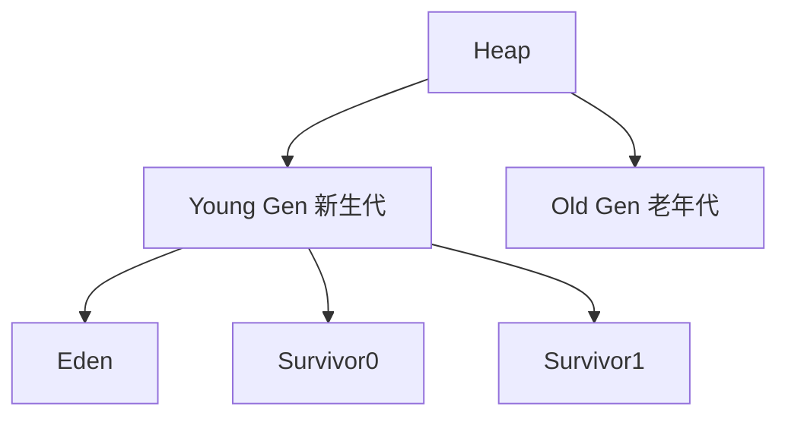

对象生命周期：

- 新对象分配在 Eden 区。
- `Minor GC` 后存活对象进入 Survivor，年龄 +1。
- From / To 区交换拷贝，年龄达到阈值（默认 15）进入老年代。
- 老年代满触发 `Major GC` / `Full GC`。
- 大对象直接进入老年代（`PretenureSizeThreshold`）。

### 11.3 对象创建与访问

创建过程：

1. 类加载检查。
2. 分配内存（指针碰撞 / 空闲列表，TLAB 优化）。
3. 初始化零值。
4. 设置对象头（Mark Word、Class 指针、长度）。
5. 执行 `<init>` 方法。

对象内存布局：

- 对象头（Mark Word 8 字节 + Class 指针 4/8 字节）。
- 实例数据。
- 对齐填充（保证 8 字节对齐）。

访问定位：

- 句柄：稳定（GC 时只需改句柄），多一次指针跳转。
- 直接指针：访问快，HotSpot 默认。

### 11.4 GC

#### 判活算法

- **引用计数**：无法解决循环引用。
- **可达性分析**：从 GC Roots（栈帧局部变量、静态变量、JNI 引用、Class 对象、Thread）出发，不可达对象可回收。

#### 引用类型

| 引用 | 回收时机 |
|---|---|
| 强引用 | 永不回收 |
| 软引用（SoftReference） | 内存不足时 |
| 弱引用（WeakReference） | 下次 GC |
| 虚引用（PhantomReference） | 任何时候都可能，无实际引用 |

#### GC 算法

| 算法 | 思路 | 缺点 |
|---|---|---|
| 标记-清除 | 两阶段遍历 | 内存碎片 |
| 复制 | 分两半互换 | 浪费空间 |
| 标记-整理 | 清除后整理 | 停顿时间 |
| 分代收集 | 按年龄选算法 | 复杂度高 |

#### 收集器

| 收集器 | 分代 | 算法 | 特点 |
|---|---|---|---|
| Serial | Young | 复制 | 单线程 STW，客户端适用 |
| ParNew | Young | 复制 | Serial 多线程版本，配合 CMS |
| Parallel Scavenge | Young | 复制 | 关注吞吐量 |
| Serial Old | Old | 标记-整理 | 单线程 |
| Parallel Old | Old | 标记-整理 | 关注吞吐量 |
| CMS | Old | 标记-清除 | 并发收集，关注停顿，有浮动垃圾和碎片（JDK 14 删除） |
| G1 | 整体 | Region 化增量 | 关注停顿，可预测（JDK 9 默认） |
| ZGC | 整体 | 染色指针 + 读屏障 | < 1ms 停顿，TB 堆（JDK 11 实验，JDK 15 正式） |
| Shenandoah | 整体 | 读写屏障 | 与 ZGC 类似，Red Hat 出品 |

#### GC 调优常用参数

```bash
-Xms / -Xmx           # 初始 / 最大堆
-Xmn                  # 新生代大小
-XX:NewRatio=2        # 老:新 = 2:1
-XX:SurvivorRatio=8   # Eden:Survivor = 8:1:1
-XX:+UseG1GC          # 启用 G1
-XX:+UseZGC           # 启用 ZGC
-XX:MaxGCPauseMillis=200
-Xlog:gc*             # GC 日志
```

### 11.5 类加载

#### 阶段

加载 → 验证 → 准备 → 解析 → 初始化 → 使用 → 卸载。

#### 类加载器

- `Bootstrap ClassLoader`：`rt.jar`、`java.*`。
- `Platform ClassLoader`（JDK 9 起取代 `ExtClassLoader`）：扩展模块。
- `AppClassLoader`：classpath。
- 自定义 `ClassLoader`。

#### 双亲委派

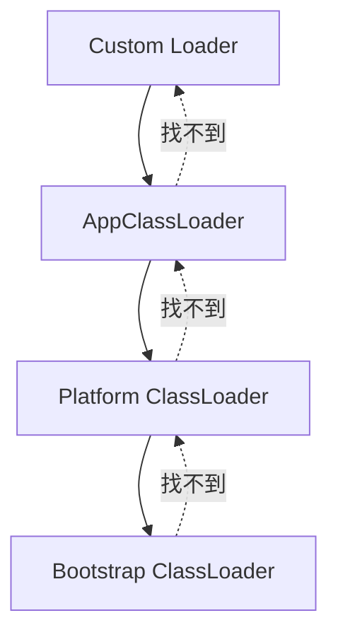

- 防止类被重复加载、保护核心 API。
- Tomcat、JDBC SPI 等场景会**打破双亲委派**。

### 11.6 JVM 调优思路

1. 明确目标：停顿时间 / 吞吐量 / 内存。
2. 监控：GC 日志 + arthas + visualvm + Prometheus + Grafana。
3. 调参：堆大小、新生代比例、收集器。
4. 验证对比：相同负载下 GC 次数和停顿。

常见 OOM：

- 堆 OOM：内存泄漏 / 数据规模超预期。
- 栈 OOM：递归 / 线程栈过大。
- 方法区 OOM：动态类加载过多（CGLIB 滥用）。
- 直接内存 OOM：Netty / NIO 分配未释放。

## 十二、Java 版本演进史

### 12.1 时间线

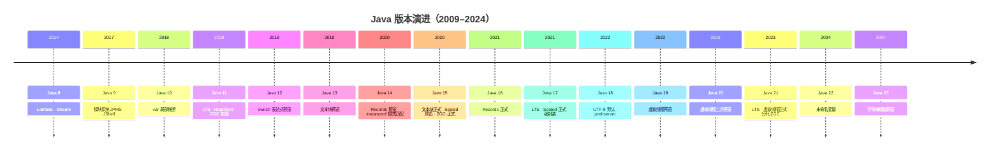

### 12.2 各版本重要特性

#### Java 8（LTS，2014）—— 革命性版本

- Lambda 表达式。
- Stream API。
- 函数式接口 `@FunctionalInterface`。
- 接口 `default` 方法与 `static` 方法。
- 方法引用。
- `Optional` 容器。
- 新日期时间 API `java.time`。
- `CompletableFuture`。
- HashMap 链表转红黑树。
- ConcurrentHashMap 抛弃 Segment。
- Metaspace 取代 PermGen。

**面试意义**：Java 8 是大部分项目的版本基准，几乎任何 Java 面试题都可能用到 8 的特性。

#### Java 9（2017）

- 模块系统 JPMS（`module-info.java`）。
- 集合工厂方法 `List.of`、`Set.of`、`Map.of`。
- 接口 `private` 方法。
- 进程 API 增强 `ProcessHandle`。
- Try-with-resources 增强。
- Stream API 增强（`takeWhile` / `dropWhile` / `iterate`）。
- Reactive Streams Flow API。
- JShell REPL。

#### Java 10（2018）

- 局部变量类型推断 `var`（仅限局部变量）。
- 不可变集合 `List.copyOf`。
- G1 并行 Full GC。
- 应用程序类数据共享（AppCDS）。

#### Java 11（LTS，2018）

- HttpClient 标准化（`java.net.http`）。
- 单文件源码直接运行 `java Hello.java`。
- Lambda 参数的 `var`。
- 删除 Java EE / CORBA 模块。
- 字符串 API 增强 `isBlank` / `strip` / `repeat`。
- 嵌套类访问控制。
- ZGC 实验性引入。
- Epsilon 无操作 GC（实验）。

**面试意义**：Java 11 是 Java 8 升级的首要 LTS 目标。

#### Java 12（2019）

- switch 表达式预览（JEP 325）。
- Shenandoah 实验性收集器。
- G1 可中断混合收集。
- 微基准套件 JMH 默认包含。

#### Java 13（2019）

- 文本块 `"""..."""` 预览。
- 重新实现旧版 Socket API。
- ZGC 归还未使用内存给操作系统。

#### Java 14（2020）

- Records 预览（JEP 359）。
- Pattern Matching for `instanceof` 预览（JEP 305）。
- 移除 CMS 收集器。
- Helpful NullPointerException（JEP 358）：`a.b.c.d` 报错能明确指出是 `b` 还是 `c` 为 null。
- `jpackage` 工具。
- 外部内存访问 API（孵化）。

#### Java 15（2020）

- 文本块正式（JEP 378）。
- Sealed Classes 预览（JEP 360）。
- ZGC 正式可用（JEP 377）。
- Shenandoah 正式可用（JEP 379）。
- Nashorn JavaScript 引擎删除。
- 隐藏类 Hidden Classes（JEP 371）。
- 偏向锁默认关闭（逐步废弃）。

#### Java 16（2021）

- Records 正式（JEP 395）。
- Pattern Matching for `instanceof` 正式（JEP 394）。
- Stream `toList()` 简化（JEP 407）。
- `jpackage` 正式。
- 启用 C++14 源码。

#### Java 17（LTS，2021）

- Sealed Classes 正式（JEP 409）。
- Pattern Matching for switch 预览（JEP 406）。
- 强封装 JDK 内部 API（默认不允许 deep reflection）。
- 删除 RMI Activation。
- 删除 Applet API。
- 新 macOS 渲染管线。
- 实验性 AArch64 支持。

**面试意义**：新项目最主流的 LTS。Spring Boot 3.x 强制要求 17+。Sealed Classes 与 Pattern Matching 是 17 前后差异化最大的特性。

#### Java 18（2022）

- UTF-8 默认字符集（JEP 400）。
- 简单 Web 服务器 `jwebserver`（JEP 408）。
- `SimpleFileServer` 类。
- Javadoc 注释的代码片段支持 `@snippet`。
- Pattern Matching for switch 第二次预览。

#### Java 19（2022）

- 虚拟线程（Virtual Threads）预览（JEP 425，Project Loom）。
- 结构化并发（Structured Concurrency）孵化。
- 外部函数 & 内存 API 预览。
- Pattern Matching for switch 第三次预览。

#### Java 20（2023）

- 虚拟线程二次预览。
- 结构化并发第二次孵化。
- Scoped Values 孵化。
- Record Patterns 预览。
- Pattern Matching for switch 第四次预览。

#### Java 21（LTS，2023）

- 虚拟线程正式（JEP 444，Project Loom）：百万级并发线程成为可能。
- 模式匹配 for switch 正式（JEP 441）。
- 记录模式（Record Patterns）正式（JEP 440）。
- 字符串模板（String Templates）预览（JEP 459）。
- 序列集合（Sequenced Collections）正式（JEP 431）。
- 分代 ZGC（Generational ZGC）预览（JEP 439）。
- 弃用 Windows 32 位。
- 简单 Key Encapsulation Mechanism API。

**面试意义**：Java 21 是当下最推荐的现代 LTS。虚拟线程让 `Thread-per-request` 同步写法能撑住十万级 QPS，是 Java 应对高并发场景的下一代核心能力。

#### Java 22（2024）

- 未命名变量与模式 `var _`、`_`（JEP 456）。
- 未命名模式 `case _ ->`（JEP 456）。
- launch multi-file source-code programs（JEP 458）。
- 字符串模板第二次预览。
- Foreign Function & Memory API 预览改进。

#### Java 23（2024）

- 字符串模板第二次预览（JEP 465）。
- Markdown 文档注释（javadoc）。
- Generational ZGC 正式（JEP 474）。
- 弃用 `sun.misc.Unsafe` 的 `MemoryAccess` 方法。
- instanceof 模式匹配 refines。

### 12.3 LTS 版本选型矩阵

| LTS | 发布时间 | 主流场景 | Premier Support |
|---|---|---|---|
| Java 8 | 2014 | 大量遗留系统的主力 | 至 2030+（扩展支持） |
| Java 11 | 2018 | 升级 8 的首选 LTS | 至 2026 |
| Java 17 | 2021 | Spring Boot 3 主流 | 至 2029 |
| Java 21 | 2023 | Loom + 分代 ZGC 新一代 LTS | 至 2031 |

### 12.4 面向面试的版本考点

1. 你项目用的是哪个 Java 版本？升级路径？
2. Java 8 的核心新特性（Lambda、Stream、Optional、新日期）？
3. Java 17 必须掌握的 Records / Sealed Classes / Pattern Matching？
4. Java 21 虚拟线程解决什么问题？与平台线程的区别？
5. switch 表达式、文本块、Records 的语法？
6. `var` 的限制？能在方法签名上用吗？
7. 模块系统的目的是什么？

## 十三、JavaSE 面试高频题

### 1. String 为什么要设计成不可变？

- 内部数组 `final`（JDK 9 改为 `byte[]`），类也是 `final`。
- 保证线程安全、字符串池可行、可作为 `Map` key 哈希值不变。

### 2. String、StringBuilder、StringBuffer 的区别？

- String 不可变，每次修改生成新对象。
- StringBuffer 线程安全（方法 `synchronized`），性能差。
- StringBuilder 不安全，单线程首选，性能高 10%–15%。

### 3. `==` 与 `equals` 区别？

- `==` 比较基本类型值，引用类型地址。
- `equals` 默认 `==`，业务类重写必须同时重写 `hashCode`。

### 4. final / finally / finalize 区别？

- `final`：修饰符，类不可继承、方法不可重写、变量不可变。
- `finally`：异常处理，用于资源释放。
- `finalize`：Object 的方法（已弃用），GC 前调用。

### 5. 抽象类与接口区别？

- 抽象类单继承，接口多实现。
- 抽象类可有非 final 成员变量，接口变量隐式 `public static final`。
- 设计意图：抽象类 IS-A 模板，接口 HAS-A 能力。

### 6. HashMap 工作原理？

- 数据结构：数组 + 链表 + 红黑树（链表长度 ≥ 8 且数组 ≥ 64 时树化）。
- 关键参数：默认容量 16、负载因子 0.75、扩容翻倍。
- JDK 7 头插法可能并发死循环，JDK 8 改尾插法但并发仍不安全，必须用 `ConcurrentHashMap`。
- 为什么 capacity 是 2 的幂？`hash & (n-1)` 等价于 `hash % n`，位运算更快；扩容只需判断高位。

### 7. ConcurrentHashMap JDK 7 vs JDK 8？

- JDK 7：Segment 分段锁，并发度等于 Segment 数量。
- JDK 8+：Node + CAS + synchronized 锁桶头节点，锁粒度更细。
- `size` 用 `baseCount + CounterCell[]`（LongAdder 思路）。

### 8. ArrayList 与 LinkedList 区别？

- ArrayList：动态数组，随机访问 O(1)，插入删除 O(n)。
- LinkedList：双向链表，插入删除 O(1)（已知位置），随机访问 O(n)。
- 实际性能：ArrayList 顺序写更快（连续内存 + CPU cache 友好），多数场景 ArrayList 胜出。

### 9. Collection 与 Collections 区别？

- Collection：集合根接口。
- Collections：工具类，提供 `sort`、`binarySearch`、`synchronizedList` 等。

### 10. fail-fast 与 fail-safe？

- fail-fast：遍历时检测结构性修改，抛 `ConcurrentModificationException`。
- fail-safe：基于快照/弱一致迭代器，不抛异常（`CopyOnWriteArrayList`、`ConcurrentHashMap`）。

### 11. 泛型擦除是什么？桥接方法是什么？

- 编译期检查类型，运行期擦除为原始类型。
- 编译器自动生成桥接方法以保证多态。

### 12. 反射优缺点？

- 优点：动态性，是 Spring / MyBatis 等框架的基础。
- 缺点：性能差（不能 JIT 内联）、破坏封装、可能绕过泛型检查和安全策略。

### 13. synchronized 与 Lock 区别？

| 维度 | synchronized | Lock |
|---|---|---|
| 灵活 | 不灵活 | 中断、超时、公平、多条件 |
| 释放 | 自动 | 手动 |
| 公平 | 非公平 | 可选公平 |
| 性能 | JDK 6+ 接近 | 复杂场景更优 |

### 14. volatile 作用？

- 保证可见性（CPU 缓存一致性）。
- 禁止指令重排（内存屏障）。
- **不保证原子性**（`i++` 非原子）。

### 15. ThreadLocal 内存泄漏原因？如何避免？

- `ThreadLocalMap` 中 key 是弱引用，value 是强引用；线程长时间存活时（线程池场景），key 被 GC 后 value 不会回收。
- 解决：用完显式调用 `remove()`。

### 16. 死锁的必要条件？如何排查？

- 必要条件：互斥、占有并等待、不可抢占、循环等待。
- 排查：`jstack <pid>` 查看 deadlock 信息。
- 避免：固定顺序加锁、`tryLock` 超时、降低锁粒度、使用并发工具类替代。

### 17. happens-before 是什么？

- JMM 定义的操作间可见性关系。
- 满足 happens-before 的语句，前面的结果对后面可见。

### 18. 类的生命周期？

加载 → 验证 → 准备 → 解析 → 初始化（`<clinit>`）→ 使用 → 卸载。

### 19. 双亲委派模型？为什么要打破？

- 类加载请求先委托父加载器，父找不到才自己加载。
- 目的：保证类的唯一性，保护 JDK 核心类。
- 打破原因：Tomcat 要实现 Web 应用类隔离；JDBC SPI 用线程上下文类加载器加载驱动实现。

### 20. JVM 内存区域如何划分？

- 线程私有：程序计数器、Java 虚拟机栈、本地方法栈。
- 线程共享：堆、方法区（含运行时常量池、Metaspace）。

### 21. 描述对象 GC 流程？

- 新对象优先在 Eden 创建。
- Minor GC 后存活进入 Survivor，年龄 +1，达到阈值（默认 15）进入老年代。
- 大对象直接进入老年代。
- 老年代空间不足触发 Major GC / Full GC。

### 22. G1 与 CMS 区别？

- CMS：标记-清除，老年代收集器，关注停顿，有浮动垃圾和内存碎片（JDK 14 删除）。
- G1：Region 化，标记-整理，将堆划分多个相等 Region，可预测停顿（JDK 9 默认）。

### 23. 什么情况触发 Full GC？

- 老年代空间不足。
- 方法区空间不足。
- `System.gc()`（一般禁用 `-XX:+DisableExplicitGC`）。
- Minor GC 后存活对象太多，survivor 装不下。
- 大对象分配找不到连续空间。

### 24. JVM 调优思路？

- 明确目标（停顿 / 吞吐量）。
- 用 GC 日志 + arthas + visualvm 监控。
- 调参：堆大小、新生代比例、收集器。
- 验证对比，同负载下观察 GC 次数和停顿。

### 25. `int` 与 `Integer` 区别？

- int 是基本类型，Integer 是对象。
- int 默认 0，Integer 默认 null。
- 两个 Integer 通过 `==` 在 `-128 ~ 127` 内等于缓存对象（比较的是地址相同），但应当永远用 `equals`。

### 26. Java 内存泄漏常见场景？

- 静态集合持有对象。
- 未关闭连接（JDBC / IO / Socket）。
- 监听器或回调未注销。
- ThreadLocal 未清理。
- 内部类持有外部类引用。
- 缓存没有淘汰策略。

### 27. Java 8 Stream API 的中间操作和终端操作？

- 中间操作：返回 Stream，惰性求值（`filter`、`map`、`flatMap`、`sorted`、`distinct`）。
- 终端操作：触发计算并返回结果（`forEach`、`collect`、`reduce`、`count`、`findFirst`）。

### 28. 常见 JVM 参数速记？

```bash
-Xms / -Xmx       # 堆初始 / 最大
-Xmn              # 新生代大小
-XX:+UseG1GC      # G1
-XX:+UseZGC       # ZGC
-XX:MaxGCPauseMillis=200
-XX:+PrintGCDetails
-Xlog:gc*         # JDK 9+ 统一日志
```

### 29. JVM 运行时区域哪些会 OOM？

- 堆 OOM、栈 OOM（递归 / 线程栈过大）、方法区 OOM（动态类加载过多）、直接内存 OOM（Netty / NIO 分配未释放）。

### 30. CAS 是什么？ABA 问题？

- CAS（Compare And Swap）是硬件原语，乐观锁核心。
- ABA：值从 A → B → A，CAS 检测不到过程。解决：版本号（`AtomicStampedReference`）。

### 31. 偏向锁、轻量级锁、重量级锁？

- 偏向锁：单线程，几乎无开销（JDK 15 默认关闭，JDK 18 删除）。
- 轻量级锁：CAS 自旋，多线程交替执行。
- 重量级锁：阻塞，依赖 OS mutex。

### 32. AQS 是什么？

- `AbstractQueuedSynchronizer`，Java 并发的核心基础设施。
- 通过 `state` + CLH 队列实现。
- `ReentrantLock`、`Semaphore`、`CountDownLatch`、`ReentrantReadWriteLock` 都基于 AQS。

### 33. `synchronized` 锁升级流程？

偏向锁 → 轻量级锁（CAS 自旋）→ 重量级锁（mutex）。JDK 6+ 优化，根据竞争激烈程度自动切换。

### 34. Java 8 默认字符集？

Java 8 之前默认 `UTF-8`，但读写文件默认是平台字符集；从 Java 18 开始 `JEP 400` 让 UTF-8 成为默认字符集。

### 35. Java 17 / 21 你怎么选？

- 新项目首推 Java 21，享受虚拟线程 + 分代 ZGC + 模式匹配全套。
- 已有 Java 8 / 11 项目渐进升级到 17 是稳妥路径。
- Spring Boot 3.x 强约束 Java 17+。

---

## 附录：Mermaid 图汇总

本文用到的 mermaid 图一览：

| 图位置 | 类型 | 表达内容 |
|---|---|---|
| §一 | flowchart LR | Java 编译到执行流程 |
| §八 | flowchart TB | 异常体系层次 |
| §四.1 | flowchart TB | 集合框架整体 |
| §四.6 | flowchart LR | HashMap put 流程 |
| §十.1 | stateDiagram-v2 | 线程生命周期 |
| §十.6 | stateDiagram-v2 | synchronized 锁升级 |
| §十.8 | flowchart LR | JMM 工作内存 / 主内存 |
| §十一.1 | flowchart TB | JVM 运行时数据区 |
| §十一.2 | flowchart TB | 堆内部分代 |
| §十一.5 | flowchart TB | 双亲委派模型 |
| §十二.1 | timeline | Java 版本演进 |

如果渲染失败，可能是 Teek 主题未开启 mermaid 插件；也可以在本地用 [mermaid.live](https://mermaid.live) 查看。
