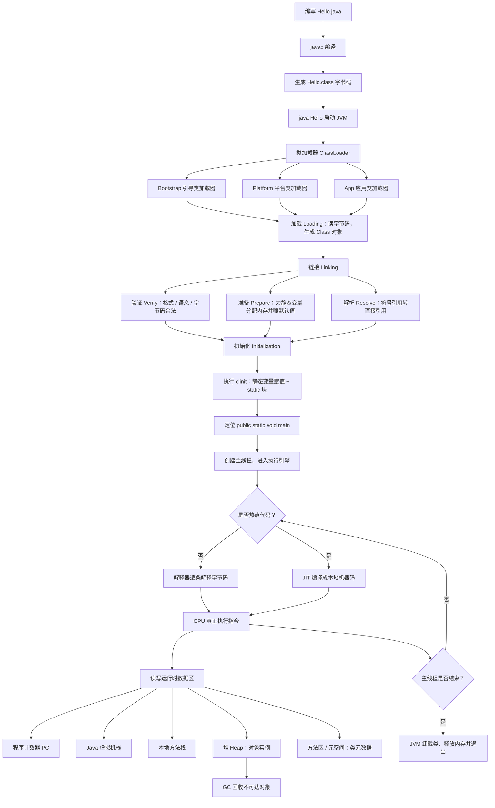

# Java 程序的运行机制

Java 和 C 不一样：源码不会直接变成机器码可执行文件，而是先编译成与平台无关的字节码，再交给 JVM 加载、链接、初始化，最后由执行引擎跑起来。

> 一句话：`.java` → `javac` → `.class` → JVM（加载 / 链接 / 初始化）→ 解释执行 + JIT → 结束退出。

## 运行机制流程图



## 和 C 程序对比

| 阶段     | C                                   | Java                       |
| -------- | ----------------------------------- | -------------------------- |
| 编译产物 | 机器码可执行文件                    | `.class` 字节码            |
| 谁来执行 | 操作系统直接加载                    | 必须先启动 JVM             |
| 跨平台   | 换平台要重新编译                    | 同一份字节码，换 JVM 即可  |
| 内存     | 进程自己的代码段 / 数据段 / 堆 / 栈 | JVM 再切出堆、栈、方法区等 |

## 三个必须记住的点

1. **编译一次，到处运行**：`javac` 只负责产出字节码，真正跑起来靠各平台自己的 JVM。
2. **类不是一下子就能用**：必须经过加载 → 链接（验证 / 准备 / 解析）→ 初始化，才能执行 `main`。
3. **执行不是纯解释**：冷代码走解释器，热点代码会被 JIT 编译成本地机器码，所以 Java 后期性能可以接近 C。

## JVM、JRE 和 JDK

**JVM (Java Virtual Machine)** Java 虚拟机，用于执行 `bytecode`字节码的虚拟计算机。

不同的操作系统有不同的版本JVM，屏蔽了底层运行平台的差别，是实现**跨平台**的核心。

**JRE**(Java Runtime Environment)包含：Java 虚拟机、库函数

Java Development Kit （JDK）包含 JRE ，编译器和调试器等。

> 如果只是要运行 java 程序或者玩 Minecraft 这样的 Java 游戏，只需要 JRE 即可。

## 收费的问题

自 2019 年后，JDK8 后续更新的版本就开始收费了，但是，主要针对的是企业用户，对于个人学习者没有影响。

由于 Java 虚拟机的规范是开放的，任何人都可以去实现它。常见的 JDK 有如下几种

1. oracle JDK
2. open JDK
3. IBM、亚马逊等大公司有自己的 JDK

> 十万行代码 = 三十万年薪

## 第一个代码

```java
public class Welcome {
  public static void main(String args[]) {
    System.out.println("hello world");
  }
}
```

```bash
javac Welcome.java

java Welcome
hello world

```

1. Java 对大小写敏感
2. 关键字`class`的意思是类。Java 是面向对象的语言，所有的代码都必须位于类里面
3. 源文件编译后，得到相应的字节码文件`.class`文件，编译器为每个类生成独立的字节码文件
4. `main`方法是 java 应用程序的入口方法，格式固定：`public static void main(String args[]){...}`。
5. 一个源文件可以包含多个类。
6. 每个语句必须以分号结束，回车不是语句的结束标志，所以一个语句可以跨多行。
7. 编程时，注意缩进规范。
8. 在写括号、引号时，一定是成对编写，然后再往里面插入内容。

## 常用的 DOS 命令

磁盘操作系统缩写，是早期个人计算机上的一类操作系统

常用命令

1. `cd 目录路径`，进入一个目录
2. `cd ..`，进入父目录
3. `dir`查看本目录下的文件和子目录列表
4. `cls`清屏
5. `上下键`查找敲过的命令
6. `tab`自动补齐命令
