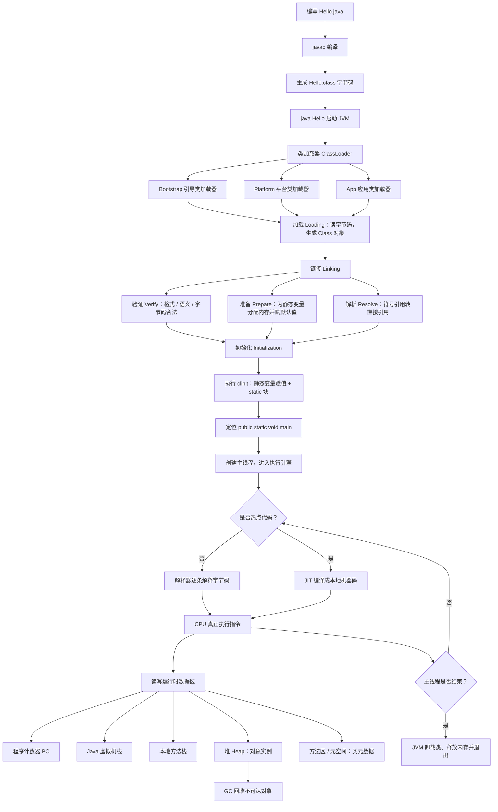

# Java 程序的运行机制

Java 和 C 不一样：源码不会直接变成机器码可执行文件，而是先编译成与平台无关的字节码，再交给 JVM 加载、链接、初始化，最后由执行引擎跑起来。

> 一句话：`.java` → `javac` → `.class` → JVM（加载 / 链接 / 初始化）→ 解释执行 + JIT → 结束退出。

## 运行机制流程图

## 和 C 程序对比

| 阶段 | C | Java |
| --- | --- | --- |
| 编译产物 | 机器码可执行文件 | `.class` 字节码 |
| 谁来执行 | 操作系统直接加载 | 必须先启动 JVM |
| 跨平台 | 换平台要重新编译 | 同一份字节码，换 JVM 即可 |
| 内存 | 进程自己的代码段 / 数据段 / 堆 / 栈 | JVM 再切出堆、栈、方法区等 |

## 三个必须记住的点

1. **编译一次，到处运行**：`javac` 只负责产出字节码，真正跑起来靠各平台自己的 JVM。
2. **类不是一下子就能用**：必须经过加载 → 链接（验证 / 准备 / 解析）→ 初始化，才能执行 `main`。
3. **执行不是纯解释**：冷代码走解释器，热点代码会被 JIT 编译成本地机器码，所以 Java 后期性能可以接近 C。
