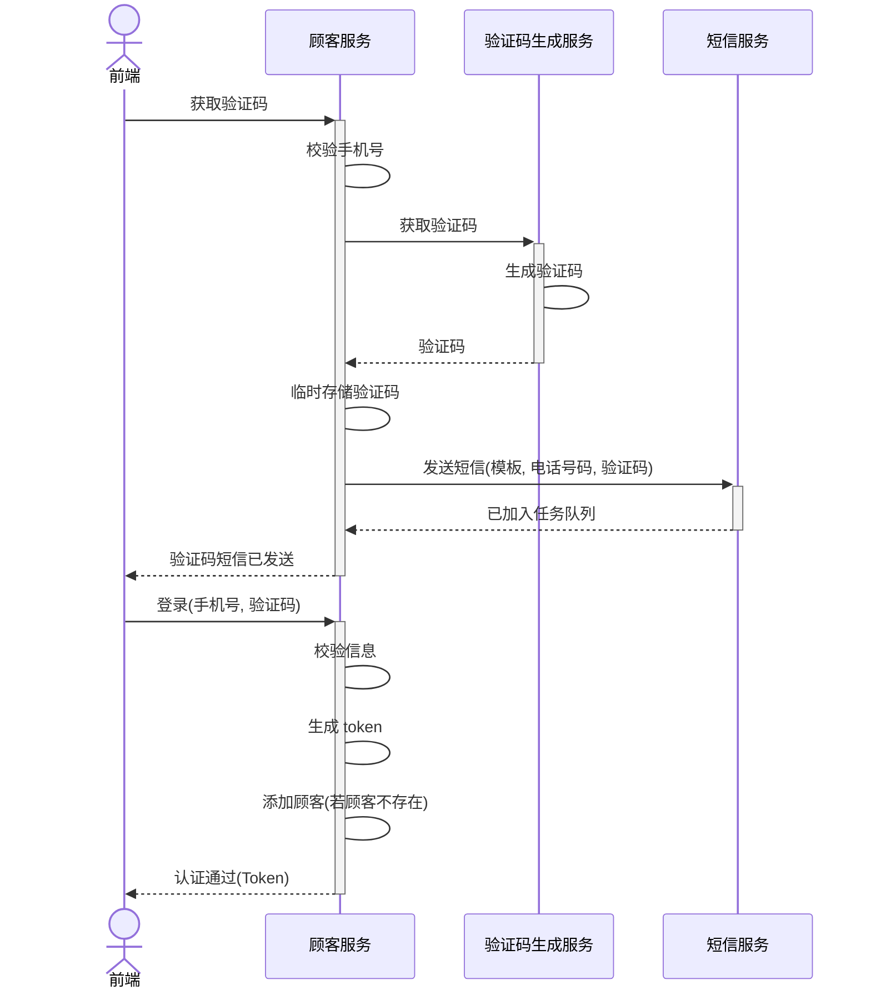

# 顾客服务

## 服务基础代码构建

```bash
cd backend

kratos new customer -r https://gitee.com/go-kratos/kratos-layout.git

cd customer

go mod tidy

go get github.com/google/wire/cmd/wire

go generate ./...

# 先修改监听端口 默认都是 8000 和 9000，避免有冲突
# 运行
kratos run
```

`backend/customer/configs/config.yaml`

修改对应的`http`和`grpc`的服务端口

```yaml
server:
  http:
    addr: 0.0.0.0:8100
    timeout: 1s
  grpc:
    addr: 0.0.0.0:9100
    timeout: 1s
data:
  database:
    driver: mysql
    source: root:root@tcp(127.0.0.1:3306)/test?parseTime=True&loc=Local
  redis:
    addr: 127.0.0.1:6379
    read_timeout: 0.2s
    write_timeout: 0.2s
```

> 启动运行效果

```bash
> kratos run
2026/06/28 16:54:02 maxprocs: Leaving GOMAXPROCS=10: CPU quota undefined
DEBUG msg=config loaded: config.yaml format: yaml
INFO ts=2026-06-28T16:54:02+08:00 caller=http/server.go:330 service.id=wujiedeMac-mini-2.local service.name= service.version= trace.id= span.id= msg=[HTTP] server listening on: [::]:8100
INFO ts=2026-06-28T16:54:02+08:00 caller=grpc/server.go:212 service.id=wujiedeMac-mini-2.local service.name= service.version= trace.id= span.id= msg=[gRPC] server listening on: [::]:9100
```

## 顾客登录页接口-设计




### 概述

- 两大步骤
  - 获取验证码
  - 认证
- 获取验证码需要后端多个服务参与
  - 顾客服务负责与前端交互
  - 验证码生成服务负责生成验证码，由顾客服务调用
  - 短信服务负责发送短信，由顾客服务异步调用
- 涉及技术
  - 服务间调用
  - JWT Token 的使用
  -  临时数据存储(Redis)
  - 持久数据存储(MySQL)
  - HTTP 接口


## 顾客获取验证码-protobuf 定义以及代码生成

### 添加.proto文件

> 命令

```bash
kratos proto add api/customer/customer.proto
```

