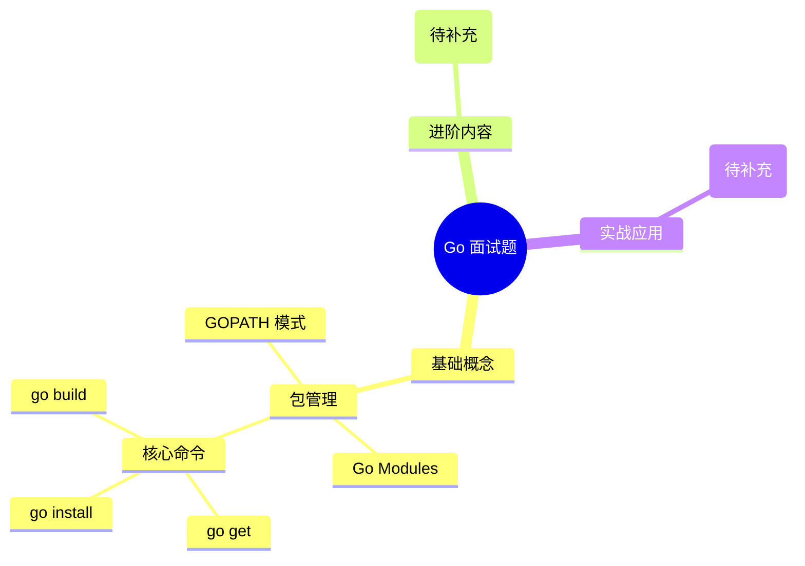

# Go 面试题索引

## 📚 内容概览

本章节收集了 Go 语言相关的面试题目和解答，帮助开发者系统准备技术面试。

## 📝 文章列表

### Go 包管理

- [Go 包管理的方式有哪些](./package.md) - 介绍从 GOPATH 到 Go Modules 的演变过程，包括核心命令的使用区别

## 🎯 学习路径

图 1. Go 面试题知识体系

## 📌 其他资源

- [Go 语言基础](/views/go/) - Go 语言核心知识
- [Go 核心](/views/go-core/) - Go 语言深入理解
- [Kratos 微服务](/kratos/) - 基于 Kratos 框架的微服务开发
- [Go-zero 框架](/views/go-zero/) - Go-zero 微服务框架使用

## 💡 贡献指南

欢迎提交更多 Go 面试题到你的笔记中！
