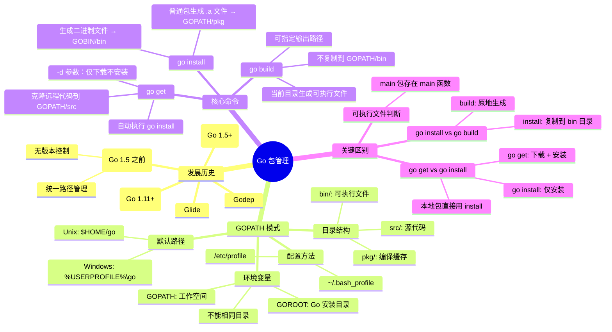

# Go 包管理的方式有哪些

## 🧠 知识图谱



<div class="caption">图 1. Go 包管理体系思维导图</div>

## 包管理的发展历史

- **GOPATH <Go1.5**
- Godep
- Glide
- **Govendor >=Go1.5**
- **Go Modules >=Go1.11 版本**


### GOPATH 模式

- 最早的管理模式随 go 语言诞生
- 通过统一包存放的路径实现包管理
- 不支持依赖包的版本控制

- GOPATH 模式是指我们通过 GOPATH 来管理我们的包
- GOPATH 路径指的是 GOPATH 这个环境变量的路径
- GOROOT 是 go 语言的安装目录，内置的包，标准库
- GOPATH 是 go 语言制定的工作空间
- GOPATH 目录和 GOROOT 不能是同一个目录


### 默认值

GOPATH 从 go1.8 版本，默认值

- windows：`%USERPROFILE%/go`，即 `C:\Users\用户名\go`
- Unix：`$HOME/go`，即`/home/用户名/go`

可以通过`go env`指令来查看。


GOPATH 的配置

`~/.bash_profile`文件或者`/etc/profile`文件【对全部用户有效】


```bash
export GOPATH=$HOME/mygopath
export GOBIN=$GOPATH/bin
export PATH=$PATH:$GOBIN
```

开启了 `GOPATH` 模式，我们的工程代码就必须放在`GOPATH/src`目录下。


## go get 命令过程

- 先将远程代码克隆到`$GOPATH/src`目录下
- 执行`go install`命令，如果指定的包生成的二进制文件保存到`GOPATH/bin`目录下
- 可以指定`-d`参数仅下载不安装


## go install

- 可生成可执行的二进制文件，存储到`$GOPATH/bin`，严格意义来说是`GOBIN`目录下
- 普通包，则会编译生成`.a`结尾的文件放到`$GOPATH/pkg`下，编译缓存，提升后续的编译的速度


## 怎么判断一个能否生成可执行文件

- `main`包中存在`main`函数的情况下
- `go install`是建立在`GOPATH`的基础上的，无法单独使用的
- `go install`生成的可执行文件的名称与包名一致
- `go install`输出的目录是不支持通过命令指定的


## 既然 go get 包含了 go install 操作，为什么还需要 go install

- go get 包含了下载远程的依赖包，如果是本地的依赖包，就不需要远程了，直接 `go install`
- go1.15 版后，如果没有本地包`go install `也会从远程进行下载依赖包


## go build

- 默认会在当前目录下编译生成可执行文件，可指定
- 不会将可执行文件复制到`$GOPATH/bin`目录下
