# 系统接口设计与集成实战（编号 51-80）

## 整体架构说明

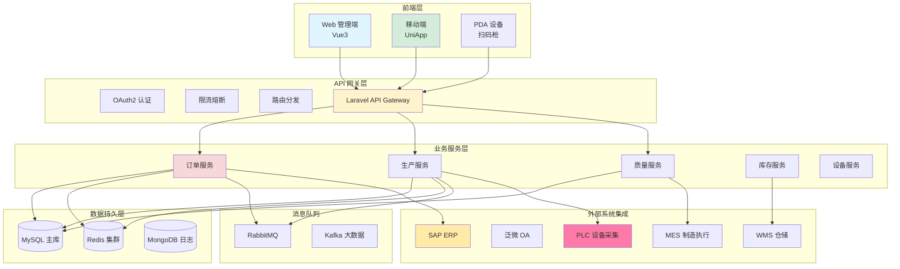

### 51. ERP 订单同步完整流程

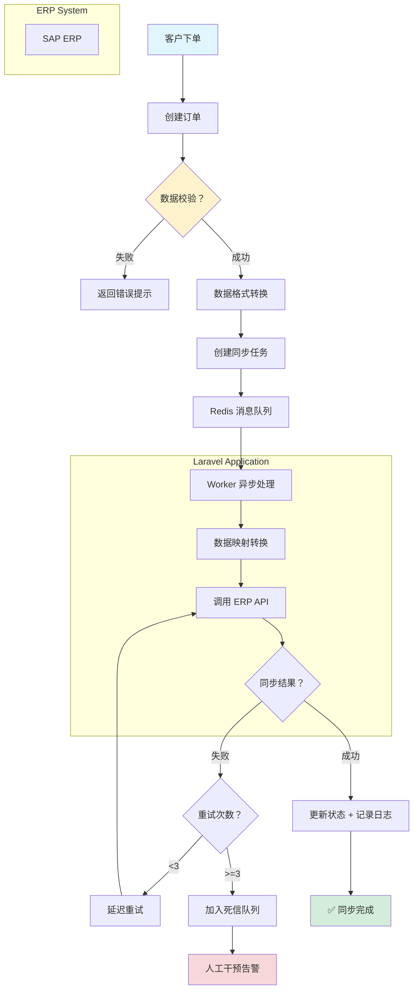

```php
class ErpOrderSyncService {
    public function __construct(
        private OrderRepository $orderRepo,
        private ErpClient $erpClient,
        private SyncLogRepository $logRepo,
    ) {}

    /**
     * 将订单同步到 ERP 系统
     */
    public function sync(Order $order): SyncResult {
        // ✅ 步骤 1: 数据校验
        if (!$this->validateOrder($order)) {
            return SyncResult::failed('订单数据不完整');
        }

        // ✅ 步骤 2: 准备 ERP 所需数据格式
        $erpData = $this->mapToErpFormat($order);

        // ✅ 步骤 3: 异步队列发送
        SyncOrderToERP::dispatch($order->id);

        // ✅ 步骤 4: 记录同步日志
        $this->logRepo->create([
            'order_id' => $order->id,
            'action' => 'sync_to_erp',
            'status' => 'pending',
            'payload' => json_encode($erpData),
        ]);

        return SyncResult::success();
    }

    private function mapToErpFormat(Order $order): array {
        return [
            'sales_order_no' => $order->order_code,
            'customer_code' => $order->customer->erp_customer_code,
            'order_date' => $order->created_at->format('Y-m-d'),
            'lines' => $order->items->map(fn($item) => [
                'material_code' => $item->product->erp_sku,
                'quantity' => $item->quantity,
                'unit_price' => $item->unit_price,
                'tax_rate' => 0.13,  // 13%增值税
            ])->toArray(),
            'delivery_date' => $order->delivery_date?->format('Y-m-d'),
        ];
    }

    private function validateOrder(Order $order): bool {
        return $order->status === 'confirmed'
            && $order->customer->erp_customer_code !== null
            && $order->items->where('quantity', 0)->isEmpty();
    }
}
```

**关键设计说明：**

::: details 点击查看时序图

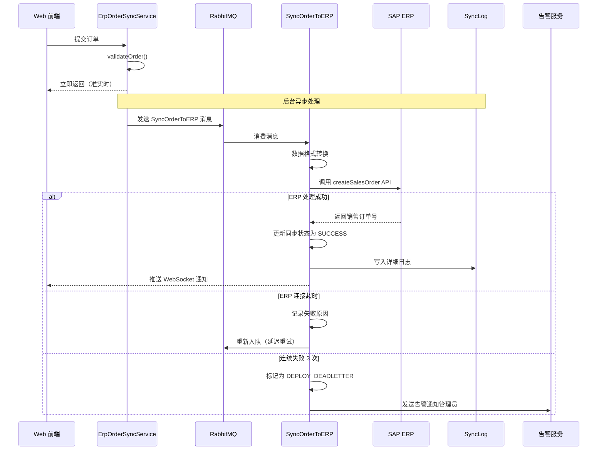

### 52. 物料主数据同步

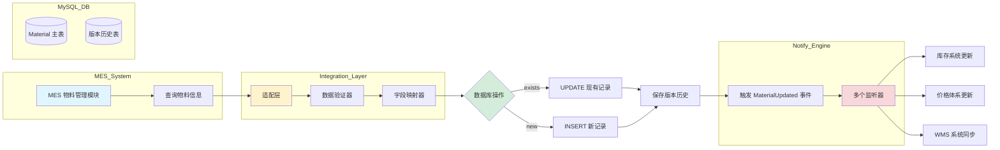

```php
class MaterialMasterSync {
    public function syncFromMES(string $materialCode): Material {
        // 从 MES 拉取物料主数据
        $mesMaterial = $this->mesClient->getMaterial($materialCode);

        return DB::transaction(function () use ($mesMaterial) {
            // ✅ 更新或创建
            $material = Material::firstOrCreate(
                ['code' => $mesMaterial->code],
                [
                    'name' => $mesMaterial->name,
                    'specification' => $mesMaterial->spec,
                    'unit' => $mesMaterial->unit,
                    'weight' => $mesMaterial->weight,
                    'volume' => $mesMaterial->volume,
                    'erp_material_code' => $mesMaterial->erp_code,
                ]
            );

            // ✅ 触发事件通知其他系统
            event(new MaterialUpdated($material));

            return $material;
        });
    }
}

// Laravel Event Listener
class UpdateInventoryAfterMaterialUpdate {
    public function handle(MaterialUpdated $event): void {
        $material = $event->material;

        // 更新库存系统的物料信息
        InventoryService::updateMaterial([
            'material_code' => $material->erp_material_code,
            'specification' => $material->specification,
        ]);
    }
}
```

### 53. BOM（Bill of Materials）同步

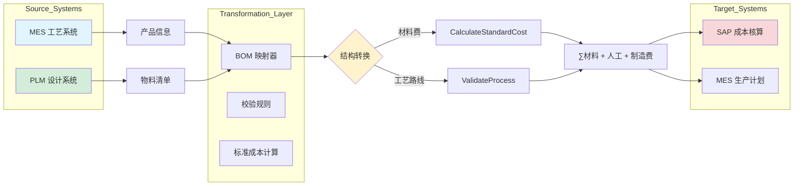

```php
class BomSyncService {
    /**
     * 工艺路线和 BOM 表同步
     */
    public function syncBom(int $productId): void {
        $product = Product::with('bomOperations')->find($productId);

        $bomData = [
            'product_code' => $product->code,
            'version' => $product->bom_version,
            'components' => $product->bom->map(fn($comp) => [
                'component_code' => $comp->material->code,
                'quantity' => $comp->quantity,
                'unit' => $comp->material->unit,
                'yield_rate' => $comp->yield_rate,  // 良品率
                'operation_seq' => $comp->operationSequence,
            ])->toArray(),
        ];

        // 发送到 MES 系统
        $this->mesClient->syncBom($bomData);

        // 发送到 ERP 成本核算
        $this->erpClient->updateBomCost([
            'product_code' => $product->code,
            'standard_cost' => $this->calculateStandardCost($product->bom),
        ]);
    }

    private function calculateStandardCost(Collection $bom): float {
        $total = 0;
        foreach ($bom as $comp) {
            $total += $comp->material->cost * $comp->quantity;
        }
        return $total * (1 + $this->laborRate);  // 加上人工费
    }
}
```

### 54. 工单状态回传

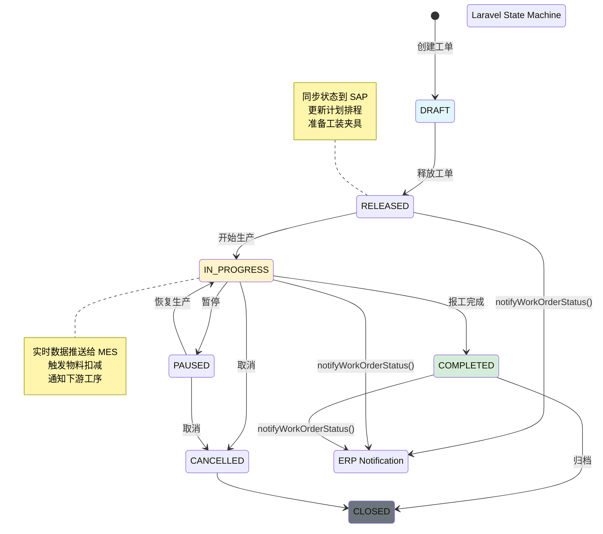

```php
class WorkOrderStatusCallback {
    public function notifyWorkOrderStatus(WorkOrder $workOrder): void {
        $statusMapping = [
            'created' => 'RELEASED',
            'in_progress' => 'EXECUTING',
            'completed' => 'CLOSED',
            'cancelled' => 'CANCELLED',
        ];

        $erpStatus = $statusMapping[$workOrder->status] ?? null;

        if ($erpStatus) {
            $this->erpClient->updateWorkOrderStatus([
                'work_order_no' => $workOrder->erp_work_order_no,
                'status' => $erpStatus,
                'completion_rate' => $workOrder->progress_percentage,
                'actual_start_time' => $workOrder->actual_start_time,
                'actual_end_time' => $workOrder->actual_end_time,
            ]);
        }
    }
}

// 使用观察者模式
class WorkOrder extends Model {
    protected static function boot() {
        parent::boot();

        static::updated(function (WorkOrder $wo) {
            if ($wo->isDirty('status')) {
                app(WorkOrderStatusCallback::class)->notifyWorkOrderStatus($wo);
            }
        });
    }
}
```

### 55-60. ERP 快速问答

**55. ERP 接口异常如何处理？**  
重试机制 + 死信队列 + 人工干预界面 + 详细错误日志

**56. 如何保证数据一致性？**  
分布式事务（TCC）、最终一致性补偿、对账机制

**57. ERP 订单数量巨大怎么优化？**  
分批处理（chunk）、消息队列、批量 API、压缩传输

**58. 如何处理字段映射冲突？**  
建立映射配置表、版本化转换规则、数据清洗层

**59. 实时 vs 异步同步？**  
关键业务实时（如库存变更），非关键批量（如报表）

**60. ERP 对接常见坑？**  
编码不一致、时区差异、主键冲突、数据字典映射

## MES 系统集成（61-70）

### 61. 生产报工数据采集

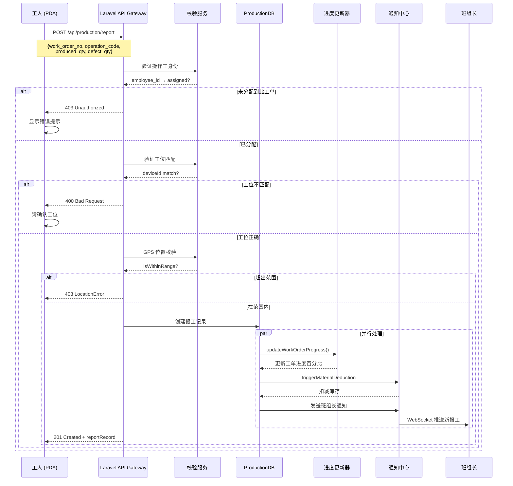

```php
class ProductionReportingService {
    public function submitReport(ReportRequest $request): ReportRecord {
        // 验证工序和机台
        if (!$this->validateOperation($request->operationCode, $request->deviceId)) {
            throw new BusinessException('工序机台不匹配');
        }

        // 防作弊：操作员不能代打卡
        $worker = auth()->user();
        if (!$this->workerIsOnStation($worker->id, $request->deviceId)) {
            throw new BusinessException('操作员不在指定工位');
        }

        // 创建报工记录
        $report = ReportRecord::create([
            'work_order_no' => $request->workOrderNo,
            'operation_code' => $request->operationCode,
            'operator_id' => $worker->employee_id,
            'device_id' => $request->deviceId,
            'produced_qty' => $request->producedQty,
            'defect_qty' => $request->defectQty,
            'scrap_rate' => $this->calculateScrapRate($request),
            'process_params' => $request->processParams,  // 温度、压力等
            'reported_at' => now(),
        ]);

        // 实时更新工单进度
        $workOrder = WorkOrder::where('work_order_no', $request->workOrderNo)->first();
        $this->updateWorkOrderProgress($workOrder);

        return $report;
    }

    private function updateWorkOrderProgress(WorkOrder $wo): void {
        $totalReported = $wo->reports->sum('produced_qty');
        $plannedQty = $wo->planned_quantity;

        $wo->update([
            'progress_percentage' => min(100, round($totalReported / $plannedQty * 100)),
            'actual_output' => $totalReported,
        ]);
    }
}
```

### 62. 设备参数采集

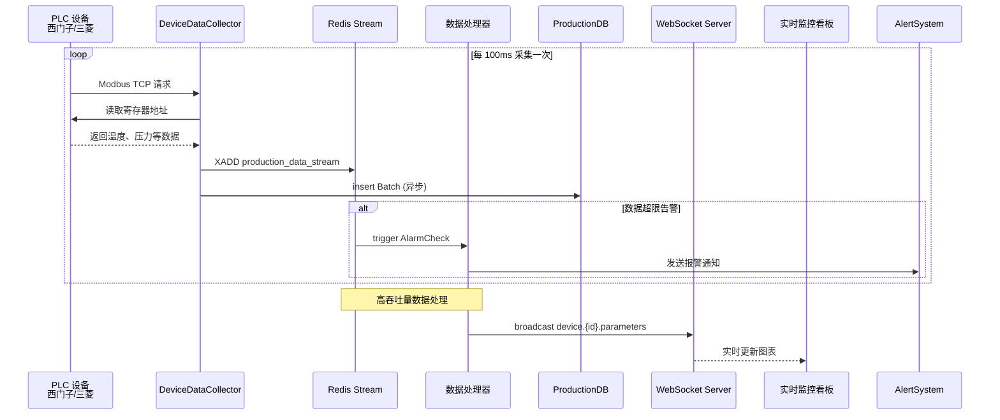

```php
class DeviceParameterCollector {
    public function collectFromPLC(string $deviceId, array $parameterCodes): array {
        // Modbus TCP通信
        $socket = $this->getConnection($deviceId);

        $results = [];
        foreach ($parameterCodes as $code) {
            $address = $this->getParameterAddress($code);
            $value = socket_read($socket, $address, 2);  // 读取寄存器

            $results[] = [
                'param_code' => $code,
                'param_name' => $this->getParamName($code),
                'value' => $value,
                'timestamp' => now(),
            ];
        }

        // 保存到数据库
        ProductionParameter::insert(collection($results)->map(fn($r) => [
            'device_id' => $deviceId,
            'parameter_code' => $r['param_code'],
            'parameter_value' => $r['value'],
            'collected_at' => $r['timestamp'],
        ])->toArray());

        return $results;
    }
}

// WebSocket推送实时数据到前端
class ParameterWebSocket {
    public function pushParameterChange(string $deviceId, float $temperature): void {
        Broadcast::channel("device.{$deviceId}.parameters", [
            'device_id' => $deviceId,
            'temperature' => $temperature,
            'timestamp' => now()->toIso8601ZonedDateTimeString(),
        ]);
    }
}
```

### 63. 质量检验记录

```php
class QualityInspectionService {
    public function createInspection(QualityInspectionRequest $request): InspectionRecord {
        $inspection = InspectionRecord::create([
            'order_id' => $request->orderId,
            'batch_no' => $request->batchNo,
            'inspection_type' => $request->type,  // INCOMING/FINAL
            'inspector_id' => auth()->id(),
            'sample_size' => $request->sampleSize,
            'passed_count' => $request->passedCount,
            'failed_count' => $request->failedCount,
            'defect_types' => $request->defects,  // JSON数组
            'dimensional_data' => $request->measurements,  // 尺寸数据
            'result' => $request->passed ? 'PASS' : 'FAIL',
            'remark' => $request->remark,
        ]);

        // 不合格品自动触发 NCR 流程
        if (!$request->passed) {
            NotConformanceReport::create([
                'related_inspection_id' => $inspection->id,
                'defect_summary' => $this->summarizeDefects($request->defects),
                'severity' => $this->classifySeverity($request->failedCount),
            ]);
        }

        return $inspection;
    }
}
```

### 64. 追溯码管理

```php
class TraceabilityCodeManager {
    public function assignTraceCode(string $workOrderNo): string {
        // SN 码生成规则：批次年月 + 流水号 + 校验位
        $prefix = now()->format('Ymd') . substr(str_shuffle('ABCDEFGHIJKLMNOPQRSTUVWXYZ0123456789'), 0, 3);
        $serial = $this->getNextSerial($workOrderNo, $prefix);

        $traceCode = $prefix . str_pad($serial, 6, '0', STR_PAD_LEFT) . $this->checkDigit($prefix.$serial);

        TraceCode::create([
            'trace_code' => $traceCode,
            'work_order_no' => $workOrderNo,
            'product_id' => $this->getProductFromWorkOrder($workOrderNo),
            'assigned_at' => now(),
            'status' => 'ASSIGNED',
        ]);

        return $traceCode;
    }

    public function traceBack(string $traceCode): TracebackResult {
        $code = TraceCode::where('trace_code', $traceCode)->firstOrFail();

        // 向上追溯：原材料批次
        $materials = $this->getUsedMaterials($code->work_order_no);

        // 向下追溯：使用情况
        $usage = $this->getUsageRecords($code->product_id);

        return new TracebackResult($code, $materials, $usage);
    }
}
```

### 65-70. MES 快速问答

**65. 如何防止报工作弊？**  
GPS 定位 + NFC 打卡 + 人脸识别 + 随机验证码

**66. 设备停机时间如何统计？**  
PLC 信号监控 + 状态轮询 + 异常告警 + 停机原因代码

**67. OEE（设备综合效率）计算？**  
OEE = 可用率 × 表现性 × 质量率

**68. 如何实现无纸化车间？**  
PDA 扫码 + 电子看板 + 移动终端 + 云端同步

**69. 良率分析怎么做？**  
SPC统计过程控制 + Pareto 分析 + 鱼骨图 + 趋势监控

**70. 防错（Poka-Yoke）系统设计？**  
扫码核对 + 工装夹具检测 + 视觉识别 + 逻辑校验

## OA 系统集成（71-75）

### 71. 审批流引擎

```php
class ApprovalWorkflowEngine {
    public function submitApproval(ApprovalRequest $request): ApprovalNode {
        // 获取审批流定义
        $workflow = WorkflowDefinition::where('type', $request->type)->first();

        // 创建审批实例
        $approval = ApprovalNode::create([
            'workflow_id' => $workflow->id,
            'business_type' => $request->type,
            'business_id' => $request->businessId,
            'applicant_id' => $request->applicantId,
            'current_node' => $workflow->startNodeId,
            'status' => 'PENDING',
            'data' => $request->payload,
        ]);

        // 自动审批节点
        $this->routeToApprovers($approval);

        return $approval;
    }

    private function routeToApprovers(ApprovalNode $approval): void {
        $nextNode = $approval->workflow->getNode($approval->current_node);

        // 串行审批
        foreach ($nextNode->approvers as $approver) {
            Notification::send(User::findOrFail($approver->user_id),
                new ApprovalPending($approval)
            );
        }
    }
}
```

### 72. 组织架构同步

```php
class OrgStructureSync {
    public function syncFromOA(): void {
        // 从 OA 系统拉取部门和员工数据
        $oaDepartments = $this->oaClient->getDepartments();

        foreach ($oaDepartments as $oaDept) {
            $dept = Department::updateOrCreate(
                ['oa_dept_code' => $oaDept->code],
                [
                    'name' => $oaDept->name,
                    'parent_id' => $this->getParentDeptId($oaDept->parentId),
                    'manager_id' => $this->getManagerId($oaDept->managerCode),
                    'level' => $oaDept->level,
                    'path' => $oaDept->path,  // 部门路径
                ]
            );
        }

        // 同步员工
        $oaEmployees = $this->oaClient->getEmployees();
        foreach ($oaEmployees as $oaEmp) {
            Employee::updateOrCreate(
                ['oa_employee_code' => $oaEmp->code],
                [
                    'name' => $oaEmp->name,
                    'department_id' => $oaEmp->departmentId,
                    'position' => $oaEmp->position,
                    'email' => $oaEmp->email,
                    'phone' => $oaEmp->phone,
                    'status' => $oaEmp->status,
                ]
            );
        }
    }
}
```

### 73. 权限账号同步

```php
class UserAccountSync {
    public function syncUserToOA(User $user): void {
        // 创建或更新 OA 账号
        $oaResponse = $this->oaClient->upsertEmployee([
            'employee_code' => $user->employee_id,
            'name' => $user->name,
            'email' => $user->email,
            'password' => $this->hashPassword($user->password),
            'departments' => [$user->department->oa_dept_code],
            'roles' => $user->getRoleNames(),
        ]);

        // 记录同步状态
        UserOASync::create([
            'user_id' => $user->id,
            'oa_user_id' => $oaResponse->userId,
            'sync_status' => 'SUCCESS',
            'synced_at' => now(),
        ]);
    }
}
```

### 74. 消息互通

```php
class MessageIntegration {
    public function sendToOANotification(string $title, string $content, array $recipients): void {
        $this->oaClient->sendNotification([
            'message_type' => 'WORKFLOW',
            'title' => $title,
            'content' => $content,
            'recipients' => $recipients,
            'callback_url' => route('oa.message.callback'),
        ]);
    }

    public function webhookHandler(Request $request): Response {
        // 处理 OA 消息回调
        $webhook = $request->json()->all();

        if ($webhook['type'] === 'APPROVAL_COMPLETE') {
            $this->handleApprovalComplete($webhook);
        }

        return response()->json(['status' => 'OK']);
    }
}
```

### 75-75. OA 快速问答

**75. 如何处理多系统用户账号一致性问题？**  
统一身份认证（SSO）、LDAP/AD集成、账号中间表、定时对账

## UniApp 开发（76-80）

### 76. 微信小程序与 APP 统一开发

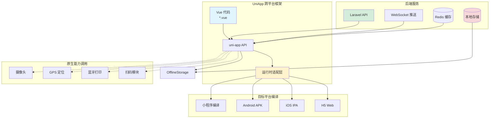

### 76. 微信小程序开发要点

```vue
<!-- pages/work-report/index.vue -->
<template>
  <view class="container">
    <!-- 表单验证 -->
    <form @submit="onSubmit">
      <input v-model="formData.workOrderNo" placeholder="工单号" />

      <!-- 扫码功能 -->
      <button @tap="scanQRCode">扫码报工</button>

      <!-- 提交按钮 -->
      <button type="primary" formType="submit">提交报工</button>
    </form>

    <!-- 实时位置 -->
    <button @tap="getLocation">当前位置</button>
  </view>
</template>

<script>
export default {
  data() {
    return {
      formData: {
        workOrderNo: "",
        producedQty: 0,
        defectQty: 0,
        devicePosition: null,
      },
    };
  },

  methods: {
    async scanQRCode() {
      const res = await uni.scanCode({
        type: "qr",
        resultType: "string",
      });

      this.formData.workOrderNo = res.result;
    },

    getLocation() {
      uni.getLocation({
        type: "gcj02",
        success: (res) => {
          this.formData.devicePosition = {
            latitude: res.latitude,
            longitude: res.longitude,
          };
        },
      });
    },

    onSubmit(e) {
      const { detail } = e.detail;

      // 防重复提交
      if (this.submitting) return;

      this.submitting = true;

      wx.request({
        url: "/api/production/report",
        method: "POST",
        data: this.formData,
        success: (res) => {
          if (res.data.code === 0) {
            uni.showToast({ title: "报工成功" });
            setTimeout(() => wx.navigateBack(), 1500);
          }
        },
        fail: (err) => {
          uni.showToast({ title: "提交失败", icon: "none" });
        },
        complete: () => {
          this.submitting = false;
        },
      });
    },
  },
};
</script>
```

### 77. APP跨平台开发策略

```javascript
// manifest.json 配置
{
  "name": "工厂助手",
  "appid": "__UNI__FactoryApp",
  "description": "工厂生产管理系统",
  "versionName": "1.0.0",
  "versionCode": "100",
  "transformPx": false,
  "app-plus": {
    "usingComponents": true,
    "nvue": true,  // 支持原生 UI
    "splashscreen": {
      "alwaysShowBeforeRender": true,
      "waiting": true
    },
    "orientation": ["portrait"],
    "modules": {
      "Barcode": {},  // 条码扫描
      "Location": {},  // GPS定位
      "Push": {}  // 推送通知
    }
  }
}

// 混合开发：NVue 页面
// pages/scanner.nvue
<template>
  <view class="scanner">
    <barcode v-model="scanResult" @scan="onScan"></barcode>
    <text>{{ scanResult }}</text>
  </view>
</template>

<script>
export default {
  data() {
    return {
      scanResult: ''
    }
  },
  methods: {
    onScan(e) {
      console.log('扫描结果:', e.content);
      this.scanResult = e.content;

      // 自动提交
      this.submitScanResult(e.content);
    }
  }
}
</script>
```

### 78. 离线数据存储

```javascript
// 使用 SQLite 本地缓存
import db from "@/common/sqlite.js";

class OfflineStorage {
  constructor() {
    this.initDB();
  }

  async initDB() {
    await db.open({ name: "factory-db" });

    // 创建表
    await db.exec(`
      CREATE TABLE IF NOT EXISTS reports (
        id INTEGER PRIMARY KEY AUTOINCREMENT,
        work_order_no TEXT,
        produced_qty INTEGER,
        status TEXT,
        created_at DATETIME
      )
    `);
  }

  async saveReportLocally(report) {
    // 离线保存报工数据
    await db.run(
      "INSERT INTO reports (work_order_no, produced_qty, status, created_at) VALUES (?, ?, ?, ?)",
      [report.workOrderNo, report.producedQty, "PENDING_SYNC", new Date()],
    );

    uni.showToast({ title: "已离线保存" });
  }

  async getOfflineReports() {
    return db.select("SELECT * FROM reports WHERE status = ?", [
      "PENDING_SYNC",
    ]);
  }

  async syncOfflineData() {
    const reports = await this.getOfflineReports();

    for (const report of reports) {
      try {
        await api.submitReport(report);

        // 同步成功后更新状态
        await db.run("UPDATE reports SET status = ? WHERE id = ?", [
          "SYNCED",
          report.id,
        ]);
      } catch (error) {
        console.error("同步失败:", error);
      }
    }
  }
}
```

### 79. 离线数据存储方案

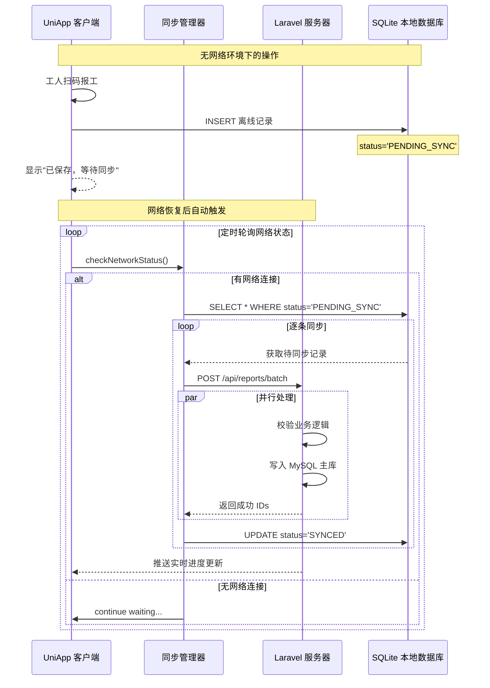

```javascript
// 懒加载列表
<scroll-view scroll-y @scrolltolower="loadMore" :style="{ height: windowHeight }">
  <view v-for="item in list" :key="item.id">{{ item.name }}</view>
</scroll-view>

<script>
export default {
  data() {
    return {
      list: [],
      page: 1,
      loading: false
    }
  },

  onLoad() {
    this.loadData();
  },

  onReachBottom() {
    this.loadMore();
  },

  methods: {
    async loadData() {
      if (this.loading) return;

      this.loading = true;

      const res = await api.getReports({
        page: this.page,
        limit: 20
      });

      this.list.push(...res.data);
      this.page++;
      this.loading = false;
    },

    loadMore() {
      this.loadData();
    }
  }
}
</script>
```

### 80. 原生模块调用

```javascript
// 调用原生蓝牙打印小票打印机
async function printWorkOrder Slip(workOrderNo) {
  const scannerModule = plus.os.modules('com.factory.barcode.Scanner');

  const barcode = await scannerModule.scan();

  // 打印标签
  const bluetoothModule = plus.os.modules('com.factory.bluetooth.Printer');

  await bluetoothModule.connect(PRINTER_ADDRESS);

  const content = \`
    工单号：${workOrderNo}
    产品：${productName}
    数量：${quantity}
  \`;

  await bluetoothModule.print(content);

  await bluetoothModule.disconnect();
}
```

## 附录：典型集成架构图

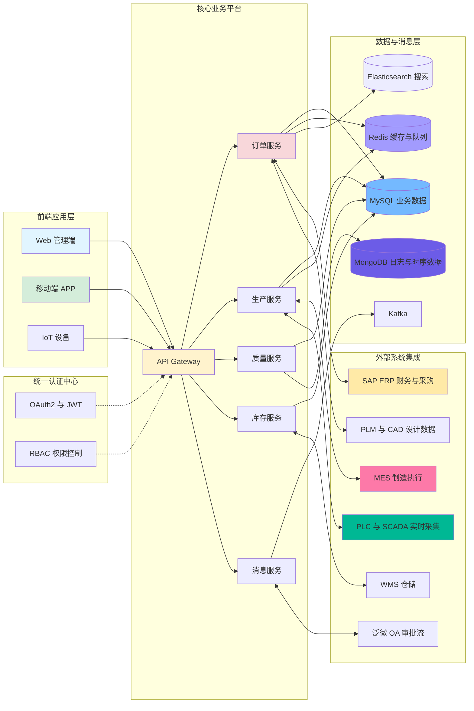

::: tip
本文档覆盖了系统集成面试的核心理论与实战案例，重点展示了 Laravel 在企业级应用开发中的集成能力。
:::
