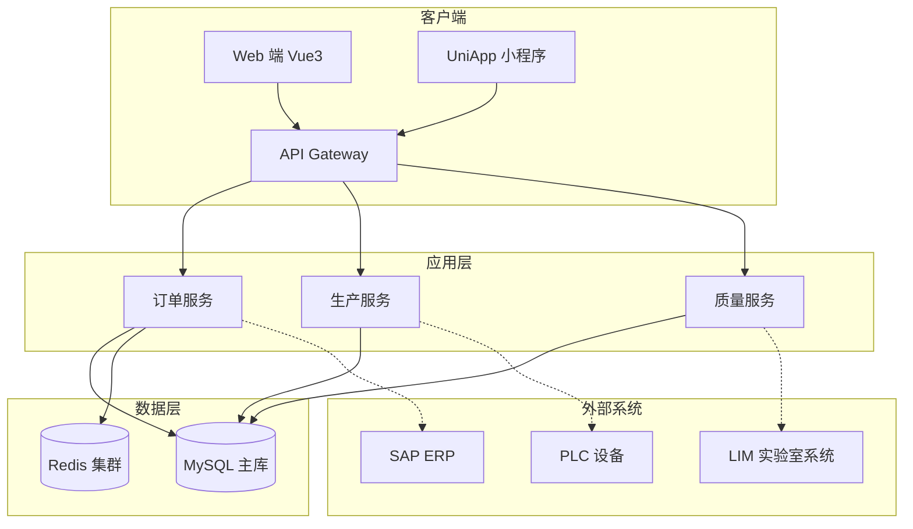
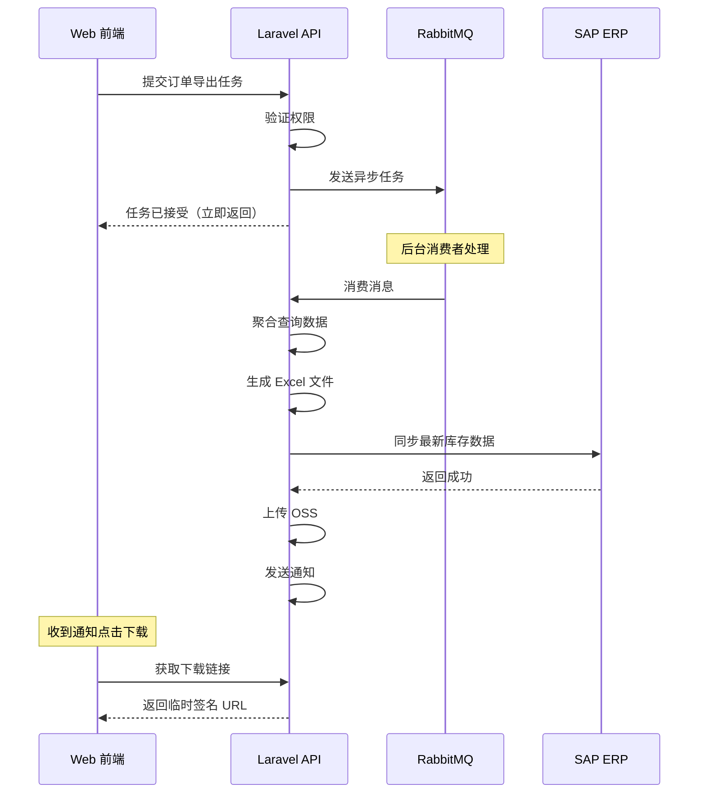

# 技术沟通与需求转化（编号 141-150）

## 场景一：业务人员说"我想要一个导出功能"

### 🔍 深度挖掘问题

```markdown
❌ 错误做法：直接开始写代码
✅ 正确做法：提问引导

关键问题清单：

1. 导出什么数据？全部字段还是部分字段？
2. 数据量大概多大？（影响性能设计）
3. 导出格式要求？（Excel/PDF/CSV）
4. 需要包含哪些统计信息？
5. 是否需要自定义列顺序？
6. 导出频率如何？（实时 or 定时）
7. 导出失败有什么补救方案？
8. 是否有权限控制？（谁能导 / 谁不能导）
```

### 💡 需求转化为技术方案

**用户原话**：

> "领导想要看到每个车间的生产效率报表，可以导出 Excel。"

**分析师转化后**：

```markdown
需求理解：
• 目标用户：生产总监 + 各车间主任
• 核心指标：OEE、良率、工时利用率、设备稼动率
• 数据范围：支持按日期范围、车间维度筛选
• 导出格式：.xlsx（保留样式公式）
• 数据量级：单月数据约 10 万行
• 时效性：T+1 凌晨生成，早上 8 点前推送

技术方案：
┌──────────────────────────────────────┐
│ 前端：Ant Design Table + ExportBtn │
├──────────────────────────────────────┤
│ 后端：异步任务 + Redis 队列 │
├──────────────────────────────────────┤
│ 计算引擎：Laravel Collection 链式调用│
├──────────────────────────────────────┤
│ 文件生成：PHPSpreadsheet │
└──────────────────────────────────────┘

性能优化：
✅ 分页查询（chunkById）避免内存溢出
✅ 预计算中间表减少实时聚合
✅ 生成完成后短信通知用户下载
✅ 缓存 24 小时，重复请求直接返回缓存
```

**输出文档**：

- 《生产效率报表需求规格说明书》
- 《接口定义文档》
- 《UI 交互原型图》
- 《测试用例清单》

---

## 场景二：MES 系统要对接 SAP ERP

### 📋 沟通流程

```markdown
第 1 天：需求调研会议
━━━━━━━━━━━━━━━━━━━━
参与人员：
• 甲方：IT 经理、生产主管、物料管理员
• 乙方：项目经理、架构师、高级开发

议程：
✅ 了解业务流程现状（画流程图）
✅ 确认数据映射规则
✅ 识别风险点和依赖项
✅ 制定实施计划

产出：会议纪要 + 业务流程图 + 待确认清单
```

### 🗺️ 业务流程梳理（示例）

```
[工单在 MES 释放] → [同步到 SAP] → [SAP 创建生产订单]
       ↓
[MES 报工完成] → [传回 SAP] → [SAP 更新订单状态]
       ↓
[SAP 成本核算完成] → [推送给 MES] → [MES 显示预计成本]
```

### 📊 数据映射表

| MES 字段      | SAP 字段 | 转换规则          | 备注         |
| ------------- | -------- | ----------------- | ------------ |
| order_code    | AUFNR    | 前缀WO 去掉       | 主键映射     |
| planned_qty   | MENGE    | 直接映射          | 单位 pcs→pcs |
| product_code  | MATNR    | SKU→Material Code | 查映射表     |
| operation_seq | PSPEA    | 工序序号          | 10,20,30...  |

### ⚠️ 风险识别清单

```markdown
高风险：
⚠️ SAP 接口版本升级（已和 SAP 厂商确认兼容性）
⚠️ 网络防火墙策略配置（需 IT 配合开放端口）
⚠️ 主数据不一致（建立数据清洗脚本）

中风险：
⚠️ 业务变更导致流程调整（预留配置空间）
⚠️ 性能瓶颈（分批处理 + 监控告警）

低风险：
⚠️ 用户体验细节（迭代优化）
```

---

## 场景三：模糊需求的结构化梳理

### 🔮 用户的"假想需求"

```markdown
用户原话：

> "我们想要一个系统，能管理好所有东西，最好还能自动预警，移动端也要能用..."

分析：
这句话包含 4 个潜在需求，但都太模糊：

1. "管理好所有东西" = ？
2. "自动预警" = 预警什么？触发条件是什么？
3. "移动端" = 微信小程序？原生 APP？PWA?
4. "最好还能" = 非功能性需求

处理方式：
✅ 通过具体场景追问
✅ 使用用例法细化
✅ 绘制线框图确认
✅ MVP 分期实现
```

### 💭 追问技巧

**对话示例**：

```text
你："您说的'管理好所有东西'具体指哪些方面？"
业务："比如物料、订单、员工、设备这些吧"

你："我先记录下来。那'自动预警'最想解决什么问题？最近有没有发生过因为没及时发现导致的损失？"
业务："去年有过一次，缺料了才发现，产线停了 4 个小时"

你："明白了！那我们重点做库存预警功能，当库存低于安全库存时自动通知采购，怎么样？"
业务："对对，这个最重要！"

你："移动端用微信小程序行吗？工人扫码报工很方便"
业务："可以啊，我手机上有"

✅ 通过这轮对话，把模糊需求拆解成 3 个可执行的需求点
```

---

## 场景四：技术方案的可视化表达

### 🎨 架构图绘制规范



### 📝 时序图展示交互



---

## 场景五：处理需求冲突

### ⚖️ 典型冲突案例

```markdown
背景：生产部 vs 财务部对"完工入库"有不同理解

生产部诉求：
"只要产品下线就算完工，我们要及时关闭工单"

财务部门诉求：
"必须经过质检合格才能入库，否则成本核算不准"

冲突焦点：流程节点的归属和触发时机
```

### 🛠️ 解决方案设计

```php
// 多状态并行管理
class WorkOrder {
    // 工单有多个独立状态维度
    public string $production_status;  // production (生产中), completed (生产完工)
    public string $quality_status;      // pending_inspection (待检), passed (合格), rejected (不合格)
    public string $financial_status;    // unconfirmed (未确认), confirmed (已确认成本)

    public function canCompleteProduction(): bool {
        // 生产完工条件：实际产出 >= 计划数量
        return $this->actual_output >= $this->planned_quantity;
    }

    public function canInboundToWarehouse(): bool {
        // 入库条件：不仅生产完工，还必须质检合格
        return $this->production_status === 'completed'
            && $this->quality_status === 'passed';
    }

    public function finalizeCost(): bool {
        // 财务结算：入库后 + 成本数据齐全
        return $this->canInboundToWarehouse()
            && !empty($this->material_cost)
            && !empty($this->labor_cost);
    }
}
```

### 📋 决策过程记录

```markdown
【会议纪要】需求冲突协调会
时间：2024-03-15
参会：张三 (产品)、李四 (生产总监)、王五 (财务总监)、赵六 (架构师)

冲突点：工单完工的定义
• 生产视角：设备停机即完工
• 财务视角：质检合格才认可

讨论过程：

1. 分别阐述各自立场和约束条件
2. 寻找共同目标（都希望提高效率和准确性）
3. 提出折中方案

最终决议：
采用"双轨制"状态机：

- 物理完工（生产侧）→ 触发设备维护和排产
- 会计完工（财务侧）→ 触发成本结转和收入确认

验收标准：
✓ 生产报表显示设备 OEE 数据准确
✓ 财务报表的在产品余额符合审计要求

责任分工：

- 产品经理：完善状态机设计文档
- 开发：两周内完成重构
- 测试：编写跨部门场景用例
```

---

## 场景六：向上管理 - 向领导汇报进度

### 📊 周报模板

```markdown
【项目周报】智能制造 MES 系统 v1.2
周期：2024.03.11 - 2024.03.15
负责人：张三

🎯 本周达成：
✅ 完成报工模块开发，进入 UAT 测试
✅ 解决设备采集并发问题，QPS 提升 3 倍
✅ 通过信息安全扫描，高危漏洞 0 个

🚧 进行中：
🔸 审批流配置界面（进度：60%，预计下周三完成）
🔸 SAP 接口联调（进度：40，遇到认证问题，已协调解决）

⚠️ 风险提示：

1. 硬件采购延迟 3 天（不影响核心功能上线）
2. 用户反馈移动端的导航不好用，已在设计修复方案

💬 需要支持：
• 下周二的 UAT 会议，请安排生产主管和班组长参加
• 关于移动端 UI 调整，需要产品确认优先级

📈 数据表现：
• 日均活跃用户：156 人
• 系统可用性：99.87%
• 平均响应时间：320ms
```

### 🎤 电梯演讲（Elevator Pitch）

```text
1 分钟版本：
"我们正在开发的 MES 系统已经完成了核心功能——报工、数据采集、追溯码管理。上周试运行数据显示，工人的平均报工时间从 3 分钟缩短到 40 秒，良率统计准确率提升到 99.9%。预计下月底正式上线，如果没问题，我申请在本周五召开上线动员会。"

3 分钟版本：
"除了刚才提到的效率提升，这个项目还有两个亮点：
第一是合规性，我们的审计追踪功能完全满足 FDA Part 11 要求，去年药监局飞检客户就是用的这套系统；
第二是可扩展性，我们已经预留了和设备、ERP 的标准接口，未来接入新工厂最多只需要一周配置时间。

当然也遇到一些挑战，主要是历史数据迁移的问题，我们准备了三个方案供选择..."
```

---

## 场景七：跨部门协作沟通

### 🤝 与合作方的对接要点

```markdown
合作方：SAP 咨询团队

第一次对接会议议程：

1. 介绍我方系统角色（上游数据源 / 下游消费方）
2. 确认接口协议（RFC/IDOC/API）
3. 约定数据字典映射关系
4. 制定测试计划（单元测试 → 集成测试 → UAT）
5. 明确问题响应机制（工单系统 SLA）

注意事项：
✅ 不承诺无法保证的时间节点
✅ 所有变更走书面确认流程
✅ 技术问题拉群快速响应
✅ 定期同步项目进度
```

### 📞 问题升级路径

```
Level 1: 技术人员直接沟通
└─ 超过 2 小时未解决 → Level 2

Level 2: 双方 Tech Lead 介入
└─ 影响上线或涉及合同条款 → Level 3

Level 3: 项目经理协调资源
└─ 重大故障或预算超支 → Level 4

Level 4: 高层决策
```

---

## 关键能力总结

### 1️⃣ 倾听能力

```markdown
• 不打断对方讲话
• 记录关键词（数字、名词、动词）
• 复述确认理解一致
• 挖掘背后的真实需求
```

### 2️⃣ 抽象能力

```markdown
• 从具体场景抽离通用模式
• 识别可变点和不变点
• 设计可扩展的架构
• 编写自解释的代码注释
```

### 3️⃣ 表达能力

```markdown
• 用对方听得懂的语言（少用技术术语）
• 图文并茂胜过千言万语
• 准备多个版本（高层版/技术版/用户版）
• 提前演练关键发言
```

### 4️⃣ 影响力

```markdown
• 用数据和事实说话
• 站在对方利益角度思考
• 提供选项而非单一结论
• 主动承担责任展现可靠性
```

---

## 实战建议

### ✅ 推荐做法

1. **开会前**：发送议程 + 资料预热
2. **会议中**：实时记录共识和待办
3. **会后**：24 小时内输出会议纪要
4. **持续跟进**：每日站会同步进度

### ❌ 避免行为

1. 带着情绪沟通
2. 推卸责任指责他人
3. 隐瞒问题直到来不及
4. 过度承诺无法兑现的目标

---

## 最后的忠告

::: tip
技术能力决定下限，沟通能力决定上限。  
真正的高手不仅是 code master，更是 communication expert。  
从今天开始，有意识地锻炼自己的软技能！
:::

记住：**好的需求不是"被实现的"，而是"被理解的"**。当你能够真正听懂业务语言，并把它翻译成技术方案时，你就已经从"程序员"升级为"工程师"了。

加油！
