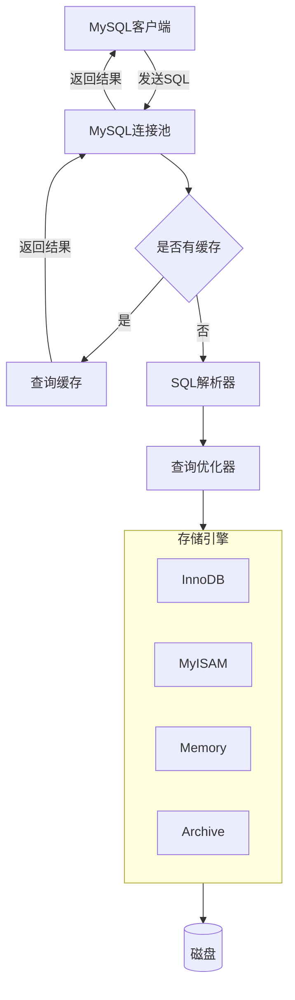

## 执行流程




由上图，可以得出：在 MySQL 中，我们大致可以分为三个部分，分别是 **MySQL 客户端**、**MySQL 服务端**和**存储层**。其中，存储层主要是硬件层面，不在今天讨论的范围内，所以这里我们主要讨论前两者。

## 一、MySQL 客户端

MySQL 数据库支持很多编程语言的 API 接口，其实这句话底层的含义是很多编程语言是内置 MySQL 客户端。除此之外，MySQL 还有一个常用的客户端就是 MySQL 数据库自带的一个 mysql 命令，这个命令使用如下：

```Bash
mysql -u$username -p$password -h$host -P$port
```

- `username `是用户名
- `password `是密码
- `host `是 MySQL 服务端地址
- `port `是 MySQL 服务端端口

**一条 SQL 执行的第一步是由 MySQL 客户端发送到 MySQL 服务端**。MySQL 客户端成功连接 MySQL 服务端之后，MySQL 服务端的连接池会对客户端的连接进行 `权限验证`，当权限验证通过之后，MySQL 服务端会将客户端的链接记录在服务端的连接池中，之后的各种操作将不再进行权限认证。

```Mermaid
flowchart LR
  id1((客户端1))
  id2((客户端2))
  subgraph A[MySQL服务端]
    direction LR
    I[创建连接]
    J[安全认证]
    K[管理连接]
    L[释放连接]
  end
  id1 <--> A
  id2 <--> A
  A --> B[(MySQL数据库)]

```

这里你肯定会有疑问：为什么 MySQL 要增加一个连接池模块呢？直接连接 MySQL 服务端不是更简单且高效吗？下面我们就来分析一下。

每一次操作数据库，都需要有一个 MySQL 客户端和服务端之间的链接，创建一个链接就会有一定的时间消耗；当在高并发的情况下，每一次访问数据都会创建一个链接，这样就会持续创建很多重复的数据库链接，很没有必要而且大量的创建链接可能会导致数据库内存溢出等问题。

为了解决这个问题，MySQL 数据库就提供了一个链接池模块，主要用来**保存和安全校验连接过来的客户端**，当一个客户端连接成功之后，并不会立即释放该连接，而是会将该链接保存在连接池中，这样下一次同一个客户端连接过来就不需要再重复创建连接和安全验证了，可以在很大程度上降低数据库的资源消耗并且减少连接数据的延时。

## 二、MySQL 服务端

### 1. 查询缓存

在 MySQL 数据库中，如果开启了缓存查询，每一次的查询都会在缓存器中以 KV 形式缓存一份。一条 SQL 在执行过程中，如果命中了缓存，就会跳过 SQL 解析器、查询优化器以及 SQL 执行器，并且立即返回数据，这样做的目的主要是**提高数据库的性能**。

其实 MySQL 数据库是将缓存以哈希的形式保存在内存中的一个引用表中，并且把本次查询的 SQL、数据库名称以及协议的 hash 值作为 key，这样做的主要目的是**下一次同一个查询过来之后可以直接命中查询**。

不过缓存并不是永恒不变的，也会失效，我总结了以下几个缓存失效的情况：

- 该条缓存对应的数据、数据表发生变化时，缓存就会自动失效；
- 查询过程中有变化的数据时，是不会创建缓存的，例如 now()。

所以，**在使用 MySQL 数据库查询的时候，要尽量避免更改数据和使用有变化的数据**。

那么，既然缓存能够提高 MySQL 数据的性能，应该怎么设置开启缓存呢？首先，我们可以使用 `SHOW VARIABLES LIKE '%query_cache%';` 来查询缓存的配置项：

```Bash
# 查询缓存配置项

mysql> SHOW VARIABLES LIKE '%query_cache%';
+------------------------------+---------+
| Variable_name                | Value   |
+------------------------------+---------+
| have_query_cache             | YES     |
| query_cache_limit            | 1048576 |
| query_cache_min_res_unit     | 4096    |
| query_cache_size             | 1048576 |
| query_cache_type             | OFF     |
| query_cache_wlock_invalidate | OFF     |
+------------------------------+---------+
6 rows in set (0.01 sec)
```

其中，**query_cache_type** 有三个选项，分别是：

- OFF（0）：关闭缓存。
- ON（1）：开启缓存。
- DEMAND（2）：按需开启缓存，加上 SQL_CACHE 关键字才会缓存。

所以，要开启查询缓存可以在 MySQL 数据库的配置文件 my.cnf 中添加 `query_cache_type = 1` 即可。如果需要使用 DEMAND 的话，就需要配置成 `query_cache_type = 2` 。如果需要缓存的话，就需要增加 `SQL_CACHE` 关键字，具体操作如下：

```Bash
mysql> select SQL_CACHE * from info;
+----+--------------+
| id | name         |
+----+--------------+
|  1 | 小仙女       |
|  2 | 小帅哥       |
|  3 | 铁锤妹妹     |
+----+--------------+
3 rows in set, 1 warning (0.00 sec)
```

### 2. SQL 解析器

当没有命中缓存时，这个时候 MySQL 数据库就得去查询数据了。在查询之前必须解析客户端发送过来的以一系列字符串和空格组成的 SQL，此时就必须用到 MySQL 数据库中的另一个模块：SQL 解析器。

**SQL 解析器的主要功能是解析客户端发送过来的 SQL**，就比如匹配到 SQL 中是以 select 开头的，那就可以认定其为查询语句；以 insert 开头的 SQL，就可以认定其为插入语句。但如果在判断的过程中，出现了匹配不到的这种情况，就会报出 `ERROR 1064 (42000): You have an error in your SQL syntax;` 的错误。具体如下：

```Bash
mysql> elect * from info;
ERROR 1064 (42000): You have an error in your SQL syntax; check the manual that corresponds to your MySQL server version for the right syntax to use near 'elect * from info' at line 1
```

### 3. 查询优化器

查询优化器，顾名思义就是优化 SQL 的执行效率，也就是说查询优化器的具体功能是**为了找到 SQL 的最佳执行方案**。

在 MySQL 数据库中的查询优化器优化 SQL 具体有两个方面，分别是逻辑层面和物理层面。

物理层面主要是跟硬件有关，很难通过逻辑去优化，所以这里我们从逻辑层面说明一下。

逻辑层面的优化主要有命中索引优化、顺序优化、排序优化等。例如连表查询，具体如下：

```SQL
mysql> select * from province inner join city on city.fid = province.id where province.id = 1;
+----+-----------+----+--------------+------+
| id | name      | id | name         | fid  |
+----+-----------+----+--------------+------+
|  1 | 上海市    |  1 | 徐汇区         |    1 |
|  1 | 上海市    |  2 | 浦东新区       |    1 |
+----+-----------+----+--------------+------+
2 rows in set (0.00 sec)
```

上面的 SQL 连接 `province `和 `city `两个数据表，在内存中，有如下两种情况。

- 第一种情况：首先查询 province 表中 id 为 1 的数据，然后再查询 city 表中 fid 为 1 的数据。
- 第二种情况：首先查询 city 表中的所有数据，然后再判断 city 表中的 fid 是否等于 1。

这两种情况的结果是一样的，这个时候查询优化器内部通过算法的方式判断哪个方案的效率更高，进而选择哪个方案。

### 4. SQL 执行器

当分析完 SQL 并且选择合适的方案之后，就开始执行 SQL 了，执行 SQL 就需要使用 MySQL 数据库提供的 SQL 执行器模块。

SQL 执行模块首先会判断当前用户是否对该表有相关的操作权限（如果命中了缓存，将会在返回缓存数据之前进行权限认证）。权限判断通过之后才会调用存储引擎去操作对应的数据表，然后将操作的结果返回。

## 总结

- MySQL 客户端主要是用来将 SQL 发送至服务端的一个模块。
- 连接池主要是用来保存成功连接 MySQL 服务端的链接的，这样做的好处是可以防止数据库连接短时间内不断重复创建，减少了资源浪费，提高了数据库的访问速度。
- 数据库缓存模块是将之前访问过的数据保存在内存中，这样做的好处是避免相同的一个任务重复执行的问题，可以提高数据库速度，并且也可以降低数据库资源消耗。
- SQL 解析器主要是用于解析 SQL 的，搞清楚这条 SQL 的具体目的——查询还是更新数据。
- SQL 优化器是通过内部的算法选择执行这条 SQL 效率最高的方案。
- 搞清了 SQL 的具体操作，也选择了最优的执行方案，最后就开始执行 SQL，SQL 执行器的主要作用除了调用存储引擎接口获取数据之外，还有权限认证的作用
