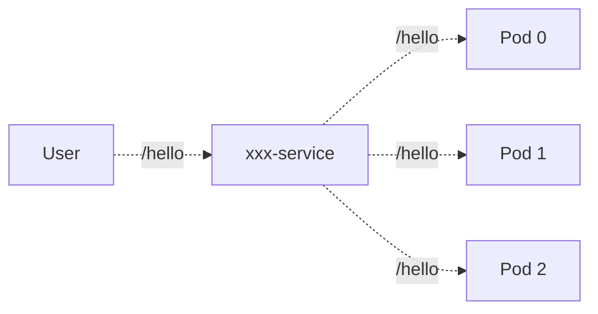

# Kubernetes 入门

## 基本概念

-   `Pod`：实例，里面可以安装`mysql`，等内容。
-   `Service`: 逻辑上的服务，可以认为这个是你业务上`XXX`服务的直接映射
-   `Deployment`: 管理`Pod`的东西


`Pod`和`Service`最简的理解方式：你有一个`web`应用，部署了 3 个实例，那么就是一个`Web Service`，对应了 3 个`Pod`

`Deployment`最好的理解方式：运维保证`Web`有 3 个实例，少了就重启一个，多了就删除一个，那么运维就是这个`Deployment`。


:::tip

这里我们直接使用`Docker Desktop`里的`Kubernetes`点击`Enable Kubenetes`；`windows`系统的得需要专业版，且开启虚拟化，还得科学上网。

:::


## 安装kubectl 工具

打开网站[https://kubernetes.io/docs/tasks/tools/](https://kubernetes.io/docs/tasks/tools/)，执行对应的命令即可。

## 使用 Rancher 安装

```bash
sudo docker run --privileged -d --restart=unless-stopped -p 80:80 -p 443:443 rancher/rancher
```

需要等一段时间，看电脑性能。


## 使用 K8S 部署web服务器

### 改造

我们先把依赖的`redis`和`MySQL`去掉

```go
func main() {
	//db := initDB()
	//server := initWebServer()
	//
	//userHandle := initUserHdl(db)
	//userHandle.RegisterRoutes(server)

	server := gin.Default()
    server.GET("/hello", func(c *gin.Context) {
		c.String(http.StatusOK, "这是 hello world")
	})
	err := server.Run(":9093")
	if err != nil {
		log.Fatalln(err)
		return
	}
}
```

### 部署方案

>   目标是部署 3 个实例，一般 3 个是比较稳定的数据，比较不容易出问题，实际中需要根据自己的业务来判断。
>
>   也就是说，需要一个`Service`，一个`Deployment`，这个`Deployment`管着 3 个`Pod`，每个`Pod`是一个实例。



### 准备K8S容器镜像

-   已知：K8S 调度的是容器
-   已知：容器里运行的是各种镜像
-   又知：我们要在 K8S 里运行 xxx

**即：我们要把`xxx`应用打包成镜像**

#### 首先在本地完成编译

必须生成一个可在`linux`平台可执行的`xxx`可执行的文件

```bash
# 必须进入到对应的目录里执行
GOOS=linux GOARCH=arm go build -o xxx .
```

执行一个`Docker`命令打包成一个镜像，还需要准备一个`Dockerfile`

```Dockerfile
# 指定基础镜像
FROM ubuntu:20.04

# copy 二进制文件
COPY webook /app/webook

# 设置工作目录
WORKDIR /app

# 执行二进制文件
ENTRYPOINT ["/app/webook"]
```

```bash
docker build -t wxvirus/webook:v0.0.1 .
```

```bash
docker images | grep webook            
wxvirus/webook                     v0.0.1    1944c883ad2f   29 seconds ago   75.9MB

```

封装一个`make docker`命令

```makefile
.PHONY: docker
docker:
	@rm webook || true
	@GOOS=linux GOARCH=arm go build -o webook .
	@docker rmi -f wxvirus/webook:v0.0.1
	@docker build -t wxvirus/webook:v0.0.1 .
```

```bash
# 执行命令 一步到位
make docker
```

如果是`windows`的，可以写一个`.sh`一样执行即可。

## 编写 Deployment

编写第一个`K8S`的配置文件

参考文档: [https://kubernetes.io/docs/concepts/workloads/controllers/deployment/](https://kubernetes.io/docs/concepts/workloads/controllers/deployment/)

`k8s-webook-deployment.yaml`

```yaml
apiVersion: apps/v1
kind: Deployment
# 元数据
metadata:
  # 名称
  name: webook
# 规格说明，部署的什么
spec:
  # 副本数量，即让它部署 3 个实例
  replicas: 3
  selector:
    matchLabels:
      app: webook
  # 描述的是你的 pod 是什么样的
  template:
    metadata:
      labels:
        # 要和上面的完全配的上，KS8 都是按照标签寻找的
        app: webook
    # POD 得具体信息
    spec:
      containers:
        - name: webook
          image: wxvirus/webook:v0.0.1
          ports:
            # 对应的你的 webook 启动的端口
            - containerPort: 9093

```

:::danger 注意

`app: webook`对应的应用名称基本都保持一致

:::

```bash
kubectl apply -f k8s-webook-deployment.yaml
```

有提示: `deployment.apps/webook created`即可。

```bash
kubectl get deployments                    
NAME      READY   UP-TO-DATE   AVAILABLE   AGE
webook    3/3     3            3           35s
```

```bash
kubectl get pods | grep webook
webook-5bc7f45d66-qp69t    1/1     Running   0          30s
webook-5bc7f45d66-jt2q7    1/1     Running   0          29s
webook-5bc7f45d66-64drd    1/1     Running   0          28s
```

---

### `apiVersion`

`K8S`简单理解就是一个配置驱动的，或者元数据驱动，我们用户负责提供各种配置，然后`K8S`根据配置来执行一些动作，就是使用`apiVersion`来确定如何解读配置。

>   可以充分利用编辑器的提示来确定使用哪个`apiVersion`，自动帮你纠正。

### spec

`Deployment`的规格说明，规格说明理解为说明书

-   `replicas`: 值为 3，意思是这个`Deployment`里面有 3 个副本，实际上就是 3 个`Pod`
-   `selector`: 筛选器，在`K8S`里一大堆`Pod`里面知道管理的是哪3 个，标签的`key`为`app`，值叫`webook`的
-   `template`: 每个`Pod`长什么样，就是模板，直接按照模板创建

### selector

筛选 K8S 所需资源。配置中使用的是`machLabels`，也就是说`Deployment`按照标签`label`来筛选它需要的资源--`Pod`。

**它需要的是含有`app=webook`这个标签的`Pod`**

还有`matchExpressions`,即根据表达式来筛选。

### template

在`kind`不同的时候对应的内容也不同，在`Deployment`里面是创建的`Pod`的模板，而`template`的`spec`得里面要指定`containers`，就可以看的出来`Pod`里面跑的就是容器，而且可以跑多个容器。

### image

`image`就是镜像，我们这里用的是`docker`构建的镜像

:::tip 注意

`Docker`是实现`OCI`标准的，所以即便现在`K8s`声称不支持`Docker`，但这个镜像依旧可以使用。

:::


## 编写 Service

此时`Deployment`是没有办法从外面访问的，我们需要将`Pod`封装为一个逻辑上的服务，即`Service`。

`spec`里有 2 个字段要注意：

-   `type`：这里选择的是`LoadBalancer`，负载均衡，意思是这个`Service`在逻辑上还要负责负载均衡的问题
    -   给`selector`里筛选出来的`Pod`做负载均衡
-   `ports`：端口，可以配置多个，还可以额外配置一个`HTTPS`的
    -   `name`：端口的名字，一般用来指示用途，比如`http`意思就是用来接收`HTTP`请求，可以随便写
    -   `port`：外部访问的端口
    -   `protocol`：这个端口监听什么协议
    -   `targetPort`：转发请求的时候，应该转发到哪个`Pod`上的哪个端口


```yaml
apiVersion: v1
kind: Service
metadata:
  name: webook
spec:
  selector:
    # 筛选的是 deployment 里定义的 pod 的标签
    app: webook
  ports:
    - protocol: TCP
      port: 8081
      targetPort: 9093
  # 当成是一个负载均衡器
  type: LoadBalancer
  
```

>   注意，这里我的`80`端口改成了`8081`，因为我本地`80`端口已经被占用了，所以换了一个，对应的`targetPort`也要换成和`Pod`实例里面`web`服务的端口一致。

```bash
kubectl apply -f k8s-webook-service.yaml   
service/webook created
```

```bash
kubectl get services                    
NAME         TYPE           CLUSTER-IP        EXTERNAL-IP    PORT(S)                      AGE
webook       LoadBalancer   192.168.194.248   <pending>      80:30038/TCP                 16s

```

>   注意，我这里显示了`<pending>`就是因为上面写的端口是`80`导致占用的，改了之后就行了。

