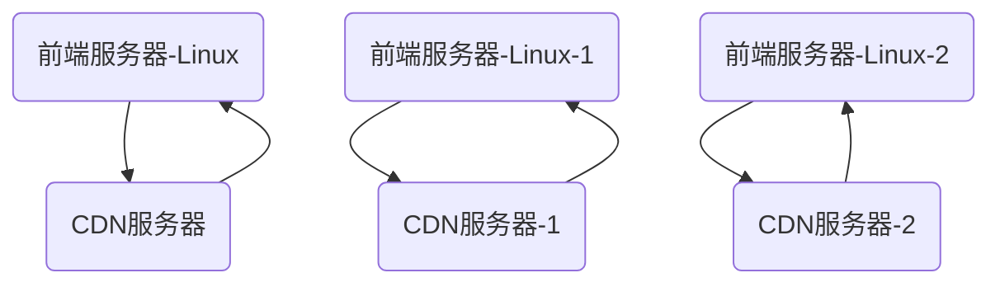
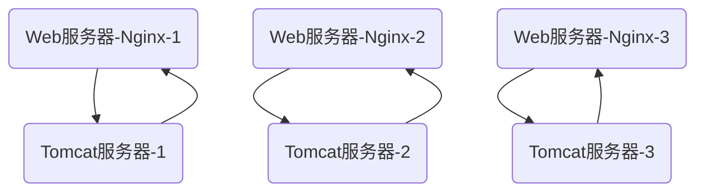
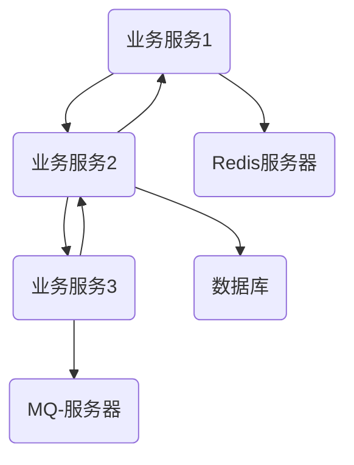
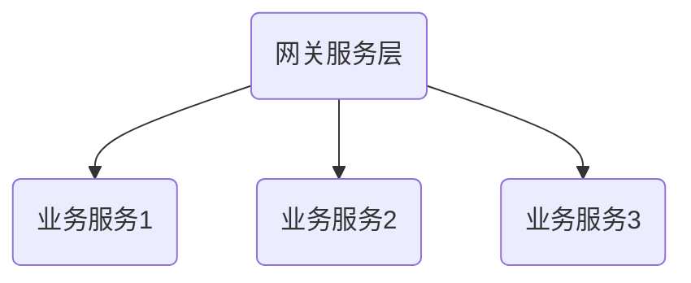
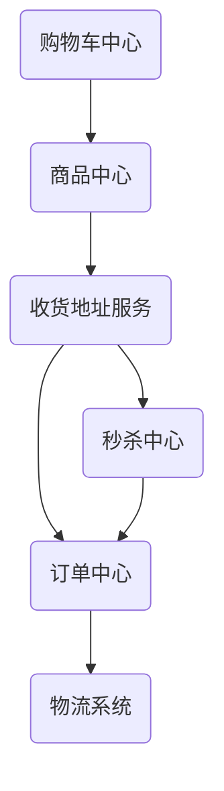
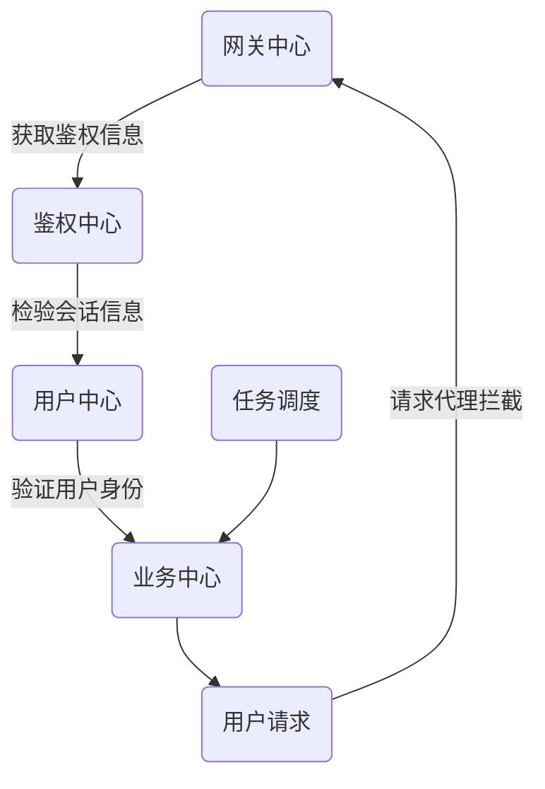

# 秒杀购物技术架构

## 物理架构

-   `IAAS层`：系统底层操作系统以及硬件服务主机
-   `PAAS层`：`Web`/应用服务器、消息队列、数据库和缓存服务器等
-   `SAAS层`：业务基础服务、核心基础服务、API 网关服务等

### IAAS 服务层

### PAAS 层

> `Web`服务

> 数据服务

### SAAS 层

> 软件及服务：业务服务 + 网关服务 + 应用服务

-   每个业务都得经过网关
-   业务与业务之间也有联系

## 整体系统服务组成

### 基础中间件

-   `OSS`服务中间件：存储媒体资源和对象资源
-   `WEB`服务中间件：请求以及服务代理
-   数据库中间件：持久数据信息
-   消息中间件：消息、事件驱动中间件
-   缓存中间件：缓存数据、临时数据存储

### 基础服务层

-   用户中心
-   鉴权中心
-   网关中心
-   任务调度

### 业务服务层

-   商品中心
-   购物车中心
-   订单中心
-   收货地址服务
-   秒杀中心

### 业务服务流程

## 技术路线板块

-   微服务技术
-   数据访问层
-   高并发技术
-   分布式技术

---

-   综合管理框架：`Spring`全家桶
-   微服务框架：`Spring Cloud`、`Alibaba`全家桶、`Dubbo3`
-   数据持久框架：`Mybatis/JPA`
-   功能支持框架：`XXLjob/Guava`等

## 业务路线规划

-   业务领域范围
-   业务领域行为
-   业务领域模型
    -   业务数据模型
    -   业务编程模型：中间状态、业务状态【不入库】

## 电商介绍以及商业模式

### 一些概念

-   电商的运营模式：不同类型的运营模式和表现形式进行分类
-   电商的商业模式：买方和卖方之间的关系及性质进行分类
-   电商的盈利模式：不同的营收方式以及营收范围进行分类

### 运营模式

-   内容电商
-   跨境电商
-   直播电商
-   社交电商

### 商业模式

-   C2C：客户对客户
-   B2B：企业对企业
-   C2B：客户对企业
-   B2C：企业对客户
-   G2G：企业对企业【少见】

### 盈利模式

-   导购型
-   闪购型
-   买手型
-   垂直型
-   混合型

-   平台型

### 常用名词

-   SPU：标准化产品单位，商品聚合的基本单元，例如：一个手机
-   SKU：仓库库存量单位，用来定价和库存管理，例如：一个红色的 512G 的`iphone13`
-   ID：商品的唯一标识，用于定位和标记商品，全局化定位
