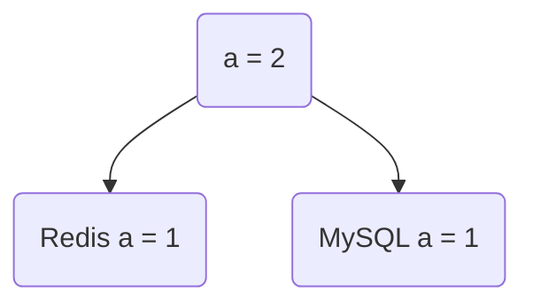
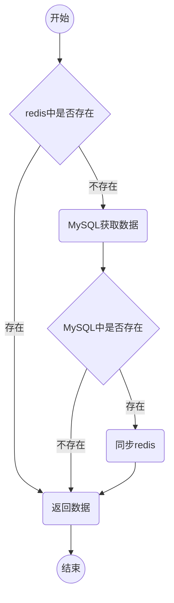

# 如何避免高并发场景下数据不一致性

## 双写一致性

当我们更新数据库的时候同时也把`redis`中的数据更新，这是正常情况。

假如在写入`redis`有延迟，就会造成数据不一致

### 解决

-   不考虑高并发时，使用锁就可以彻底解决问题，锁会把高并发串行化，但是效率就达不到了
-   先更新数据库，后更新缓存
-   先更新缓存，后更新数据库
-   先删除缓存，后更新数据库
-   先更新数据库，后删除缓存
-   更新数据库效率远远大于读取数据库 s，发生概率大

**cache aside pattern** + 延迟双删
