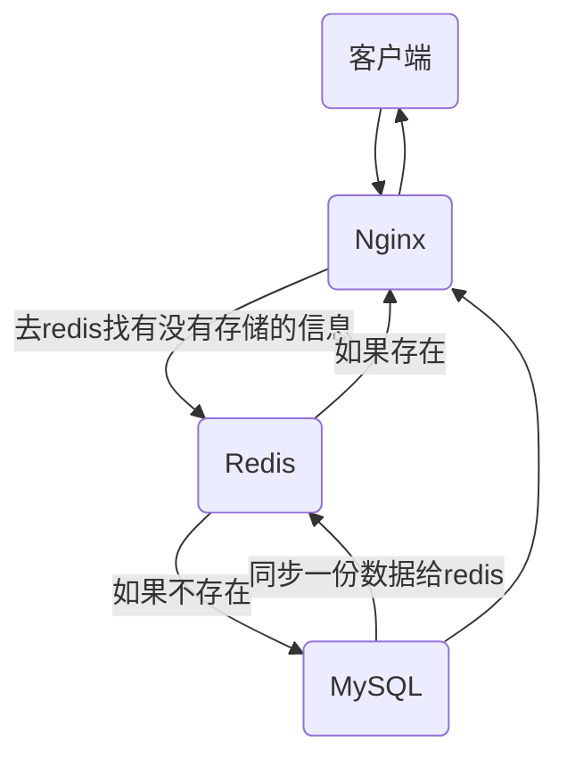

# 缓存问题应对方案

## 缓存穿透

> 短时间内大量访问不存在的数据，导致穿透`redis`直接访问数据库，造成数据库瓶颈

一个`web`程序正常访问流程：

但是如果你的`id`是自增模式的，攻击者发来一个小于 0 的数值或者无穷大的数值，这个时候`redis`就会找不到，会直接到`MySQL`中查找，间接增加数据库的压力。

### 解决办法

-   没有值时，也保存一个对应的`null`值在`redis`中；假如攻击者不断地换 id，就会产生一大堆的没有用的`key`，内存占满之后，会淘汰掉正常的`key`，所以也是有问题的
-   封禁对方`ip`
-   对参数进行校验，把非法的参数给过滤掉
-   最终解决办法：布隆过滤器

### 布隆过滤器

主旨：采用一个很长的二进制数组，并通过一系列的`hash`函数来确认该数据是否存在。

哈希函数要满足两点

1.  范围必须是数组的长度
2.  足够的散列

:::tip

数组中只有 0 和 1，它说数据不存在，那么数据是一定不存在的；它说数据存在，数据是有可能不存在的。

如何减少误判产生：

1.  增加数组的位置，当数组越长的时候，哈希的值就会越散列，越分散，重复可能性就会越小
2.  增加哈希的次数，就会增加 CPU 的运算，效率会降低
3.  不能只保存 0 和 1，还要存储计数信息

优点：

二进制组成的数组，占用内存极少，并且插入和查询速度都足够快

缺点：

随着数据的增加，误判率会增加；还有无法判断数据一定存在；无法删除数据

:::

## 缓存雪崩

> 大量`redis key`同一时间失效，导致请求访问到数据库，造成数据库瓶颈

案例：网站首页在某一时刻有大量访问，这个时候会存储一定数据一定时间在`redis`中，在这个时效之内，访问都可以直接通过`redis`得到信息，但是如果失效了，这些`key`集体失效了，这个时候再次访问，就会集体访问`MySQL`，很可能就会遇到瓶颈。

### 解决办法

-   过期时间随机设置
-   定时任务重新设置过期时间，在过期前重新设置，保证缓存不失效
-   永不过期(不推荐)

## 缓存击穿

> 一个热点的`key`失效，导致访问这个热点`key`的请求，直接访问数据库，造成数据库瓶颈

案例：竞拍一些商品时，会预估一下过期时间，但是也会有延后的情况，而在这延后的时候，它过期了，就会导致所有请求一下子访问`MySQL`，即热点`key`突然失效问题。

### 解决办法

-   加锁，分布式锁或互斥锁

当第一个请求在`redis`中没有找到`key`时，访问`MySQL`时，这个时候先上锁，其他没有拿到锁的请求继续等待，第一个请求拿到数据之后就会把数据同步到`redis`，其他请求等待以后在请求以后`redis`就有数据了。
