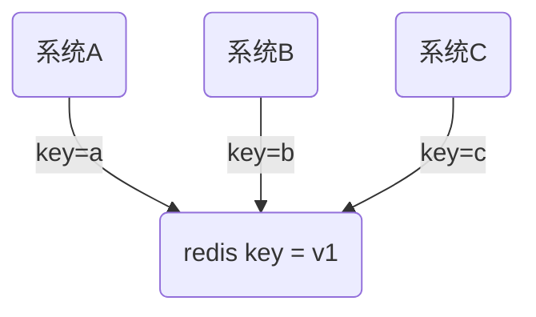
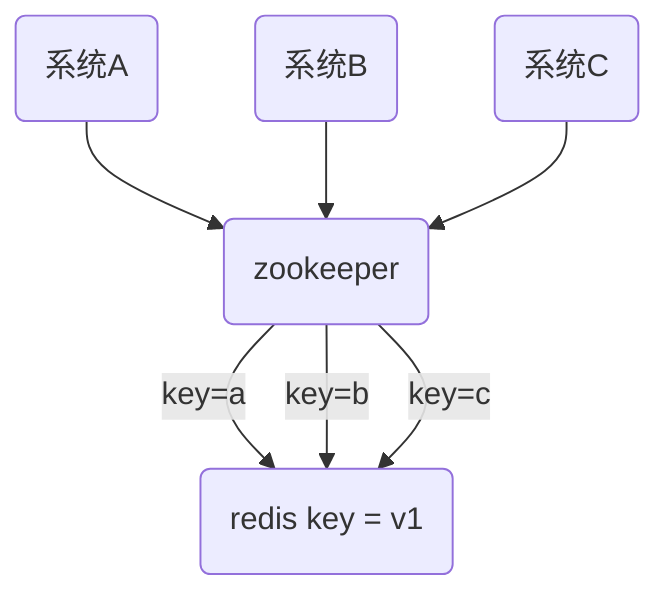
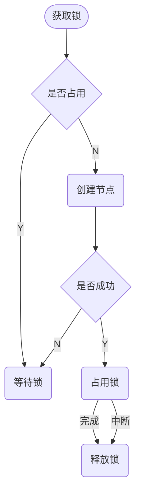

# redis 并发竞争问题以及分布式锁

## 并发竞争

-   多个客户端同时并发写一个`key`，本来应该先到的操作因为某些原因后到了，导致数据出错。

期望结果：`v1->a->b->c`

可能因为某种原因`b`延迟了，就会导致: `v1->a->c->b`

## 解决

使用分布式锁 ，比如常用的`zookeeper`，`redis`也自带分布式锁，但是用的很少

使用分布式锁流程

-   系统 A 先拿到锁，修改值为`a`
-   系统 B 拿不到锁，阻塞等待不会修改
-   系统 C 也拿不到锁，阻塞等待不会修改
-   系统 A 释放锁以后，系统 B 拿到锁，修改数据为`b`

> 但是这样也是有问题的，分布式锁只是保证同一时间内只有一个系统来拿到这个锁，修改值，不能保证顺序到达问题，有可能还是`系统B`延迟了，没拿到锁，导致最终结果和期望值还是不一样。

### 按照时间更新

修改数据的时候，携带时间戳，更新时判断时间戳是否为最新时间，最新时间则更新。

假设系统 A 的时间为`00:00:01`，系统 B 的时间为`00:00:02`，系统 C 的时间为`00:00:03`，这样当系统 B 到达比 C 晚的时候，因为有时间戳判断，也不会进行更新。

### 解决办法

-   利用分布式锁，确保同一时间只有一个系统在操作某一个`redis key`，其他系统不能操作
-   利用时间戳，当时间戳最新时修改`redis key`的值，当时间戳比较旧时，忽略操作。

## ZooKeeper

-   `ZooKeeper`主要服务于分布式系统，可以用它来做：统一配置管理、统一命名服务、分布式锁、集群管理
-   它的目标就是封装好复杂易出错的关键服务，将简单易用的接口和性能高效、功能稳定的系统提供给用户
-   可以把它看成是树状的结构，它的节点是`znode`
    -   持久节点：默认节点类型，创建节点的客户端与`zk`断开连接以后，节点依然存在
    -   持久节点顺序节点：在创建节点时，`zk`会根据节点的创建时间，对节点进行编号
    -   临时节点：创建节点的客户端与`zk`断开连接后，节点就会被删除
    -   临时顺序节点：创建节点时，`zk`会根据节点的创建时间，对节点进行编号，创建节点的客户端与`zk`断开连接后，节点就会被删除；`zookeeper`就是选用这个实现的分布式锁

:::tip

这个时候就知道为什么选用临时节点，因为当客户端没有释放锁，或者因为问题断开之后，就会删除节点，自动的释放锁。

为什么选用顺序节点：

> 假如现在有一万个请求，但是只有一个能获取到锁，但是剩下 9999 个只能监听灯等待锁；当第一个完成之后，这 9999 个又会同时去获取锁，只能有一个拿到，剩下的继续等待，循环的这样执行下去，这种情况是有问题的。即：`羊群效应`和`惊群效应`

解决：

-   创建临时顺序节点
-   判断是不是最小的节点
-   是最小的，获得锁 ，否则监听上一个的节点
-   释放锁后，后面的监听节点处理

:::
